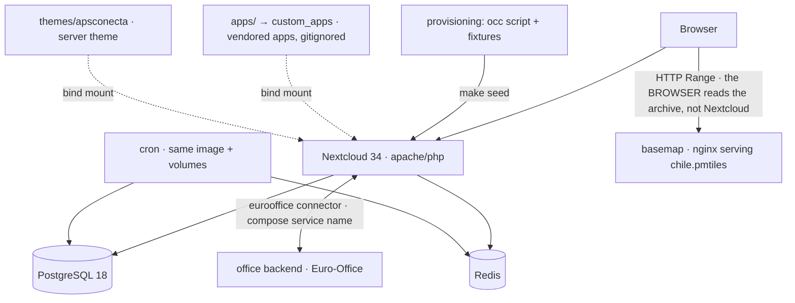
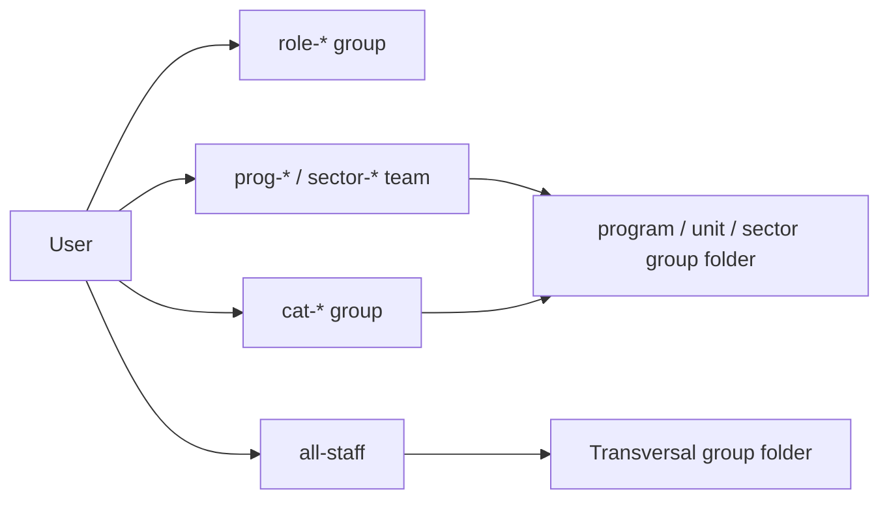

# Architecture — APS Conecta Gestión

Technical architecture for **v1**: the developer-facing Foundation (Epic 0) + the initial Spine A document
structure, built as a **white-label Nextcloud 34** deployment. This document is the design SSOT; the code
(`provisioning/phases/`, `compose.yaml`) is authoritative for behavior, and the invariants builders must
not violate are in [`AGENTS.md`](../AGENTS.md).

## Design paradigm

**Vanilla platform + configuration-as-code, no fork.** Nextcloud 34 is the platform and owns the runtime and
all product data. The repository adds **only** declarative customization — configuration, theming, and
group/folder/ACL provisioning. There is **no source fork and no core patch**. There are **three custom apps**,
`epidemiologia`, `farmacia` and `territorio`, installed from their own repositories and declared in provisioning
([ADR-0003](adr/0003-this-stack-ships-a-custom-app.md), reversing AD-1); they reach the platform only
through `OCP\…`, so the boundary in AD-9 still holds. The
running instance is a *projection* of the repository's recipe applied over the official image: reproducible,
disposable, and upgrade-safe.

The single mechanism that mutates instance state is one **idempotent `occ`-based provisioning script**
(`provisioning/`, run by `make seed`). It is **idempotent by guard** — it queries before it creates
(`occ group:list`, `groupfolders:list`, a recorded folder-id map) and skips or patches what already exists,
because `groupfolders:create` is not idempotent by name. It runs its phase files in a fixed numeric
order, structure (05–40) before fixtures (50–60); **[`provisioning/README.md`](../provisioning/README.md)
is the one place that lists what each phase does** — do not restate it here.
Responsibilities are partitioned: **provisioning owns structure** (groups, folders, ACLs, locale);
**fixtures own only sample content and sample users** placed into already-existing groups. Re-running converges
to the same state; there is no second source of truth and no manual admin-UI step that isn't scripted.

**Convergence is one-directional: it adds and never deletes** (#85). Everything reversible is converged —
group membership, ACL grants, app enablement, config keys — and `gf_prune` already revokes grants the matrix
no longer declares, because revoking a grant loses nothing and the files stay. The three operations that
*do* lose content — deleting a group folder, a user, or files — are never automatic and have no flag that
makes them so. Deleting a group is in the same bucket for a different reason: it strands any group folder it
was sole grantee of. What is live but no longer declared is **reported** at the end of `make install`, and on
demand via `make divergence` — naming the object and the command that would remove it, exit 0 either way. The
usual justification for a guarded destructive mode is a backup to fall back on, and there is none in this
repo yet (see *Environments* below, and #75).

## Stack

*Verified current 2026-08-01; pins are seed — the running code owns them thereafter.*

**Every image is pinned by digest** (#109). The tags below are what you read; the digest beside each
in `compose.yaml` is what resolves. Refresh with `make images`; `make images-check` reports when a
tag has moved past its pin, and the weekly `image-digests` workflow runs that check for you.

| Component | Image / package | Role |
| --- | --- | --- |
| Nextcloud | `nextcloud:34-apache` (34.x line, 34.0.4 head, supported to ~June 2027) | Platform, web UI, files, users/groups |
| PostgreSQL | `postgres:18-alpine` (PG18, NC-recommended) | Metadata (users, groups, shares, ACLs, file index) |
| Redis | `redis:8-alpine` (Redis 8 = AGPL, OSS-restored) | Cache + file/transaction locking |
| Office server — Euro-Office | `ghcr.io/euro-office/documentserver` (standalone container) + `eurooffice` connector | Office editing engine (OnlyOffice-fidelity) |
| Group Folders | `groupfolders` app | Team/role-scoped shared folders + ACLs |
| Talk | `spreed` app (vendored tarball) | Chat and calls between staff. Two properties this stack does not otherwise have, both recorded in its `VENDOR`: it reaches an **external STUN server** by default, and group calls stay small (~4) without a High Performance Backend, which is not part of this stack |
| Desktop Workspace | `desktop_workspace` app (vendored tarball) | Desktop-style workspace surface. **Third party** (`canisdata`), not a Nextcloud-org app — the same posture as `side_menu` |
| Basemap | `nginx:alpine` — the `tiles` service, serving one `.pmtiles` archive | The map's background, self-hosted. Replaces OpenStreetMap's public tile service, which answered **403**: it is a P2 best-effort service under a Tile Usage Policy, and their own answer to a blocked application is to run your own. **Not a tile server** — PMTiles is one file the browser reads with HTTP **Range** requests, so this is a static file server that honours ranges and sets CORS. ~1 GB in `./tiles/` (gitignored, generated by `scripts/refresh-basemap.sh`); a client pulls ~0.5–1 MB per screenful, not the file |
| Job scheduler | `cron` service — same image and volumes as `nextcloud`, via a compose anchor | Runs `cron.php` on a schedule instead of on page loads (phase `06-jobs`) |
| Tooling | Docker Compose · Make · Xdebug (dev) | Orchestration, task runner, step-debug |

The `nextcloud:34-apache` tag rolls forward across 34.x patch releases, which is why the digest and
not the tag is what `compose.yaml` resolves: byte-identical environments across machines stopped
being optional once the same install has to reach more than one clinic (#109). NC34 (the current
line) is used because **Euro-Office requires NC34+**. All components are OSS (per
the OSS-first mandate): Nextcloud / groupfolders / eurooffice AGPL-3.0, Euro-Office AGPL-3.0,
PostgreSQL PostgreSQL-License, Redis 8 AGPL-3.0 — settled 2026-07-19 in
[`LICENSING.md`](LICENSING.md) §3.1, which elects AGPLv3 for Redis rather than switching to
**Valkey** (BSD-3), its permissive drop-in.

## Runtime topology

v1 runs as a single Docker Compose stack — one per clinic, or one per developer machine — portable
across OSes.

Portability is an invariant: the core compose carries nothing VPS-specific and no absolute host paths.
The `tiles` service mounts `./tiles`, relative like `./apps` and `./themes`, for exactly that reason —
an early draft of it mounted `/srv/tiles` and would have broken this rule silently.

The basemap arrow above goes **browser → tiles**, not Nextcloud → tiles, and that is the whole shape
of PMTiles: the archive is read client-side by byte range. So the address staff browsers use is
instance configuration (`TILES_PUBLIC_URL`, written to Territorio's `tile_url` by provisioning phase
16), and a compose service name would be useless here — the browser is not in this network.
**Container↔container** traffic (Nextcloud↔Euro-Office↔PostgreSQL↔Redis, including the document-server
callbacks) uses **compose service names** (e.g. `http://eurooffice`, `http://nextcloud`); **`host.docker.internal` is only
for host↔container** — the browser or a container reaching a host-published port (on Linux via
`extra_hosts: host.docker.internal:host-gateway`). Step-debugging is delivered by a **derived** dev-only
image/profile (`compose.dev.yaml`) layered on the official image — never baked into the base.

## Data ownership & flows

Each datum has exactly one owner:

- **Nextcloud data volume** — product content (the establishment's documents). Never in git.
- **PostgreSQL** — all metadata: accounts, groups, group-folder definitions, ACL rules, the file index.
- **Redis** — ephemeral cache and file/transaction locks.
- **The repository** — the *desired-state recipe* (provisioning script), configuration, and branding assets.
  It holds **no product data and no secrets**. Secrets live in `.env` (gitignored); dev data is **synthetic
  fixtures only** (no patient or clinical data, ever).

Editing flow: a user opens a document in the browser → Nextcloud hands off to the standalone Euro-Office
server over the `eurooffice` connector/**JWT** — a separate container reachable at its own server URL → the
server renders and co-edits in-browser, writing back through the callback. The server comes up with the stack
and `make install` wires the connector (#81). Documents open in a **new window** (`sameTab=false`), so an
editor never replaces the folder it was opened from; multiple documents are independent sessions.

## Access model (RBAC)

Authorization is entirely **group-based — never per individual**, delivered through the Group Folders app.

- **The group is the only access key.** Every grant in the system takes a group id and nothing else —
  `gf_grant` for folders, `app_restrict_to_groups` for apps, `add_user_to_group` for people — so "what may
  this user reach" is answered entirely by "which groups is this user in". Custom apps added later plug into
  the same key; there is no second mechanism. The rule that follows: **grant on the broadest group that is
  still correct** (`cat-*` over `role-*` unless the job title is genuinely the point), which is what lets a
  clinic add a role and have it inherit every existing grant without one being edited.
- Each CESFAM **role** is a flat Nextcloud group (`role-*`); Nextcloud groups do not nest. **22 are shared by
  every clinic** — the vocabulary that keeps one clinic's ACL matrix readable beside another's — with IDs,
  display names and the role→category mapping declared in
  [`provisioning/phases/20-groups.sh`](../provisioning/phases/20-groups.sh), which **is** the registry —
  the phase that creates them is the authority, and this document deliberately does not restate the
  list. A clinic running a **SAR, SAPU
  or SUR** adds its own in `SITE_ROLES` (`id|display|category`), since it could already declare the unit, its
  folder and its grants but had no way to name who leads it (#103).
- Coarse and cross-role access use **parallel groups**: the four categories (`cat-jefaturas`, `cat-clinicos`,
  `cat-tecnicos`, `cat-administrativos`), an **`all-staff`** group **every user belongs to** (the single
  encoding of "all staff"), and parameterizable **team groups** `prog-*` (program teams) and `sector-*`
  (territorial-sector teams). A user is provisioned into their `role-*`, their `cat-*`, `all-staff`, and any
  `prog-*`/`sector-*` teams.
- **Mount model** (Group Folders don't nest): **Transversal is one group folder** (read → `all-staff`, with
  per-subfolder manager writes via ACL); **each program, unit, and sector is its own group folder** granted to
  its team group (+ `cat-jefaturas` read). ACL is **allow-refinement** — grant least at the folder base, add
  explicit **allow** rules, and use **no DENY rules** (a deny would override a multi-role user's allows and
  break FR-11's union). Rules stay shallow to bound evaluation cost.

The initial Document Home is the four-area hybrid tree from the PRD (Transversal · Programas · Unidades ·
Sectores) with a first-cut access matrix; the final validated matrix is settled with a specific establishment later.

**What varies per clinic is data, not code.** The `prog-*`/`sector-*` teams, the folder tree, the whole
grant matrix and the clinic's identity live in `sites/<slug>/site.sh`; phases 20/30/40 only loop over it.
`cat-*` and `all-staff` do not vary — the four categories are what make one clinic's matrix comparable to
another's, so they are deliberately not site-definable. `role-*` is **both**: 22 shared ones stay in the
phase and a clinic may add its own in `SITE_ROLES` (#103). How that file is written
and read: [`provisioning/README.md`](../provisioning/README.md).

> **Note:** the Nextcloud Activity stream may surface names of ACL-hidden items — keep genuinely sensitive
> names out of ACL-restricted subfolders (relevant for any establishment).

## Branding & localization

- **White-label branding ships as a server theme**, `themes/apsconecta/`, activated with
  `occ config:system:set theme --value apsconecta`. Identity (name, slogan, URL, colors, `productName`)
  stays config-as-code via `occ theming:config`, with `enforce_theme=light` + `disable-user-theming yes`.
  Logo, favicon and login background are **files in the theme** (`core/img/`), registered by the
  `15-branding` phase with `occ theming:config <key> <absolute-path>` pointing at the bind-mounted
  theme directory — never admin-UI uploads, which would break AD-2. The iOS "Nextcloud — Abrir" banner
  is killed with `occ config:system:set customclient_ios_appid ""`, which replaced what
  `defaults.php` was doing at the time (deleted 2026-07-27, and with it the opcache restart).
  **`themes/apsconecta/defaults.php` exists again** since 2026-08-04, on entirely different grounds:
  where Nextcloud hands out `\OC_Defaults` instead of `ThemingDefaults` — an untrusted host, the three
  setup screens, both upgrade screens — identity comes from hardcoded literals with no config key, and
  only that file can answer. It reintroduces the opcache dependency, so editing it needs a container
  restart. See [ADR-0004](adr/0004-branding-the-legacy-render-path.md).
  This supersedes **AD-6** on `themes/` files. AD-6 was *right* to reject `defaults.php` **for the
  banner**; ADR-0004 brought it back for identity on the legacy render path — reasoning and accepted
  costs in [ADR-0001](adr/0001-server-theme-for-branding.md) and its Corrections 2 and 4.
- **What the theme can actually change is narrow.** Nextcloud scopes its CSS variables to
  `body[data-theme-light]` and a server theme loads *first*, so variables declared in `:root` are
  inert; element selectors win, variables do not. `server.css` therefore ships fonts, display
  typography, the header, focus rings and the high-contrast block — not a token→variable map. The
  rules, the full knob inventory and the verification snippet are in
  [`THEMING-MODEL.md`](THEMING-MODEL.md); `themes/` itself is undocumented legacy in Nextcloud and
  must be re-verified on every major upgrade.
- **Navigation** uses the third-party `side_menu` app, installed by `12-apps` and coloured by `15-branding`.
- **Locale**: `default_language=es` (the only Spanish translation NC34 ships) plus `force_language=es`,
  and `default_locale=es_CL` for Chilean date/number formatting. Language is forced because
  `findLanguage()` reads the browser's Accept-Language *before* the default; the locale is not. Timezone America/Santiago is per-user (browser auto-detected). UI text
  is Spanish; all code, identifiers, and config keys are English.

## Environments

A single Compose stack, brought up with one command, on **a developer's machine or a clinic's** — those
are the same stack and the same command. `make setup && make install` stands up a named establishment from a clean
checkout, and #77's whole effort was making that true of a machine nobody has seen.

**`main` is the trunk; a release is a tag.** The dev stack installs from `main`; a clinic installs a
tag, and that tag is the only answer to "which bytes does that instance have?"
([ADR-0005](adr/0005-gestion-is-the-development-trunk.md)). Three kinds of app follow from it and a
release ships only two kinds of app: **vendored** apps, whose upstream tarballs are committed under
`provisioning/apps/<id>/` with a `VENDOR` file naming version, URL and sha256; and **own** apps —
`epidemiologia`, `farmacia` and `territorio` — installed from tarballs built from tags of their own
repositories. The third kind, **lab** apps (none today), exist only as clones in `apps/`, are
declared in `dev/lab-apps.sh`, and are **never in a release**: phase 12 acts on an entry only where
`apps/<id>/.git` exists, so a clinic falls straight through.
[`apps/README.md`](../apps/README.md) is the authority for that boundary and for the app-id ↔
repository-name mapping; this document does not restate it.

What is still **deferred** is everything that makes a host reachable and survivable rather than everything
that makes it run: hosting/provider, a TLS reverse-proxy for the office server with a hardened allow-list
(Euro-Office uses a shared JWT secret), backups and RTO/RPO, sizing/HA, and production observability — all
owned by #75, which is why staff password delivery (#106) waits on it. **There is no backup story in this
repo**, and that absence is load-bearing elsewhere: it is why convergence reports rather than deletes (#85).
The operational surface is `occ status` plus the `make smoke` gate.

Euro-Office is resource-bound (uncapped, OSS) and fairly heavy (~8 GB RAM recommended for multi-user). Since
#81 dropped its compose profile it comes up with the stack, so that is now a **hard floor for every clinic
host and every dev box**, not a number that only applies when someone opts in. `make office-down` stops just
the document server when the work does not need it.

### Logs — three facts nobody had written down

Established 2026-07-30, when the admin Overview's *"errors in the logs"* warning was mistaken for a live
fault:

- **Where.** `data/nextcloud.log`, inside the `nextcloud_data` **named volume** — not a bind mount, so it
  is invisible from the repo tree and survives `make down`. Read it with
  `docker compose exec nextcloud tail /var/www/html/data/nextcloud.log`, or `occ log:tail`.
- **Rotation is an inherited default, not a decision.** 100 MiB, from
  `lib/private/Log/Rotate.php` in the pinned image, with a single roll to `nextcloud.log.1`. Nothing in
  this repo sets `log_rotate_size`. At this instance's growth (~150 KB/week) it will effectively never
  fire — which is fine, and is why no value is pinned. That rotation job runs at all only because of the
  `cron` service and `06-jobs.sh`.
- **A nonzero error count on a dev box is history, not a fault.** The 15 errors that warning counts are
  from 2026-07-28/29, with **zero since**; four of them were this repo's own retired smoke script calling
  `OC\Server::getConfig()`, removed in NC34. Read the timestamps before treating the warning as news.

## Extension boundary (beyond v1)

The roadmap (the REM custom app → full-text search → Paperless-ngx → Analytics → a local-model AI
layer — Tables was dropped, see ROADMAP.md § Future) attaches at a fixed seam: custom apps live in `apps/` → `custom_apps` and may depend on
Nextcloud **only through OCP public APIs** — never patching core, never relying on private internals, and core
never depends on a custom app. This keeps the platform upgrade-safe as capabilities are added one at a time.
