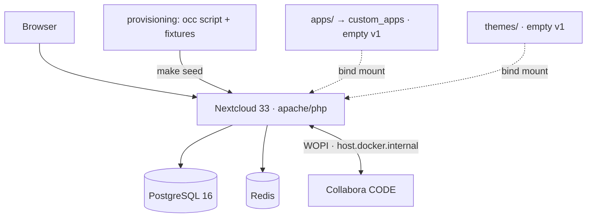
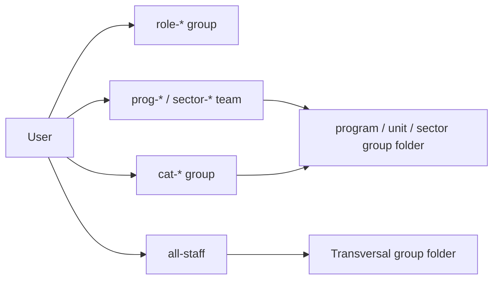

# Architecture — APS Conecta Gestión

Technical architecture for **v1**: the developer-facing Foundation (Epic 0) + the initial Spine A document
structure, built as a **white-label Nextcloud 33** deployment. This document is the human-facing reference;
the terse invariant contract (the `AD` decisions builders must not violate) lives in
[`docs/planning/architecture/architecture-apsconecta-gestion-2026-07-18/ARCHITECTURE-SPINE.md`](planning/architecture/architecture-apsconecta-gestion-2026-07-18/ARCHITECTURE-SPINE.md),
and the requirements it satisfies live in the
[PRD](planning/prds/prd-apsconecta-gestion-2026-07-18/prd.md).

## Design paradigm

**Vanilla platform + configuration-as-code, no fork.** Nextcloud 33 is the platform and owns the runtime and
all product data. The repository adds **only** declarative customization — configuration, theming, and
group/folder/ACL provisioning. There is **no source fork, no core patch, and zero custom PHP in v1**. The
running instance is a *projection* of the repository's recipe applied over the official image: reproducible,
disposable, and upgrade-safe.

The single mechanism that mutates instance state is one **idempotent `occ`-based provisioning script**
(`provisioning/`, run by `make seed`). It is **idempotent by guard** — it queries before it creates
(`occ group:list`, `groupfolders:list`, a recorded folder-id map) and skips or patches what already exists,
because `groupfolders:create` is not idempotent by name. It runs a fixed **phase order**: (1) branding +
locale → (2) groups → (3) group folders → (4) ACLs → (5) user→group membership → (6) sample-content fixtures.
Responsibilities are partitioned: **provisioning owns structure** (groups, folders, ACLs, branding, locale);
**fixtures own only sample content and sample users** placed into already-existing groups. Re-running converges
to the same state; there is no second source of truth and no manual admin-UI step that isn't scripted.

## Stack

*Verified current 2026-07-19; pins are seed — the running code owns them thereafter.*

| Component | Image / package | Role |
| --- | --- | --- |
| Nextcloud | `nextcloud:33-apache` (rolling 33.x; 33.0.6 head, supported ~monthly to ~Feb 2027) | Platform, web UI, files, users/groups |
| PostgreSQL | `postgres:16-alpine` | Metadata (users, groups, shares, ACLs, file index) |
| Redis | `redis:8-alpine` (Redis 8 = AGPL, OSS-restored) | Cache + file/transaction locking |
| Collabora Online CODE | `collabora/code` (standalone) | Collaborative office editing engine |
| Nextcloud Office | `richdocuments` app | Nextcloud↔Collabora integration (WOPI) |
| Group Folders | `groupfolders` app | Team/role-scoped shared folders + ACLs |
| Tooling | Docker Compose · Make · Xdebug (dev) | Orchestration, task runner, step-debug |

The `nextcloud:33-apache` tag rolls forward across 33.x patch releases; pin the exact patch
(`nextcloud:33.0.6-apache`) if byte-identical environments across machines become necessary. Nextcloud 33 was
chosen over 34 as the longest-soaked current line for a greenfield internal-ops deployment. All components are
OSS (per the OSS-first mandate): Nextcloud/richdocuments/groupfolders AGPL-3.0, Collabora CODE MPL-2.0,
PostgreSQL PostgreSQL-License, Redis 8 AGPL-3.0 — with **Valkey** (BSD-3) as the permissive drop-in alternative
to Redis, to be settled in the committed License-outline artifact.

## Runtime topology

v1 runs as a single Docker Compose stack, one per developer machine, portable across OSes.

Portability is an invariant: the core compose carries nothing VPS-specific and no absolute host paths.
**Container↔container** traffic (Nextcloud↔Collabora↔PostgreSQL↔Redis, including the WOPI callbacks) uses
**compose service names** (e.g. `http://collabora:9980`, `http://nextcloud`); **`host.docker.internal` is only
for host↔container** — the browser or a container reaching a host-published port (on Linux via
`extra_hosts: host.docker.internal:host-gateway`). Step-debugging is delivered by a **derived** dev-only
image/profile (`compose.dev.yaml`) layered on the official image — never baked into the base.

## Data ownership & flows

Each datum has exactly one owner:

- **Nextcloud data volume** — product content (the CESFAM's documents). Never in git.
- **PostgreSQL** — all metadata: accounts, groups, group-folder definitions, ACL rules, the file index.
- **Redis** — ephemeral cache and file/transaction locks.
- **The repository** — the *desired-state recipe* (provisioning script), configuration, and branding assets.
  It holds **no product data and no secrets**. Secrets live in `.env` (gitignored); dev data is **synthetic
  fixtures only** (no patient or clinical data, ever).

Editing flow: a user opens a document in the browser → Nextcloud (`richdocuments`) hands off to the standalone
Collabora CODE server over **WOPI** → Collabora renders and co-edits in-browser, writing back through the WOPI
callback. Multiple documents open as independent sessions (side-by-side tabs).

## Access model (RBAC)

Authorization is entirely **group-based — never per individual**, delivered through the Group Folders app.

- Each of the ~21 CESFAM **roles** is a flat Nextcloud group (`role-*`); Nextcloud groups do not nest. IDs,
  slugs, and the role→category mapping are fixed in the spine's **Group Registry**.
- Coarse and cross-role access use **parallel groups**: the four categories (`cat-jefaturas`, `cat-clinicos`,
  `cat-tecnicos`, `cat-administrativos`), an **`all-staff`** group **every user belongs to** (the single
  encoding of "all staff"), and parameterizable **team groups** `prog-*` (program teams) and `sector-*`
  (territorial-sector teams). A user is provisioned into their `role-*`, their `cat-*`, `all-staff`, and any
  `prog-*`/`sector-*` teams.
- **Mount model** (Group Folders don't nest): **Transversal is one group folder** (read → `all-staff`, with
  per-subfolder manager writes via ACL); **each program, unit, and sector is its own group folder** granted to
  its team group (+ `cat-jefaturas` read). ACL is **allow-refinement** — grant least at the folder base, add
  explicit **allow** rules, and use **no DENY rules** (a deny would override a multi-role user's allows and
  break FR-11's union). Rules stay shallow to bound evaluation cost.

The initial Document Home is the four-area hybrid tree from the PRD (Transversal · Programas · Unidades ·
Sectores) with a first-cut access matrix; the `prog-*`/`sector-*` names, role→program and sector→team
assignments, and the final validated matrix are parameterizable and settled with a specific CESFAM later.

> **Note:** the Nextcloud Activity stream may surface names of ACL-hidden items — keep genuinely sensitive
> names out of ACL-restricted subfolders (relevant for a CESFAM).

## Branding & localization

- **White-label** is applied via `occ theming:config` (`name`, `logo`, `favicon`, `primary_color`,
  `background_color`, `slogan`, `url`, `background`) with `disable-user-theming yes` for brand consistency —
  no fork, no `themes/` file, no `defaults.php`
  (which would need an opcache reset and is the fork-adjacent path to avoid). Branding assets are bind-mounted
  local files.
- **Locale** defaults are seeded but **not** forced: `default_language=es_419` (Latin-American Spanish; a
  discrete `es_CL` UI translation does not exist) and `default_locale=es_CL` (Chilean date/number formatting).
  Users and developers may change them. Timezone America/Santiago is per-user (browser auto-detected). UI text
  is Spanish; all code, identifiers, and config keys are English.

## Environments

v1 targets **local development per developer only** — a single Compose stack brought up with one command.

Everything operational for a live deployment is intentionally **deferred**: hosting/provider, a TLS
reverse-proxy for Collabora with a hardened WOPI allow-list (dev runs Collabora with `--o:ssl.enable=false`),
backups and RTO/RPO, sizing/HA, and production observability. The v1 operational surface is `occ status` plus
the `make smoke` gate.

Collabora capacity is resource-bound, not license-bound: roughly **10 concurrent editors per CPU thread and
~50 MB RAM per editor**, so ~20–30 concurrent editors need ~3–4 vCPU and ~3 GB RAM for Collabora — comfortable
on a laptop for dev and modest on a server later.

## Extension boundary (beyond v1)

The roadmap (Nextcloud Tables → the REM custom app → full-text search → Paperless-ngx → Analytics → a
local-model AI layer) attaches at a fixed seam: custom apps live in `apps/` → `custom_apps` and may depend on
Nextcloud **only through OCP public APIs** — never patching core, never relying on private internals, and core
never depends on a custom app. This keeps the platform upgrade-safe as capabilities are added one at a time.
