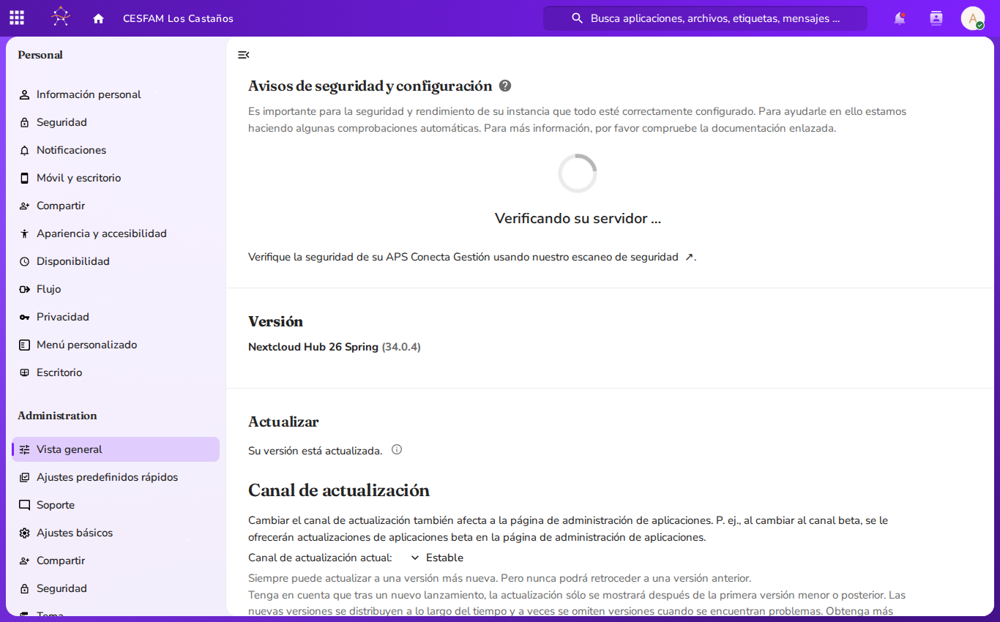
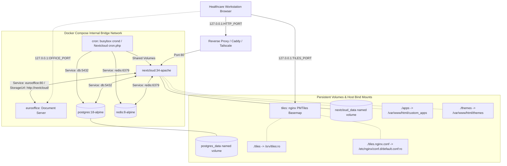
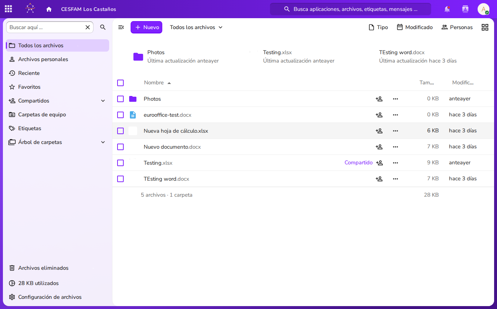
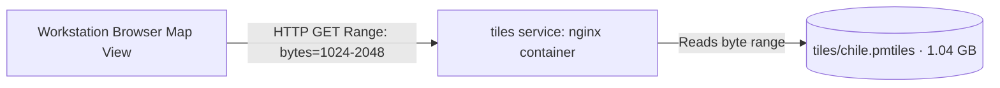

<link rel="stylesheet" href="style.css">
<style>
@import url('https://fonts.googleapis.com/css2?family=Fraunces:ital,opsz,wght@0,9..144,400..800;1,9..144,400..800&family=Nunito+Sans:ital,opsz,wght@0,6..12,400..800;1,6..12,400..800&display=swap');
:root {
  --aps-primary: #7f21fe;
  --aps-dark-violet: #5315a8;
  --aps-ink: #101828;
  --aps-muted: #485363;
  --aps-border: #e4e7ec;
  --aps-gold: #e06f00;
  --aps-dark-gold: #9a4c00;
  --aps-error: #ea003e;
  --aps-error-bg: #FFE7E7;
  --aps-card-bg: #ffffff;
  --aps-canvas-bg: #fcfaff;
  --aps-badge-bg: #f4ebff;
  --aps-badge-text: #5315a8;
}
body, .markdown-body {
  font-family: "Nunito Sans", -apple-system, BlinkMacSystemFont, "Segoe UI", Roboto, sans-serif !important;
  color: var(--aps-ink) !important;
  background-color: var(--aps-canvas-bg);
  line-height: 1.65;
}
h1, h2, h3, h4 { font-family: "Fraunces", Georgia, serif !important; letter-spacing: -0.015em; font-weight: 700; }
h1 { color: var(--aps-dark-violet) !important; border-bottom: 3px solid var(--aps-primary); padding-bottom: 0.35em; }
h2 { color: var(--aps-dark-violet) !important; border-bottom: 1px solid var(--aps-border); padding-bottom: 0.25em; margin-top: 1.6em; }
h3 { color: var(--aps-primary) !important; }
h4 { color: var(--aps-dark-gold) !important; }
a { color: var(--aps-primary) !important; font-weight: 600; text-decoration: none; }
a:hover { color: var(--aps-dark-violet) !important; text-decoration: underline; }
table { border-collapse: collapse; width: 100%; border: 1px solid var(--aps-border); margin: 1.4em 0; border-radius: 8px; overflow: hidden; background: #ffffff; }
th { background-color: var(--aps-dark-violet) !important; color: #ffffff !important; font-family: "Fraunces", serif !important; font-weight: 600; padding: 10px 14px; text-align: left; }
td { padding: 9px 14px; border-bottom: 1px solid var(--aps-border); color: var(--aps-ink); }
tr:nth-child(even) { background-color: #fbf9ff; }
blockquote { border-left: 4px solid var(--aps-primary) !important; background-color: #f8f4ff !important; color: var(--aps-muted) !important; padding: 0.8em 1.4em; border-radius: 0 8px 8px 0; }
code { font-family: ui-monospace, SFMono-Regular, Menlo, monospace !important; background-color: var(--aps-badge-bg); color: var(--aps-dark-violet); padding: 0.2em 0.45em; border-radius: 4px; border: 1px solid #d6bbfb; }
pre { background-color: var(--aps-ink) !important; color: #f9fafb !important; border-radius: 8px; padding: 1.1em 1.3em; border: 1px solid #344054; }
pre code { background: transparent !important; color: inherit !important; border: none !important; }
.aps-hero { background: linear-gradient(135deg, #5315a8 0%, #7f21fe 100%); color: #ffffff; border-radius: 12px; padding: 26px 32px; margin-bottom: 24px; box-shadow: 0 4px 14px rgba(83,21,168,0.22); }
.aps-hero h1 { color: #ffffff !important; border-bottom: 2px solid rgba(255,255,255,0.3); margin: 0 0 10px 0; padding: 0 0 8px 0; }
.aps-tag { display: inline-block; background: #e06f00; color: #ffffff; font-size: 0.78em; font-weight: 700; text-transform: uppercase; letter-spacing: 0.08em; padding: 3px 10px; border-radius: 20px; margin-bottom: 12px; }
.aps-meta { color: rgba(255,255,255,0.9); font-size: 0.95em; margin: 4px 0; }
</style>

<div class="aps-hero">
  <span class="aps-tag">Municipal Infrastructure & Healthcare Operations</span>
  <h1>APS Conecta Gestión — Server Administration Manual</h1>
  <p class="aps-meta"><strong>Multi-Container Docker Architecture, 13-Phase Provisioning & Governance</strong></p>
  <p class="aps-meta">Downstream Nextcloud 34 Fork | AGPLv3 Municipal Node Operations</p>
</div>

# APS Conecta Gestión — Server Administration Manual

This Server Administration Manual defines operational procedures, architecture specifications, deployment instructions, and maintenance protocols for **APS Conecta Gestión**, the sovereign intranet, clinical governance, and institutional collaboration platform designed for Chilean Primary Healthcare (*Atención Primaria de Salud* — APS), including CESFAM, CECOSF, Postas de Salud Rural (PSR), COSAM, SAPU, and SAR facilities.

This manual provides authoritative, operational instructions for system administrators, DevOps engineers, and municipal IT teams deploying, hardening, configuring, and maintaining APS Conecta Gestión nodes.

APS Conecta Gestión is architected as an immutable, declarative configuration-as-code layer projected over official upstream **Nextcloud 34** containers. It eliminates manual Web UI configuration drift, strictly avoids core platform source code forks, enforces a resilient Role-Based Access Control (RBAC) model tailored to Chilean primary healthcare centers, and integrates Euro-Office for in-browser collaborative document editing alongside an autonomous, self-hosted geospatial basemap service.


*Figure 1: Server Administration Overview in APS Conecta Gestión (`Administration settings -> Overview`), showing full security validation, system status, and active platform parameters.*

---

## Master Table of Contents

1. [Introduction & Operational Principles](#1-introduction--operational-principles)
   - [Target Audience & System Scope](#target-audience--system-scope)
   - [Downstream Nextcloud Suite Fork & Open Source Licensing Governance](#downstream-nextcloud-suite-fork--open-source-licensing-governance)
   - [Foundational Invariants](#foundational-invariants)
   - [Administrative Interface & Visual References](#administrative-interface--visual-references)
2. [System Architecture & Topology](#2-system-architecture--topology)
   - [Multi-Container Architecture (`compose.yaml`)](#multi-container-architecture-composeyaml)
   - [Services Inventory & Digest Pinning](#services-inventory--digest-pinning)
   - [Container Networking & Communication](#container-networking--communication)
   - [Loopback Binding & Network Isolation](#loopback-binding--network-isolation)
   - [Hardware Sizing & Prerequisites](#hardware-sizing--prerequisites)
3. [Installation & Initial Setup](#3-installation--initial-setup)
   - [Step 1: Environment Generation (`make setup`)](#step-1-environment-generation-make-setup)
   - [Step 2: Establishment Configuration (`scripts/deis.py`)](#step-2-establishment-configuration-scriptsdeispy)
   - [Step 3: Installation & Convergence (`make install`)](#step-3-installation--convergence-make-install)
   - [Container Lifecycle Management](#container-lifecycle-management)
4. [The 13-Phase Idempotent Provisioning Engine](#4-the-13-phase-idempotent-provisioning-engine)
   - [Provisioning Philosophy & Idempotency Guards](#provisioning-philosophy--idempotency-guards)
   - [Phase-by-Phase Reference](#phase-by-phase-reference)
     - [`05-security.sh`: Session Hardening & Security Defaults](#05-securitysh-session-hardening--security-defaults)
     - [`06-jobs.sh`: Background Job Scheduling Mode](#06-jobssh-background-job-scheduling-mode)
     - [`07-certs.sh`: TLS Certificate Authority Intermediates](#07-certssh-tls-certificate-authority-intermediates)
     - [`10-locale.sh`: Chilean Spanish Locale & Language Enforcement](#10-localesh-chilean-spanish-locale--language-enforcement)
     - [`12-apps.sh`: Application Deployment, Vendoring & Patching](#12-appssh-application-deployment-vendoring--patching)
     - [`14-office.sh`: Euro-Office Connector & Storage Configuration](#14-officesh-euro-office-connector--storage-configuration)
     - [`15-branding.sh`: White-Label Server Theming & Identity](#15-brandingsh-white-label-server-theming--identity)
     - [`16-app-policy.sh`: Application Visibility & Egress Policy](#16-app-policysh-application-visibility--egress-policy)
     - [`20-groups.sh`: Role Vocabulary, Category Taxonomy & Group Registry](#20-groupssh-role-vocabulary-category-taxonomy--group-registry)
     - [`30-folders.sh`: Document Hierarchy & Group Folders Tree](#30-folderssh-document-hierarchy--group-folders-tree)
     - [`40-acl.sh`: Access Control Matrix (ACL) Application](#40-aclsh-access-control-matrix-acl-application)
     - [`50-users.sh`: Standing Leadership Accounts Provisioning](#50-userssh-standing-leadership-accounts-provisioning)
     - [`60-fixtures.sh`: Deterministic Synthetic Fixtures](#60-fixturessh-deterministic-synthetic-fixtures)
5. [User, Role & Access Control Management (RBAC)](#5-user-role--access-control-management-rbac)
   - [The Group as the Sole Authorization Key](#the-group-as-the-sole-authorization-key)
   - [The 22 Shared Standard CESFAM Roles](#the-22-shared-standard-cesfam-roles)
   - [The Four Functional Categories (`cat-*`)](#the-four-functional-categories-cat-)
   - [Custom Establishment Roles (`SITE_ROLES`)](#custom-establishment-roles-site_roles)
   - [Group Folders Architecture & Mount Semantics](#group-folders-architecture--mount-semantics)
   - [ACL Allow-Refinement Model (Elimination of DENY Rules)](#acl-allow-refinement-model-elimination-of-deny-rules)
   - [User Lifecycle & Password Administration](#user-lifecycle--password-administration)
   - [Standard `occ` User & Group Commands](#standard-occ-user--group-commands)
6. [Office Suite Server Administration (Euro-Office)](#6-office-suite-server-administration-euro-office)
   - [Document Server Architecture](#document-server-architecture)
   - [JWT Secret Configuration & Token Validation](#jwt-secret-configuration--token-validation)
   - [Internal Storage Callback Routing](#internal-storage-callback-routing)
   - [Format Compatibility & ODF Lossy Conversion](#format-compatibility--odf-lossy-conversion)
   - [Resource Management & On-Demand Standby (`make office-down`)](#resource-management--on-demand-standby-make-office-down)
   - [Office Backend Verification (`make office-smoke`)](#office-backend-verification-make-office-smoke)
7. [Basemap & GIS Services (PMTiles)](#7-basemap--gis-services-pmtiles)
   - [Self-Hosted PMTiles Architecture](#self-hosted-pmtiles-architecture)
   - [Archive Specifications & Chilean Geographic Bounds](#archive-specifications--chilean-geographic-bounds)
   - [Nginx Range-Request & CORS Compliance](#nginx-range-request--cors-compliance)
   - [Basemap Verification & Maintenance (`scripts/refresh-basemap.sh`)](#basemap-verification--maintenance-scriptsrefresh-basemapsh)
8. [Security & Hardening](#8-security--hardening)
   - [Network Isolation & Reverse Proxy Strategy](#network-isolation--reverse-proxy-strategy)
   - [Trusted Domains & Request Host Validation](#trusted-domains--request-host-validation)
   - [Brute Force Protection & Session Lifetimes](#brute-force-protection--session-lifetimes)
   - [Signature Suppression for Patched Vendored Apps](#signature-suppression-for-patched-vendored-apps)
   - [App Store Lockdown & Egress Isolation](#app-store-lockdown--egress-isolation)
9. [Operations, Maintenance & Troubleshooting](#9-operations-maintenance--troubleshooting)
   - [Health Checks & Stack Smoke Gating (`make smoke`)](#health-checks--stack-smoke-gating-make-smoke)
   - [Configuration Drift & Divergence Auditing (`make divergence`)](#configuration-drift--divergence-auditing-make-divergence)
   - [Upstream Container Image Digest Tracking (`make images-check`)](#upstream-container-image-digest-tracking-make-images-check)
   - [Vendored Application Lifecycle (`make apps-check`)](#vendored-application-lifecycle-make-apps-check)
   - [Logging Architecture, Volume Storage & Log Rotation](#logging-architecture-volume-storage--log-rotation)
   - [Troubleshooting Runbooks](#troubleshooting-runbooks)
     - [PostgreSQL Database Connectivity Failures](#postgresql-database-connectivity-failures)
     - [Redis Locking & Memory Cache Stalls](#redis-locking--memory-cache-stalls)
     - [Euro-Office Document Opening & Token Verification Errors](#euro-office-document-opening--token-verification-errors)
     - [Background Cron Job Inactivity](#background-cron-job-inactivity)
     - [Bind Mount Permissions Synchronization](#bind-mount-permissions-synchronization)

---

## 1. Introduction & Operational Principles

### Target Audience & System Scope
This administration manual is written for system administrators, municipal healthcare infrastructure operators (*Direcciones de Salud Municipal* / DISAM / DESAM), and technical personnel responsible for hosting, deploying, and maintaining APS Conecta Gestión within primary healthcare networks in Chile.

APS Conecta Gestión operates as an internal institutional collaboration environment:
- It serves clinical protocols, referral workflows (*flujogramas*), administrative guidelines, internal circulars, meeting minutes, epidemiological alerts, and technical vademécums.
- **It is NOT an Electronic Health Record (EHR / Ficha Clínica Electrónica).**
- In strict adherence to Law No. 20.584 (Patient Rights and Duties) and Law No. 19.628 (Protection of Private Life), **zero clinical patient records, individual patient files, or diagnostic registers are stored, processed, or uploaded to this platform.**

### Downstream Nextcloud Suite Fork & Open Source Licensing Governance

APS Conecta Gestión represents an operational downstream distribution and specialized fork of the **Nextcloud** collaboration ecosystem, engineered for Chilean municipal primary healthcare networks.

#### Preservation of Open Source Licenses
The deployment complies strictly with the terms of all underlying free and open-source licenses, preserving upstream copyright notices, source headers, and legal disclaimers:
- **Core Nextcloud Platform (GNU AGPL-3.0-or-later)**: Nextcloud Server and integrated core applications are licensed under the GNU Affero General Public License v3.0 or later as published by the Free Software Foundation.
- **Office Collaboration (GNU AGPL-3.0-only)**: Euro-Office DocumentServer (`ghcr.io/euro-office/documentserver`) and its Nextcloud connector application are licensed under GNU AGPLv3 only.
- **Metadata & Cache Infrastructure**: PostgreSQL is licensed under the permissive PostgreSQL License; Redis 8 is tri-licensed, and APS Conecta explicitly elects the GNU AGPLv3 option.
- **Vendored Applications**: `groupfolders`, `side_menu`, `calendar`, `contacts`, `spreed`, and `desktop_workspace` are distributed under GNU AGPLv3 or later.
- **Custom Primary Care Applications**: `epidemiologia`, `farmacia`, `territorio`, along with `themes/apsconecta` and the provisioning engine, are licensed under GNU AGPLv3 or later (Copyright © Daniel Espinoza Charrier / APS Conecta) pursuant to ADR-0010.

#### Operator Legal Obligations under AGPL Section 13
> [!CAUTION]
> **Operator Legal Duty under AGPLv3 §13 (Network Copyleft):**
> Operating an AGPLv3-licensed network service creates an affirmative legal obligation to anyone who interacts with the software remotely through a computer network. The operator must provide a prominent, accessible mechanism through which users can obtain the complete **Corresponding Source** code for all running components (including custom apps, applied patches, and theme files).
>
> System administrators must ensure that internal clinic portals or deployment runbooks provide direct access to the upstream public source repositories and the organization's published source releases. Failure to fulfill source code requests from network users constitutes copyright infringement under the GNU AGPLv3 and incurs direct legal liabilities and penalties.

#### Trademark Disclaimers & Attribution
- **Nextcloud Trademark**: "Nextcloud" and the Nextcloud logo are registered trademarks of Nextcloud GmbH. APS Conecta Gestión is an independent downstream software distribution and is not affiliated with, endorsed by, or sponsored by Nextcloud GmbH.
- **Preservation of Attribution**: Upstream copyright notices in code headers, API definitions, and license files are maintained without modification.
- **Brand Asset Carve-Out**: APS Conecta brand marks, emblems, and visual assets are reserved under AGPL Section 7(e).

### Foundational Invariants
System administration of APS Conecta Gestión is governed by five non-negotiable architectural doctrines:

1. **Vanilla Platform, No Core Fork (AD-1):** Standard, unmodified official container images (`nextcloud:34-apache`, `postgres:18-alpine`, `redis:8-alpine`) are deployed. All customizations are achieved strictly via public APIs (`OCP\...`), configuration parameters, themes, and official Nextcloud extension hooks.
2. **Declarative Configuration-as-Code (AD-2):** Every setting, group, folder, access permission, and theme parameter is defined in versioned shell scripts and configuration files. No administrative state is altered by hand through the Nextcloud Web UI.
3. **One-Directional Add-Only Convergence (#85):** The installation and provisioning pipelines converge state additively. The provisioning engine never deletes user documents, group folders, or user accounts automatically. Divergences are detected and reported for conscious human review.
4. **Isolated Workstation Posture:** Clinical workstations in Chilean primary care centers are frequently shared among rotating shifts and multi-disciplinary teams. Session lifetimes, authentication dialogs, and browser storage are hardened so that individual access cannot leak across staff handoffs.
5. **Operational Simplicity (DRY, KISS, YAGNI):** The deployment avoids unnecessary distributed clustering, Kubernetes overhead, or external proprietary SaaS dependencies. A single Docker Compose stack encapsulates the entire service boundary for a health center.

### Administrative Interface & Visual References
Administrators interact with the system via standard CLI tools (`make`, `docker compose`, `occ`) and through the Nextcloud Administration Settings panel (`/settings/admin/overview`).

The following reference screenshots from the operational testbed highlight key system interfaces:

| Reference Interface | Path / Screenshot | Administrative Context |
|---|---|---|
| **Branded Login Screen** | [`screenshots/01_login_page.png`](screenshots/01_login_page.png) | Hardened login screen displaying healthcare styling, Chilean locale, and the disabled "Recordarme" (remember login) option. |
| **Staff Dashboard** | [`screenshots/02_dashboard.png`](screenshots/02_dashboard.png) | Default landing interface for authenticated personnel showing active widgets and notifications. |
| **Document Tree (Home)** | [`screenshots/03_files_tree.png`](screenshots/03_files_tree.png) | Standard 4-Area tree structure: `Transversal`, `Programas`, `Unidades`, `Sectores`. |
| **Transversal Area** | [`screenshots/04_transversal_folder.png`](screenshots/04_transversal_folder.png) | Institutional knowledge repository containing conventions (`LÉEME — Convenciones.md`), protocols, and workflows. |
| **Epidemiología App** | [`screenshots/05_app_epidemiologia.png`](screenshots/05_app_epidemiologia.png) | Custom health intelligence module parsing real-time MINSAL and ISP alert feeds. |
| **Farmacia App** | [`screenshots/06_app_farmacia.png`](screenshots/06_app_farmacia.png) | Pharmacological vademécum with integrated clinical risk warnings (renal, pregnancy, elderly). |
| **Territorio App** | [`screenshots/07_app_territorio.png`](screenshots/07_app_territorio.png) | Geospatial sector mapping powered by the self-hosted PMTiles basemap engine. |
| **Talk Internal Chat** | [`screenshots/08_app_talk.png`](screenshots/08_app_talk.png) | Secure on-premise team chat and clinical coordination rooms. |
| **Institutional Calendar** | [`screenshots/09_app_calendar.png`](screenshots/09_app_calendar.png) | Shift scheduling, team meetings, and primary care campaign coordination. |
| **Admin System Overview** | [`screenshots/10_admin_overview.png`](screenshots/10_admin_overview.png) | Server administration health check and system configuration summary. |

---

## 2. System Architecture & Topology

### Multi-Container Architecture (`compose.yaml`)
APS Conecta Gestión operates as an orchestrated multi-container topology defined in `../../compose.yaml`. The services collaborate across a private internal Docker bridge network:



The six services in `compose.yaml` fulfill dedicated roles:
1. **`nextcloud`:** Nextcloud 34 Apache/PHP application server. Mounts the core `nextcloud_data` named volume, alongside `./apps` (custom and vendored applications) and `./themes` (the `apsconecta` server theme).
2. **`db`:** PostgreSQL 18 Alpine database server storing users, group definitions, ACL tables, file indices, and application state.
3. **`redis`:** Redis 8 Alpine in-memory key-value cache used for distributed caching and transactional file locking.
4. **`cron`:** Background job runner executing `/cron.sh` (`busybox crond -f`). It utilizes the identical image and volumes as `nextcloud` via an anchor definition (`x-nextcloud-base`) to execute `php -f /var/www/html/cron.php` every 5 minutes.
5. **`eurooffice`:** Standalone documentserver container (`ghcr.io/euro-office/documentserver`) providing in-browser collaborative editing for OOXML (`.docx`, `.xlsx`, `.pptx`) and ODF (`.odt`, `.ods`, `.odp`) documents.
6. **`tiles`:** High-performance static Nginx container serving the national Chilean basemap (`chile.pmtiles`) via HTTP Range Requests and CORS headers.

### Services Inventory & Digest Pinning
In production, relying on floating tags (such as `:latest`, `:34-apache`, or `:18-alpine`) creates silent deployment drift: two nodes installed days apart could run different patch levels. 

APS Conecta Gestión enforces **Index Digest Pinning (#109)** across every service image in `compose.yaml`. The human-readable tag is retained for documentation, but Docker resolves the immutable `@sha256:` index digest:

| Service | Tag | Digest Specification | Architecture |
|---|---|---|---|
| `nextcloud` | `nextcloud:34-apache` | `sha256:0c74fb931e7e5115c833b3cab8d1eb2a4894ff95cd5fa2e84124ac9d3e1fea09` | Multi-arch Index (x86_64 / arm64) |
| `db` | `postgres:18-alpine` | `sha256:d3e1620b530c944afa6e887d22eb899824da68e19c52024bf98f5220c88a65b2` | Multi-arch Index |
| `redis` | `redis:8-alpine` | `sha256:becdda6c7f4b3fb42e42fd7f120bbf5c54c4caaaf16f26da24e4563d2c1f0576` | Multi-arch Index |
| `cron` | *Inherits Nextcloud* | *(Identical digest to nextcloud service)* | Multi-arch Index |
| `eurooffice` | `ghcr.io/euro-office/documentserver:latest` | `sha256:889e681923d2dcc8bdfb92fe128d10e185fcff880d302b6a0c0c7bf339499290` | Pinned multi-arch build |
| `tiles` | `nginx:alpine` | `sha256:c8497b180665e631ec92a5091125bec5b214f0e2b99409e30653a125b37557da` | Multi-arch Index |

> [!NOTE]
> Digest pins are refreshed systematically using `make images`, which verifies upstream tags and updates both `compose.yaml` and `Dockerfile.dev` synchronously. The weekly GitHub Actions workflow `image-digests.yml` monitors upstream drift using `make images-check`.

### Container Networking & Communication
Networking follows strict architectural boundaries:
- **Container-to-Container Communication:** Operates exclusively over the default Compose bridge network using internal service names (AD-8). 
  - `nextcloud` accesses database storage at `db:5432`.
  - `nextcloud` accesses transactional caching at `redis:6379`.
  - `nextcloud` communicates with Euro-Office internally at `http://eurooffice/`.
  - `eurooffice` fetches documents from Nextcloud via `StorageUrl` set to `http://nextcloud/`.
- **Host Gateway Routing (`extra_hosts`):** The `nextcloud` container configures `host.docker.internal:host-gateway`. On Linux hosts, this maps `host.docker.internal` to the host's bridge IP address, permitting container-to-host communications when required.
- **Client-to-Service Communication:** Client browsers running on clinical workstations communicate with Nextcloud, Euro-Office, and the Tiles service using the host's published endpoints (or through an external reverse proxy).

### Loopback Binding & Network Isolation
By design, all container port publications in `compose.yaml` bind strictly to the loopback interface (`127.0.0.1`):
```yaml
ports:
  - "127.0.0.1:${HTTP_PORT:?set HTTP_PORT in .env}:80"
```
No port is ever bound directly to `0.0.0.0` or public LAN interfaces. 

External ingress is mediated by an authenticating, TLS-terminating reverse proxy (e.g., Caddy, Nginx, or a secure Tailscale node). This prevents raw unauthenticated access to the backend PHP server or the document server from the municipal clinic LAN.

### Hardware Sizing & Prerequisites

#### Host Operating System & Dependencies
- **Operating System:** Modern 64-bit Linux distribution (Ubuntu 22.04/24.04 LTS, Debian 12, Rocky Linux 9).
- **Container Runtime:** Docker Engine version 24.0 or newer.
- **Compose Tool:** Docker Compose v2 (integrated `docker compose` plugin).
- **System Utilities:** Bash 4.4+, GNU Make, Python 3.8+ (for DEIS search and health check evaluation), cURL, and standard Linux coreutils (`od`, `tr`, `grep`, `sed`).

#### Hardware Dimensioning Matrix

| Deployment Tier | Concurrency Baseline | Minimum RAM | Recommended vCPU | Storage Allocation & Type |
|---|---|---|---|---|
| **Small Establishment** (CECOSF / PSR / COSAM) | 10 – 30 active workstations | **8 GB** | 4 vCPU cores | 100 GB NVMe / SSD |
| **Standard CESFAM** (10,000 – 25,000 enrolled) | 30 – 80 active workstations | **16 GB** | 6 – 8 vCPU cores | 250 GB – 500 GB NVMe |
| **Large CESFAM / Cordón Comunal** | 80 – 150+ active workstations | **32 GB** | 8 – 16 vCPU cores | 1 TB Enterprise SSD |

> [!IMPORTANT]
> **The 8 GB RAM Floor:** Euro-Office is a self-contained, enterprise document compilation server that embeds its own worker processes, Node.js conversion daemons, and internal coordination engine. It consumes ~2.5 GB of resident RAM at baseline. Combined with PostgreSQL 18, Redis 8, Nextcloud Apache, and PHP-FPM processes, **8 GB of RAM is the absolute hard floor**. Attempting to deploy on 2 GB or 4 GB virtual machines will result in Linux OOM-killer invocations terminating the document server or database.

---

## 3. Installation & Initial Setup

Setting up an APS Conecta Gestión node requires three linear, reproducible steps.

```
┌────────────────────────────────────────────────────────┐
│ Step 1: Environment Generation (make setup)            │
│ Creates .env (mode 600) with four CSPRNG hex secrets   │
└──────────────────────────┬─────────────────────────────┘
                           │
┌──────────────────────────▼─────────────────────────────┐
│ Step 2: Establishment Profile (scripts/deis.py)        │
│ Queries DEIS catalog -> creates sites/<slug>/site.sh   │
└──────────────────────────┬─────────────────────────────┘
                           │
┌──────────────────────────▼─────────────────────────────┐
│ Step 3: Installation & Convergence (make install)       │
│ Starts stack -> runs 13-phase provisioning -> smokes   │
└────────────────────────────────────────────────────────┘
```

### Step 1: Environment Generation (`make setup`)
The deployment environment requires generated passwords for database storage, platform administration, JWT token encryption, and fixture accounts. 

Executing `make setup` triggers `scripts/env-init.sh`:
```bash
make setup
```

This script:
1. Verifies that no existing `.env` file exists. It **refuses to overwrite an active `.env` file**, preventing silent password divergence against an already initialized database.
2. Copies `.env.example` to `.env`.
3. Immediately sets filesystem permissions to `chmod 600 .env` before writing any secrets, shielding credentials from other unprivileged users on the host.
4. Generates four cryptographic secrets sampled from `/dev/urandom` encoded as **hexadecimal strings** (avoiding `$` or `/` characters that break Docker Compose interpolation):
   - `NEXTCLOUD_ADMIN_PASSWORD`: 16 bytes (32 hex characters).
   - `POSTGRES_PASSWORD`: 16 bytes (32 hex characters).
   - `OFFICE_JWT_SECRET`: 32 bytes (64 hex characters, satisfying Euro-Office JWT length requirements).
   - `FIXTURE_USER_PASSWORD`: 12 bytes (24 hex characters).

To view the generated administrative password:
```bash
grep '^NEXTCLOUD_ADMIN_PASSWORD=' .env
```
Store this value in the municipal health authority's password vault.

### Step 2: Establishment Configuration (`scripts/deis.py`)
No health establishment configuration ships pre-activated in the repository. Each health center represents a distinct organizational entity with its own DEIS code, official name, administrative dependency, health sectors, and local programs.

The interactive utility `scripts/deis.py` searches the official MINSAL Department of Health Statistics and Information (DEIS) register (`sites/establecimientos-deis-*.csv`):

```bash
# 1. Search the DEIS register by keyword or comuna (accent-blind)
python3 scripts/deis.py cesfam la florida

# 2. View details for a specific DEIS code
python3 scripts/deis.py <codigo-deis>

# 3. Generate a new establishment configuration file
python3 scripts/deis.py <codigo-deis> --new los-castanos
```

The tool writes the standalone configuration file to `sites/<slug>/site.sh` (e.g., `sites/los-castanos/site.sh`) and prompts for the establishment's territorial sectors and clinical programs.

Configure the selected establishment identifier in `.env`:
```bash
sed -i 's/^SITE=.*/SITE=los-castanos/' .env
```

### Step 3: Installation & Convergence (`make install`)
With `.env` populated and `SITE` declared, execute the master installation target:

```bash
make install
```

`make install` performs the full deployment lifecycle:
1. **Container Bootstrap:** Executes `docker compose up -d --wait --wait-timeout 420` to launch all six containers (`db`, `redis`, `nextcloud`, `cron`, `eurooffice`, `tiles`).
2. **Mount Permission Alignment:** Runs `make fix-mount-perms` inside the container to ensure `custom_apps/` and `themes/` are writable by both PHP (`uid 33 / www-data`) and the host user group (`HOST_GID`).
3. **Wait for Platform Initialization:** Executes `scripts/wait-ready.sh`, polling Nextcloud's `status.php` until the core installation completes.
4. **Provisioning Engine Execution:** Executes `provisioning/seed.sh`, running phases `05-security` through `60-fixtures` sequentially, streaming output to `.install.log`.
5. **Quality Health Check:** Automatically executes `scripts/smoke.sh` to validate all 14 architectural invariants.
6. **Divergence Check:** Runs `scripts/divergence.sh --quiet` to audit whether any legacy live resources exist outside the declaration.

### Container Lifecycle Management
Common operational lifecycle commands managed via the `Makefile`:

```bash
# Start all services and wait for healthchecks to pass
make up

# Start the stack with Xdebug enabled on port 9003 for app development
make up-dev

# Stop all containers (persistent volumes remain intact)
make down

# Temporarily stop only the Euro-Office container to free ~2.5 GB RAM during non-office tasks
make office-down

# Re-run mount permission reconciliation
make fix-mount-perms
```

---

## 4. The 13-Phase Idempotent Provisioning Engine

### Provisioning Philosophy & Idempotency Guards
The APS Conecta Gestión provisioning engine (`provisioning/seed.sh`) is the **single writer of desired state** for the entire installation (AD-2). 

It is governed by foundational design rules:
- **Idempotent by Guard (Query-Before-Set):** Every phase script checks existing state using `lib.sh` helper functions before performing mutations. If an entity exists or a parameter matches the target, the step logs a skip and exits cleanly. Running `make install` or `make seed` multiple times produces identical state with zero duplicate records.
- **Fixed Order (05 → 60):** Phases execute in fixed two-digit numerical order based on shell glob sort. Structure (security, jobs, locale, apps, office, branding, groups, folders, ACLs) is always established before fixtures (accounts and synthetic files).
- **Structure vs. Fixtures Boundary:** Phases `05` through `40` configure production structure. Phases `50` and `60` seed fixture accounts and synthetic test data. In hardened production environments, running `SEED_FIXTURES=0 make seed` suppresses fixture creation.
- **Add-Only Convergence (#85):** Provisioning converges reversible configuration (app configurations, group definitions, folder mounts, and ACL grants). It **never automatically deletes user files, group folders, or user accounts**.

```
05-security  ──▶  06-jobs  ──▶  07-certs  ──▶  10-locale
      │
      ▼
   12-apps   ──▶  14-office  ──▶  15-branding  ──▶  16-app-policy
      │
      ▼
  20-groups  ──▶  30-folders  ──▶  40-acl  ──▶  50-users  ──▶  60-fixtures
```

---

### Phase-by-Phase Reference

#### `05-security.sh`: Session Hardening & Security Defaults
- **Purpose:** Enforces workstation privacy and eliminates outbound directory lookup telemetry.
- **Configuration Keys Applied:**
  ```bash
  # Terminates browser session cookie when browser window closes
  config_system_set remember_login_cookie_lifetime 0 integer
  
  # Disables global lookup server connectivity
  config_system_set lookup_server ""
  ```
- **Operational Rationale:** Standard Nextcloud instances ship with a 15-day "Recordarme" (Remember Login) cookie checkbox pre-checked. On clinical computers shared among physicians, nurses, and TENS across shift changes, this poses a severe security hazard. Setting `remember_login_cookie_lifetime` to `0` stops rendering the checkbox on the login screen, forces `DO_NOT_REMEMBER` in session token creation, and issues session-scoped cookies that expire upon closing the browser tab.

#### `06-jobs.sh`: Background Job Scheduling Mode
- **Purpose:** Configures the execution mode for Nextcloud internal maintenance tasks.
- **Configuration Keys Applied:**
  ```bash
  app_config_set core backgroundjobs_mode cron
  config_system_set maintenance_window_start 5 integer
  ```
- **Operational Rationale:** Nextcloud defaults to `ajax` mode, which executes tasks only when a user navigates to a web page. If no user browses the server overnight, token sweeps, file scans, and database maintenance stop. Phase 06 couples with the `cron` container service, ensuring `cron.php` runs every 5 minutes. The parameter `maintenance_window_start = 5` (UTC) designates a 4-hour maintenance window opening at 01:00 CLT (Chilean Standard Time), guaranteeing heavy file scans and cache optimizations finish before staff arrive.

#### `07-certs.sh`: TLS Certificate Authority Intermediates
- **Purpose:** Imports missing intermediate Certificate Authority (CA) certificates for official Chilean government endpoints.
- **Target Hosts:** `www.ispch.gob.cl` (ISP Chile) and `estadistica.ssmso.cl` (Servicio de Salud Metropolitano Sur Oriente).
- **Execution Mechanism:**
  ```bash
  for host in www.ispch.gob.cl estadistica.ssmso.cl; do
    ensure_aia_intermediate "$host"
  done
  ```
- **Operational Rationale:** These government servers serve only their leaf TLS certificates, omitting intermediate bundles. While desktop web browsers resolve missing intermediates via Authority Information Access (AIA) chasing, server-side PHP cURL clients fail with `ssl_verify_result=20` (unable to get local issuer certificate). Rather than disabling TLS verification globally, `lib.sh` fetches the intermediate CRT via the leaf's AIA URL and appends it to Nextcloud's certificate bundle via `occ security:certificates:import`.

#### `10-locale.sh`: Chilean Spanish Locale & Language Enforcement
- **Purpose:** Enforces Chilean Spanish formatting and prevents language drift.
- **Configuration Keys Applied:**
  ```bash
  config_system_set default_language "es"
  config_system_set force_language "es"
  config_system_set default_locale "es_CL"
  config_system_set default_phone_region "CL"
  ```
- **Operational Rationale:** Nextcloud core provides the `es` translation dictionary. Setting `default_language` alone allows client browsers with English `Accept-Language` headers to load English UI strings. Setting `force_language = es` locks the interface into Spanish across all sessions, while `es_CL` guarantees proper Chilean date (`DD-MM-YYYY`), time (`24h`), and numerical punctuation.

#### `12-apps.sh`: Application Deployment, Vendoring & Patching
- **Purpose:** Deploys and enables required applications from local tarballs without contacting the public Nextcloud App Store (#98, ADR-0002).
- **Application Inventory:**
  - Vendored Applications (`provisioning/apps/<appid>/`): `groupfolders`, `side_menu`, `eurooffice`, `calendar`, `contacts`, `spreed` (Talk), `desktop_workspace`.
  - In-House Production Applications: `epidemiologia`.
  - Development Lab Applications (dev only): `territorio`.
- **Patching & Signature Management:**
  After extracting vendored applications, Phase 12 applies vendor patches (e.g., branding adjustments in `eurooffice`). Because code modifications invalidate the vendor's signature, the phase deliberately removes `custom_apps/<app>/appinfo/signature.json`:
  ```bash
  sig="custom_apps/$app/appinfo/signature.json"
  if [ -n "$patched" ] && occ_sh "test -e $sig"; then
    occ_sh "rm -f $sig" && log "signature dropped for $app (patched)"
  fi
  ```
  Nextcloud's code integrity checker only audits third-party applications when `signature.json` is present. Removing the invalid signature prevents administrative overview warnings while maintaining core system integrity audits.

#### `14-office.sh`: Euro-Office Connector & Storage Configuration
- **Purpose:** Establishes the communication bridge between Nextcloud and the Euro-Office Document Server.
- **Configuration Keys Applied:**
  ```bash
  app_config_set eurooffice DocumentServerUrl         "${OFFICE_PUBLIC_URL:-http://localhost:$OFFICE_PORT/}"
  app_config_set eurooffice DocumentServerInternalUrl "http://eurooffice/"
  app_config_set eurooffice StorageUrl                "http://nextcloud/"
  app_config_set eurooffice sameTab false
  app_config_set eurooffice customizationTheme default-light
  app_config_set eurooffice editFormats '{"odt":true,"ods":true,"odp":true}'
  app_config_set eurooffice defFormats  '{"odt":true,"ods":true,"odp":true}'
  ```
- **Operational Rationale:** 
  - `DocumentServerInternalUrl` routes internal conversion requests across Docker networking directly to `http://eurooffice/`.
  - `StorageUrl` instructs Euro-Office to fetch files from `http://nextcloud/`. Phase 14 dynamically registers `nextcloud` into `trusted_domains` in `config.php` to prevent HTTP 400 rejection.
  - `sameTab = false` ensures clinical documents open in a separate browser tab, preserving the user's active folder context.
  - `customizationTheme = default-light` disables automatic dark-mode switching, maintaining consistent legibility across clinical workstations.

#### `15-branding.sh`: White-Label Server Theming & Identity
- **Purpose:** Applies the comprehensive institutional white-label layer for Chilean healthcare, enforcing a unified visual identity and eliminating vendor leaks without modifying upstream core code.
- **The Four Layers of Theming:**
  | Layer | Scope | File System Location | Responsible Authority |
  |---|---|---|---|
  | **Layer A (Identity)** | Names, slogans, URLs, color tokens, image registrations | Theming App Configuration | `provisioning/phases/15-branding.sh` |
  | **Layer B (CSS & Fonts)** | Self-hosted `@font-face`, Fraunces/Nunito typography, header geometry | `themes/apsconecta/core/` | Server theme bind mount |
  | **Layer C (Per-App Icons)** | Application icon overrides (multi-tint icons) | `themes/apsconecta/apps/` | *Empty (zero multi-tint icons present)* |
  | **Layer D (Brand Source)** | Design tokens, master vector artwork, agnostic brandbook | External Brand Kit | Design & Communications |

- **Complete Configuration Matrix:**
  ```bash
  # Identity & Metadata
  theming_set name       "APS Conecta Gestión"
  theming_set slogan     "La salud primaria que compartimos es la que mejora"
  theming_set url        "https://apsconecta.cl"
  theming_set imprintUrl "https://apsconecta.cl"
  theming_set privacyUrl "https://apsconecta.cl/privacidad"

  # Crucial: productName must be set via app config; without it, "Nextcloud" leaks in status.php
  app_config_set theming productName "APS Conecta Gestión"

  # Colors & Accessibility
  theming_set primary_color    "#7f21fe"
  theming_set background_color "#5315a8"

  # Enforce Light Mode System-Wide
  config_system_set enforce_theme light
  theming_set disable-user-theming yes 1

  # Suppress iOS Smart-App Banner
  config_system_set customclient_ios_appid ""

  # Navigation Chrome & Home Landing Route
  app_config_set side_menu background-color "#5315a8"
  app_config_set side_menu background-color-to "#5315a8"
  config_system_set defaultapp "dashboard,files"

  # Clean Account Provisioning: Suppress English Skeleton Files
  config_system_set skeletondirectory ""

  # Activate Server Theme Bind Mount
  config_system_set theme apsconecta
  ```

- **Brand Image Registration Pipeline:**
  Images are registered using absolute container paths pointing to the bind-mounted theme:
  ```bash
  IMG=/var/www/html/themes/apsconecta/core/img
  docker compose exec -u www-data nextcloud php occ theming:config logo       "$IMG/logo/logo.svg"
  docker compose exec -u www-data nextcloud php occ theming:config logoheader "$IMG/logo/logo-header.svg"
  docker compose exec -u www-data nextcloud php occ theming:config favicon    "$IMG/favicon.svg"
  docker compose exec -u www-data nextcloud php occ theming:config background "$IMG/background.svg"
  ```
  - `logo`: Full lockup on the authentication card (embeds Fraunces font subset).
  - `logoheader`: Displayed inside the expanded Side Menu drawer (`.cm-logo`).
  - `favicon`: Drives the browser tab icon and PWA app icon rasterization.
  - `background`: Full-canvas whole-UI backdrop.

- **Dynamic Establishment Header Injection (`site.css`):**
  Phase 15 compiles the clinic's official short name (`SITE_NOMBRE_CORTO`) into `themes/apsconecta/core/css/site.css` on the host:
  ```css
  :root {
    --aps-clinic: "CESFAM Los Castaños";
  }
  ```
  This is imported by `server.css` to dynamically paint the clinic name in the header bar above 601px.

- **Verification Commands for Administrators:**
  ```bash
  # 1. Verify theming configuration keys
  docker compose exec -u www-data nextcloud php occ theming:config

  # 2. Verify status.php contains no Nextcloud leaks
  curl -s http://127.0.0.1:8180/status.php | jq .

  # 3. Verify PWA webmanifest synchronization
  curl -s http://127.0.0.1:8180/apps/theming/manifest | jq .

  # 4. Verify iOS smart banner suppression (must return 0)
  curl -s http://127.0.0.1:8180/login | grep -c apple-itunes-app
  ```

#### `16-app-policy.sh`: Application Visibility & Egress Policy
- **Purpose:** Restricts interface clutter and enforces app access boundaries defined in `provisioning/app-policy.sh`.
- **Policy Directives:**
  - **`POLICY_ADMIN_ONLY`:** Restricted to administrators: `support`, `updatenotification`, `serverinfo`, `recommendations`, `related_resources`, `weather_status`.
  - **`POLICY_CONFIG`:** Disables onboarding tours: `firstrunwizard:wizard_enabled:false`, and terminates telemetry: `survey_client:never_again:true`.
  - **`POLICY_DISABLED`:** Disabled outright: `survey_client`, `nextcloud_announcements`.
  - **Geospatial Tile Binding:** Binds `territorio` to the local PMTiles basemap endpoint:
    ```bash
    app_config_set territorio tile_url "${TILES_PUBLIC_URL:-http://localhost:${TILES_PORT:-8084}/chile.pmtiles}"
    ```

#### `20-groups.sh`: Role Vocabulary, Category Taxonomy & Group Registry
- **Purpose:** Declares the universal group registry across the instance.
- **Execution Mechanism:**
  - Creates the universal membership group: `all-staff` ("Todo el personal").
  - Creates the four overarching professional categories: `cat-jefaturas`, `cat-clinicos`, `cat-tecnicos`, `cat-administrativos`.
  - Creates the **22 Standard Shared CESFAM Roles** (`role-director-cesfam`, `role-medico`, `role-enfermeria`, etc.).
  - Reads custom establishment roles from `SITE_ROLES` in `site.sh`.
  - Reads local program and sector teams from `SITE_TEAMS` in `site.sh`.

#### `30-folders.sh`: Document Hierarchy & Group Folders Tree
- **Purpose:** Seeds the 4-Area Document Home (`Transversal`, `Programas`, `Unidades`, `Sectores`) using the `groupfolders` application.
- **Execution Mechanism:**
  - Loops over `SITE_FOLDERS` to invoke `ensure_groupfolder` (querying `occ groupfolders:list` before creating).
  - Creates transversal subfolders (`SITE_SUBFOLDERS`: *Protocolos*, *Flujogramas*, *Documentación*, *Registro de redes*, *Actas de reuniones*).
  - Seeds the institutional conventions file `LÉEME — Convenciones.md` into the root of `Transversal` directly from `docs/CONVENTIONS.md`.

#### `40-acl.sh`: Access Control Matrix (ACL) Application
- **Purpose:** Evaluates and applies the granular permission matrix defined in `SITE_ACL`.
- **Execution Mechanism:**
  - Grants access on mount points using the allow-refinement bitmask helper `gf_grant <mount> <group> [read|write|delete|share]`.
  - Executes `gf_prune` to audit active database permissions and revoke any live grants that have been removed from `SITE_ACL`.

#### `50-users.sh`: Standing Leadership Accounts Provisioning
- **Purpose:** Creates fixture leadership accounts representing clinical positions.
- **Accounts Initialized:**
  - `director`: Director/a de CESFAM (`role-director-cesfam`, `cat-jefaturas`, `all-staff`).
  - `subdirector`: Subdirector/a Médico (`role-subdirector-jefe-tecnico`, `cat-jefaturas`, `all-staff`).
  - `jefe.farmacia`: Químico Farmacéutico (`role-quimico-farmaceutico`, `cat-jefaturas`, `all-staff`).
  - `jefe.some`: Jefe/a de SOME (`role-jefe-some`, `cat-jefaturas`, `all-staff`).
  - Derived Sector Chiefs: `jefe.<sector>` for each sector defined in `SITE_TEAMS`.
  - Derived Local Chiefs: `jefe.<unit>` for any custom role marked `cat-jefaturas` in `SITE_ROLES`.

#### `60-fixtures.sh`: Deterministic Synthetic Fixtures
- **Purpose:** Places non-clinical sample files in fixture accounts (`Bienvenida-APS-Conecta.md`).
- **Operational Guarantee:** Contains zero patient identifiers or clinical health information. Operates only in development environments when `SEED_FIXTURES=1`.

---

## 5. User, Role & Access Control Management (RBAC)

### The Group as the Sole Authorization Key
Access control in APS Conecta Gestión is strictly **group-based** (AD-4). Permissions are never assigned to individual users. 

Every authorization decision is governed by group membership:
$$\text{User Permissions} = \bigcup_{G \in \text{User Groups}} \text{Permissions}(G)$$

When configuring permissions, administrators must adhere to the principle: **Grant on the broadest group that remains correct.** For example, if all clinical staff require read access to clinical guidelines, grant access to `cat-clinicos` rather than individually enumerating `role-medico`, `role-enfermeria`, `role-matroneria`, etc.

### The 22 Shared Standard CESFAM Roles
To guarantee portability across establishments and ensure ACL rules are mutually intelligible across the municipal network, APS Conecta Gestión standardizes **22 operational CESFAM roles** in Phase 20:

| Group ID | Display Name (Spanish) | Functional Description | Category |
|---|---|---|---|
| `role-director-cesfam` | Director/a de CESFAM | Executive director of the primary health center | `cat-jefaturas` |
| `role-subdirector-jefe-tecnico` | Subdirector/a Médico o Jefe Técnico | Clinical director and technical supervisor | `cat-jefaturas` |
| `role-jefe-sector-mais` | Jefe/a de Sector (Gestión MAIS) | Sector leader managing the comprehensive family health model | `cat-jefaturas` |
| `role-medico` | Médico General / de Familia | General practitioner / family medicine physician | `cat-clinicos` |
| `role-dentista` | Cirujano Dentista | Primary care dental surgeon | `cat-clinicos` |
| `role-quimico-farmaceutico` | Químico Farmacéutico | Technical director of the pharmacy department | `cat-jefaturas` |
| `role-enfermeria` | Enfermera/o | Registered professional nurse | `cat-clinicos` |
| `role-matroneria` | Matrona/Matrón | Midwife / maternal & reproductive healthcare professional | `cat-clinicos` |
| `role-kinesiologo` | Kinesiólogo/a | Physical therapist / respiratory rehabilitation specialist | `cat-clinicos` |
| `role-psicologo` | Psicólogo/a | Mental health psychologist | `cat-clinicos` |
| `role-trabajador-social` | Trabajador/a Social | Social worker managing community support and casework | `cat-clinicos` |
| `role-nutricionista` | Nutricionista | Clinical dietitian / nutrition specialist | `cat-clinicos` |
| `role-terapeuta-fono` | Terapeuta Ocupacional / Fonoaudiólogo/a | Occupational therapist / speech-language pathologist | `cat-clinicos` |
| `role-tens-procedimientos` | TENS – Procedimientos / Vacunatorio | Nursing technician (treatment room, vaccination) | `cat-tecnicos` |
| `role-tens-farmacia` | TENS – Farmacia / PNAC | Pharmacy technician / nutritional program distribution | `cat-tecnicos` |
| `role-tons` | TONS (Técnico en Odontología) | Dental assistant / dental technician | `cat-tecnicos` |
| `role-administrativo-some` | Administrativo SOME | Patient reception, scheduling, and health records clerk | `cat-administrativos` |
| `role-jefe-some` | Jefe/a de SOME | Operational head of admissions and statistic counters | `cat-jefaturas` |
| `role-oirs` | Encargado/a OIRS | Citizen information and grievance office lead | `cat-administrativos` |
| `role-estadistica-rem` | Encargado/a de Estadística (REM) | Monthly Statistical Report (REM) manager | `cat-administrativos` |
| `role-conductor` | Conductor (Ambulancia / Traslado) | Emergency driver / medical transport technician | `cat-tecnicos` |
| `role-auxiliar-servicio` | Auxiliar de Servicio | Facilities maintenance, logistics, and cleaning staff | `cat-administrativos` |

### The Four Functional Categories (`cat-*`)
All roles map into four primary categories:
1. **`cat-jefaturas`:** Center leadership and unit directors. Hold administrative curation rights over `Transversal` and manage operational unit folders.
2. **`cat-clinicos`:** Licensed clinical practitioners requiring access to clinical guidelines, vademécums, and program documentation.
3. **`cat-tecnicos`:** Technical staff executing procedural workflows.
4. **`cat-administrativos`:** Administrative, statistical, and logistics personnel.

In addition, every active staff member is provisioned into **`all-staff`**.

### Custom Establishment Roles (`SITE_ROLES`)
Establishments operating emergency services (SAR, SAPU, SUR) or community centers (CECOSF) define local roles in `sites/<slug>/site.sh` using the syntax:
```bash
SITE_ROLES=(
  "role-jefe-sar|Jefe/a de SAR|cat-jefaturas"
  "role-tens-sar|TENS – SAR|cat-tecnicos"
)
```
- The group ID must begin with `role-`.
- The third field must declare an existing category (`cat-jefaturas`, `cat-clinicos`, `cat-tecnicos`, or `cat-administrativos`). Phase 20 validates this strictly, preventing misconfigured orphan roles.

### Group Folders Architecture & Mount Semantics
Nextcloud core user files reside in individual user home directories. For institutional collaboration, APS Conecta Gestión uses the `groupfolders` application.

Group Folders enforce specific operational characteristics:
- **No Native Directory Nesting:** Nextcloud Group Folders cannot be nested inside one another at the filesystem level.
- **Slash Mount Point Hierarchy:** Hierarchical grouping is achieved using slash-separated mount point names:
  ```bash
  SITE_FOLDERS=(
    "Transversal"
    "Programas/Cardiovascular"
    "Programas/Salud Mental"
    "Unidades/SOME"
    "Unidades/Farmacia"
    "Sectores/Sector Sol"
  )
  ```
  The Nextcloud Files frontend groups folders sharing prefixes (`Programas/`, `Unidades/`, `Sectores/`) into visual trees while keeping storage boundaries distinct.


*Figure 2: The Document Home showing the 4-Area tree structure (`Transversal`, `Programas`, `Unidades`, `Sectores`) in the Files app.*

### ACL Allow-Refinement Model (Elimination of DENY Rules)
Group folder permissions are configured in `SITE_ACL` within `sites/<slug>/site.sh`:
```bash
SITE_ACL=(
  'Transversal|all-staff|'
  'Transversal|cat-jefaturas|read write delete'
  'Programas/Cardiovascular|prog-cardiovascular|read write delete'
  'Programas/Cardiovascular|cat-jefaturas|read write delete'
  'Unidades/Farmacia|role-quimico-farmaceutico|read write delete'
  'Unidades/Farmacia|role-tens-farmacia|read write delete'
  'Unidades/Farmacia|cat-jefaturas|'
)
```

Rules follow the **Allow-Refinement Principle**:
1. Base access is restricted to authorized groups.
2. Read-only permissions are defined by an empty permissions argument (e.g., `'Transversal|all-staff|'`), applying bitmask `1` (Read).
3. Management access is defined by `'read write delete'`, applying full write and file removal privileges. (Delete permissions are necessary to allow users to move or rename files).
4. **STRICTLY NO DENY RULES:** Group Folders allow administrators to define explicit `DENY` rules. In APS Conecta Gestión, **DENY rules are strictly prohibited**. In Nextcloud's permission inheritance model, a single `DENY` rule overrides all `ALLOW` grants. Because primary healthcare professionals frequently hold dual assignments (e.g., a nurse who is both in `role-enfermeria` and assigned to `prog-cardiovascular`), a `DENY` rule set on a general role would silently lock the professional out of their assigned program folders.

#### Group Folders CLI Permission Management
To inspect or adjust group folder grants directly through `occ`:
```bash
# List all provisioned group folders and their numeric IDs:
docker compose exec -T --user www-data nextcloud php occ groupfolders:list

# Grant read-only access (passing no trailing permission arguments sets bitmask 1):
docker compose exec -T --user www-data nextcloud php occ groupfolders:group 1 all-staff

# Grant full management access (read write delete):
docker compose exec -T --user www-data nextcloud php occ groupfolders:group 1 cat-jefaturas read write delete

# Revoke a group grant completely:
docker compose exec -T --user www-data nextcloud php occ groupfolders:group 1 former-group --delete
```

### User Lifecycle & Password Administration
User accounts are managed through the CLI to preserve automated reproducibility.

#### Creating a New Staff Account
To provision a new account manually via `docker compose exec`:

```bash
# Headless / scripted creation (passes password from environment without prompting):
docker compose exec -T --user www-data -e OC_PASS="TemporarySecurePass2026!" nextcloud \
  php occ user:add --password-from-env \
  --display-name="Dra. Marcela Paz" \
  --group="role-medico" \
  --group="cat-clinicos" \
  --group="all-staff" \
  --group="sector-sol" \
  mpaz

# Interactive creation (prompts for password on stdin):
docker compose exec -it --user www-data nextcloud \
  php occ user:add --display-name="Dra. Marcela Paz" --group="role-medico" mpaz
```

#### Assigning a User to Additional Teams or Roles
```bash
docker compose exec -T --user www-data nextcloud php occ group:adduser role-jefe-sector-mais mpaz
docker compose exec -T --user www-data nextcloud php occ group:adduser cat-jefaturas mpaz
```

#### Resetting a Forgotten Staff Password
```bash
docker compose exec -T --user www-data nextcloud php occ user:resetpassword mpaz
```

#### Disabling a Staff Account Upon Departure
When a staff member leaves the health center, do not immediately delete the account to prevent breaking document modification logs. Instead, disable the account:
```bash
docker compose exec -T --user www-data nextcloud php occ user:disable mpaz
```

### Standard `occ` User & Group Commands
Administrative management of users and groups via `occ` follows upstream Nextcloud standards:

```bash
# List all registered users
docker compose exec -T --user www-data nextcloud php occ user:list

# Inspect detailed user profile information
docker compose exec -T --user www-data nextcloud php occ user:info mpaz

# List all groups and their membership count
docker compose exec -T --user www-data nextcloud php occ group:list

# Delete a user account (CAUTION: Deletes personal files and trash)
docker compose exec -T --user www-data nextcloud php occ user:delete mpaz
```

---

## 6. Office Suite Server Administration (Euro-Office)

### Document Server Architecture
APS Conecta Gestión integrates **Euro-Office** (`ghcr.io/euro-office/documentserver`), a standalone, open-source collaborative office document server compatible with the OnlyOffice document engine protocol.

The integration operates through three components:
1. **The Euro-Office Container (`eurooffice`):** An independent server encapsulating document conversion engines and in-browser WebSocket collaboration workers.
2. **The `eurooffice` Nextcloud Connector App:** An integration app running within Nextcloud that intercepts document opening requests, generates signed JWT access tokens, and loads the editor interface in the user's browser.
3. **The Workstation Web Browser:** The client workstation connects to Euro-Office to execute the rich JavaScript document canvas, streaming real-time operational diffs over WebSockets.

```mermaid
sequenceDiagram
  autonumber
  actor User as Clinical Staff (Browser)
  participant NC as Nextcloud (Apache/PHP)
  participant EO as Euro-Office Server
  
  User->>NC: Clicks protocol document (.docx)
  NC-->>User: Returns editor page with signed JWT token
  User->>EO: Connects via WebSocket / HTTP using JWT
  EO->>NC: Requests document binary via internal StorageUrl (http://nextcloud/)
  NC-->>EO: Streams document binary
  EO-->>User: Renders canvas in browser; begins co-authoring
  User->>EO: Edits document in real-time
  EO->>NC: Saves converted document back to Nextcloud via callback
```

### JWT Secret Configuration & Token Validation
Security between Nextcloud and Euro-Office is governed by JSON Web Tokens (JWT).
- The secret key is generated during `make setup` and recorded as `OFFICE_JWT_SECRET` in `.env`.
- In `compose.yaml`, the environment variables `JWT_ENABLED=true` and `JWT_SECRET=${OFFICE_JWT_SECRET}` are passed to the `eurooffice` service.
- In Nextcloud, Phase 14 configures the matching secret:
  ```bash
  occ config:app:set eurooffice jwt_secret --value="$OFFICE_JWT_SECRET"
  ```
- If JWT secrets mismatch, the editor canvas fails to load, reporting `"Error occurred while opening the document: Invalid token"`.

### Internal Storage Callback Routing
The Euro-Office container must resolve Nextcloud internally to download document binaries and upload saved versions.

In Phase 14:
- `DocumentServerInternalUrl` is set to `http://eurooffice/`.
- `StorageUrl` is set to `http://nextcloud/`.
- Nextcloud's `trusted_domains` list is amended to include `nextcloud`.

> [!WARNING]
> **The Browser URL Trap (B-019):** `DocumentServerUrl` is the URL the *browser* contacts to load the editor iframe. By default, it resolves to `http://localhost:${OFFICE_PORT}/`. If clinical staff access the server from remote laptops or LAN workstations, `localhost` points to the client's local computer, causing document loading to stall. For remote or municipal network access, configure `OFFICE_PUBLIC_URL` in `.env` (e.g., `OFFICE_PUBLIC_URL=https://gestion.cesfam.cl/office/`) and re-run `make seed`.

### Format Compatibility & ODF Lossy Conversion
Euro-Office natively parses and stores Office Open XML (OOXML: `.docx`, `.xlsx`, `.pptx`) with complete fidelity.

Chilean primary care establishments frequently manage OpenDocument Format files (ODF: `.odt`, `.ods`, `.odp`) produced by LibreOffice or OpenOffice. In Phase 14, ODF editing is enabled explicitly:
```bash
app_config_set eurooffice editFormats '{"odt":true,"ods":true,"odp":true}'
app_config_set eurooffice defFormats  '{"odt":true,"ods":true,"odp":true}'
```

> [!NOTE]
> **ODF Conversion Semantics:** Euro-Office converts ODF documents to OOXML internally in memory for collaborative editing, converting the output back to ODF upon saving. While layout fidelity for typical protocols and memos is well preserved, complex macros, specific formula dialect variants, or advanced frame formatting may experience minor conversion variance.

### Resource Management & On-Demand Standby (`make office-down`)
Euro-Office consumes significant server memory (~2.5 GB RAM baseline). 

During development or maintenance tasks where office document editing is not required, administrators can halt the document server without affecting the rest of the Nextcloud stack:
```bash
# Stop the Euro-Office container
make office-down

# Restart the Euro-Office container when needed
docker compose up -d eurooffice
```

### Office Backend Verification (`make office-smoke`)
To verify that the Euro-Office backend is healthy, correctly licensed under AGPL, and responding to Nextcloud queries, execute:
```bash
make office-smoke
```
This script confirms:
1. The `eurooffice` connector is enabled in Nextcloud.
2. The white-label rename to "Euro-Office" is intact in `custom_apps/eurooffice`.
3. The Euro-Office healthcheck endpoint (`/healthcheck`) responds HTTP 200.
4. Nextcloud successfully verifies communication via `occ eurooffice:documentserver --check`.
5. The container runs an official, unencumbered AGPL open-source image.

---

## 7. Basemap & GIS Services (PMTiles)

### Self-Hosted PMTiles Architecture
The custom `territorio` application provides health sectoring, community unit (*unidades vecinales*) visualization, and geographic boundary mapping for the CESFAM.

Public map tile servers (such as OpenStreetMap tile servers) enforce strict Tile Usage Policies that prohibit production application scraping and frequently return HTTP 403 Forbidden. APS Conecta Gestión incorporates a fully autonomous, self-hosted basemap service using **PMTiles** (Protomaps format).

Unlike traditional tile servers (which run complex Python/Node rendering stacks and tile databases), PMTiles consolidates the entire country's basemap into a **single static archive** (`tiles/chile.pmtiles`). The browser reads vector tile geometries directly using HTTP Range requests.



### Archive Specifications & Chilean Geographic Bounds
The basemap archive is generated using the Protomaps build system:
- **Archive Size:** ~1.04 GB.
- **Bounding Box (`BBOX`):** `-110.0, -56.0, -66.4, -17.5`.
- **Territorial Scope:** Covers the entire continental territory of Chile from Arica to Magallanes, **plus insular territories** (Isla de Pascua / Rapa Nui at -109.4° and Juan Fernández at -78.8°).
- **Zoom Levels:** Level 0 through 15 (providing high-resolution street and building block fidelity across urban and rural health jurisdictions).

### Nginx Range-Request & CORS Compliance
The `tiles` container runs an optimized Nginx instance configured in `tiles.nginx.conf`:
- **Range Request Handling:** Evaluates `Range: bytes=X-Y` headers natively, returning HTTP 206 Partial Content.
- **CORS Headers:** Emits `Access-Control-Allow-Origin: *` and `Access-Control-Allow-Headers: Range`, permitting client-side MapLibre GL instances inside Nextcloud to fetch tile blocks directly.
- **Cache Controls:** Caches immutable vector blocks in client browser storage (`max-age=86400`).

### Basemap Verification & Maintenance (`scripts/refresh-basemap.sh`)
Because road networks and urban boundaries evolve, the basemap should be updated periodically (e.g., quarterly or semi-annually).

Execute the automated refresh script:
```bash
bash scripts/refresh-basemap.sh
```

The script:
1. Discovers the latest published planetary vector build from `build.protomaps.com`.
2. Uses the `pmtiles` CLI utility to extract the Chilean bounding box with multi-threaded downloads.
3. **Performs Semantic Verification:** Opens the newly downloaded archive, validates that metadata headers identify it as PMTiles v3, checks zoom levels (0–15), and tests range query extraction for a known reference tile (e.g., La Florida, Santiago: $Z=12, X=1244, Y=2452$).
4. Atomically replaces `tiles/chile.pmtiles` using `mv`. If the download or validation fails, the active basemap remains completely untouched.

---

## 8. Security & Hardening

### Network Isolation & Reverse Proxy Strategy
To ensure maximum defense-in-depth, APS Conecta Gestión mandates that containers run isolated behind a hardened reverse proxy.

```
Internet / LAN ──▶ [ Reverse Proxy: Caddy / Nginx / Tailscale ]
                         │
                         ├── TLS Termination (HTTPS 443)
                         ├── Strict Host Header Rewriting
                         ├── Compression & Buffer Hardening
                         │
                         ▼ (Plaintext HTTP over Loopback)
                    127.0.0.1:HTTP_PORT
```

#### Production Reverse Proxy Configuration (Caddy Example)
A standard Caddy deployment configuration (`Caddyfile`):

```caddy
gestion.cesfam-loscastanos.cl {
    encode zstd gzip

    # Reverse proxy Nextcloud web traffic
    reverse_proxy 127.0.0.1:8180 {
        header_up Host {host}
        header_up X-Real-IP {remote_host}
        header_up X-Forwarded-Proto https
        header_up X-Forwarded-For {remote_host}
    }

    # Strict transport security
    header Strict-Transport-Security "max-age=31536000; includeSubDomains; preload"
}
```

When terminating TLS at a reverse proxy, register the following parameters in `config/config.php` via `occ`:
```bash
docker compose exec -T --user www-data nextcloud php occ config:system:set overwriteprotocol --value=https
docker compose exec -T --user www-data nextcloud php occ config:system:set overwritehost --value="gestion.cesfam-loscastanos.cl"

# Configure trusted proxies so Nextcloud respects client IPs in X-Forwarded-For:
docker compose exec -T --user www-data nextcloud php occ config:system:set trusted_proxies 0 --value="127.0.0.1"
docker compose exec -T --user www-data nextcloud php occ config:system:set trusted_proxies 1 --value="172.16.0.0/12"
```

> [!WARNING]
> **Risk of Client IP Flattening:** If `trusted_proxies` is omitted, Nextcloud ignores `X-Forwarded-For` and logs every client connection as originating from the reverse proxy or loopback address (`127.0.0.1`). If a single user fails login multiple times, the brute-force protection system will throttle `127.0.0.1`, locking out every healthcare professional across the entire establishment!

### Trusted Domains & Request Host Validation
Nextcloud protects against Host Header Poisoning by rejecting requests whose HTTP `Host:` header does not match the configured `trusted_domains` array.

To inspect trusted domains:
```bash
docker compose exec -T --user www-data nextcloud php occ config:system:get trusted_domains
```

To add a new domain or IP address:
```bash
# Append a new domain at index 3
docker compose exec -T --user www-data nextcloud php occ config:system:set trusted_domains 3 --value="gestion.cesfam-loscastanos.cl"
```

### Brute Force Protection & Session Lifetimes
Nextcloud incorporates an automatic brute-force protection IP throttling engine. If multiple failed login attempts originate from an IP address within a short window, Nextcloud delays subsequent responses from that IP by up to 30 seconds.

If an administrative workstation becomes throttled during testing:
```bash
# Inspect throttled attempts for a specific IP address:
docker compose exec -T --user www-data nextcloud php occ security:bruteforce:attempts 192.168.1.50

# Reset throttling counters for a specific IP:
docker compose exec -T --user www-data nextcloud php occ security:bruteforce:reset 192.168.1.50
```

Combined with Phase 05's `remember_login_cookie_lifetime = 0`, authentication sessions terminate immediately when users close their browser windows, preventing unauthorized access on shared clinical workstations.

### Signature Suppression for Patched Vendored Apps
Standard Nextcloud environments run a background code integrity audit that alerts administrators if application files deviate from vendor signatures (`signature.json`).

Because APS Conecta Gestión vendors applications locally and applies targeted healthcare branding patches, Phase 12 removes `custom_apps/<app>/appinfo/signature.json` upon patching. This is an intentional architectural design (ADR-0002).

If the administrative overview flags an integrity warning after manual updates:
```bash
# Re-scan code integrity to synchronize state
docker compose exec -T --user www-data nextcloud php occ integrity:check-core
docker compose exec -T --user www-data nextcloud php occ integrity:check-app eurooffice
```

### App Store Lockdown & Egress Isolation
To prevent untracked updates from breaking platform stability, the public Nextcloud App Store is **disabled at the container runtime level**:
```yaml
environment:
  NC_appstoreenabled: "0"
```
Setting `NC_appstoreenabled: "0"` in `compose.yaml` guarantees that:
1. Neither administrators nor automated processes can download unvetted third-party apps from the public internet.
2. Nextcloud's container entrypoint does not pull unexpected updates during restarts.
3. The platform operates reliably in air-gapped or restricted-egress municipal networks.

---

## 9. Operations, Maintenance & Troubleshooting

### Health Checks & Stack Smoke Gating (`make smoke`)
The primary operational verification gate for APS Conecta Gestión is `scripts/smoke.sh`, executed via:
```bash
make smoke
```

This automated test suite validates **14 foundational invariants**:
1. `nextcloud` container is actively running.
2. Nextcloud is installed and operational via `occ status`.
3. PostgreSQL is accepting queries (`pg_isready`).
4. Redis responds with `PONG`.
5. `GET /status.php` returns HTTP 200 and contains no Nextcloud vendor branding leaks.
6. The `cron` service container is running and Nextcloud's `backgroundjobs_mode` is set to `cron`.
7. The login page serves the branded `themes/apsconecta` webmanifest without drift.
8. Application visibility policies strictly adhere to `app-policy.sh`.
9. The login form omits the "Remember Login" checkbox.
10. No patched vendored application carries an invalidated `signature.json`.
11. Untrusted domain error screens display the APS Conecta brand via `defaults.php`.
12. The `admin` user's home directory contains no default Nextcloud skeleton files.
13. `appstoreenabled` is confirmed disabled (`0`) in both `nextcloud` and `cron` containers.
14. Euro-Office's `DocumentServerUrl` matches the server's public reachability posture.

### Configuration Drift & Divergence Auditing (`make divergence`)
To identify resources on a live server that are no longer declared in the repository's configuration files, execute:
```bash
make divergence
```

`scripts/divergence.sh` audits:
- **Undeclared Group Folders:** Identifies folders created via the Web UI that are absent from `SITE_FOLDERS`. (Outputs the exact `occ groupfolders:delete <id>` command for manual deletion).
- **Undeclared Groups:** Identifies groups created outside Phase 20, `SITE_TEAMS`, and `SITE_ROLES`.
- **Undeclared Applications:** Identifies unpacked directories in `apps/` that do not appear in `APPS` or `OWN_APPS`.

> [!NOTE]
> `make divergence` exits `0` even when findings exist. It serves as an informative operational report, never an automated destruction script (#85).

### Upstream Container Image Digest Tracking (`make images-check`)
To audit whether upstream images have released updates beyond the digests pinned in `compose.yaml`:
```bash
make images-check
```

To update all image tags to current upstream digests:
```bash
make images
```
After updating digests, re-run `make test` to validate that new container builds pass all smoke assertions before committing changes.

### Vendored Application Lifecycle (`make apps-check`)
To inspect whether newer releases of vendored applications exist in the Nextcloud 34 application catalog:
```bash
make apps-check
```
Updating an application is a deliberate, versioned process: download the updated tarball into `provisioning/apps/<appid>/`, update the corresponding `VENDOR` metadata file, regenerate any `.patch` files if required, and execute `make seed`.

### Logging Architecture, Volume Storage & Log Rotation
Nextcloud operational logs are written to `/var/www/html/data/nextcloud.log` inside the `nextcloud_data` named volume.

#### Reading Live Logs
```bash
# Tail live Nextcloud logs
docker compose exec -T --user www-data nextcloud tail -f /var/www/html/data/nextcloud.log

# Alternatively, query via occ log:tail
docker compose exec -T --user www-data nextcloud php occ log:tail

# View container console logs
docker compose logs -f nextcloud
docker compose logs -f eurooffice
docker compose logs -f cron
```

#### Log Rotation Policy
Log rotation is handled automatically by Nextcloud's internal garbage collection executed via the `cron` container. Rotation is governed by `lib/private/Log/Rotate.php` with a default size threshold of **100 MiB**, rolling the file to `nextcloud.log.1`.

#### Adjusting the Log Level
Logging levels range from `0` (DEBUG) to `4` (FATAL):
- `0`: DEBUG (Detailed operational tracing).
- `1`: INFO (User logins, file activities).
- `2`: WARN (Default production level).
- `3`: ERROR (Failed operations).
- `4`: FATAL (Service halts).

To set the log level to DEBUG for troubleshooting:
```bash
docker compose exec -T --user www-data nextcloud php occ config:system:set loglevel --value=0
```
To restore production logging:
```bash
docker compose exec -T --user www-data nextcloud php occ config:system:set loglevel --value=2
```

---

### Troubleshooting Runbooks

#### PostgreSQL Database Connectivity Failures
- **Symptom:** Nextcloud displays an internal server error; `make smoke` fails at Check 3 (`PostgreSQL (db) is not accepting connections`).
- **Diagnosis:**
  ```bash
  # Check PostgreSQL container status
  docker compose ps db
  
  # Inspect database engine logs
  docker compose logs --tail=50 db
  
  # Manually probe database readiness
  docker compose exec db pg_isready -U nextcloud -d nextcloud
  ```
- **Remediation:**
  1. If the database failed during boot with a permission error, ensure the `postgres_data` volume is intact.
  2. In `compose.yaml`, note that PostgreSQL 18 stores data in a major-version subdirectory; mounting the root volume to `/var/lib/postgresql/data` directly will trigger boot failures. Ensure the mount target is `/var/lib/postgresql`.
  3. Verify that credentials in `.env` (`POSTGRES_USER`, `POSTGRES_PASSWORD`, `POSTGRES_DB`) match the active database volume.

#### Redis Locking & Memory Cache Stalls
- **Symptom:** Files appear permanently locked; uploads fail with `"File is locked"`; Nextcloud web interface responds sluggishly.
- **Diagnosis:**
  ```bash
  # Test Redis ping response
  docker compose exec redis redis-cli ping
  
  # Inspect Redis memory usage and connected clients
  docker compose exec redis redis-cli info memory
  ```
- **Remediation:**
  If a dead lock persists in Redis due to an interrupted large file upload:
  ```bash
  # Flush all keys from the Redis cache
  docker compose exec redis redis-cli FLUSHALL
  ```
  Flushing Redis clears transient locks and session caches safely; persistent data in PostgreSQL remains unaffected.

#### Euro-Office Document Opening & Token Verification Errors
- **Symptom:** Clicking a document yields a blank white screen, `"Document could not be saved"`, or `"Invalid JWT token"`.
- **Diagnosis:**
  ```bash
  # Execute Euro-Office verification
  make office-smoke
  
  # Inspect Euro-Office container logs
  docker compose logs --tail=100 eurooffice
  ```
- **Remediation:**
  1. **Token Mismatch:** Verify that `OFFICE_JWT_SECRET` in `.env` matches the secret configured in Nextcloud (`occ config:app:get eurooffice jwt_secret`). Re-run `make seed` to synchronize.
  2. **Callback Address Resolution:** Ensure Euro-Office can resolve `http://nextcloud/`. If `StorageUrl` was altered, verify that `nextcloud` is present in Nextcloud's `trusted_domains`.
  3. **Mixed Content / Browser URL (B-019):** If accessing via HTTPS externally while `DocumentServerUrl` is set to an HTTP or loopback address, the browser blocks the iframe. Set `OFFICE_PUBLIC_URL` in `.env` to the public HTTPS URL and re-run `make seed`.

#### Background Cron Job Inactivity
- **Symptom:** Administration Overview flags a warning that background jobs have not executed in hours; token sweeps stall.
- **Diagnosis:**
  ```bash
  # Check if the cron container is alive
  docker compose ps cron
  
  # Inspect cron container process tree
  docker compose exec cron ps aux
  
  # Check Nextcloud's recorded background jobs mode
  docker compose exec -T --user www-data nextcloud php occ config:app:get core backgroundjobs_mode
  ```
- **Remediation:**
  1. The `cron` container healthcheck requires `pgrep -f 'busybox crond'`. If the container shows unhealthy, verify its entrypoint is `/cron.sh`.
  2. Manually trigger a background jobs run to inspect errors:
     ```bash
     docker compose exec -T --user www-data nextcloud php -f /var/www/html/cron.php
     ```
  3. If `backgroundjobs_mode` reverted to `ajax`, restore it via:
     ```bash
     docker compose exec -T --user www-data nextcloud php occ config:app:set core backgroundjobs_mode --value=cron
     ```

#### Bind Mount Permissions Synchronization
- **Symptom:** Nextcloud logs show `Permission denied` when attempting to write to `custom_apps/` or `themes/`.
- **Diagnosis:**
  Linux bind mounts retain the host user's UID/GID. Nextcloud Apache runs as `www-data` (`uid 33`). If host files are created with mode `0755` owned by `root`, the container cannot modify them.
- **Remediation:**
  Execute the permission repair target:
  ```bash
  make fix-mount-perms
  ```
  This command executes in-container as `root`, setting ownership to `www-data:HOST_GID` and applying `chmod -R g+w` across `/var/www/html/custom_apps` and `/var/www/html/themes`, allowing seamless concurrent writes from both host developer tools and the PHP runtime.

---

*APS Conecta Gestión — Server Administration Manual. Document Version 1.0 (September 2026).*
