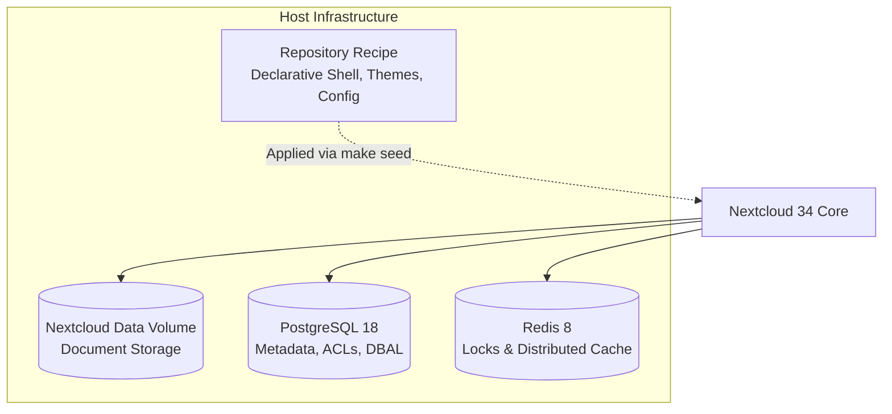
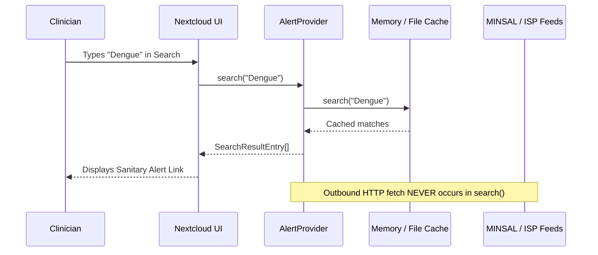
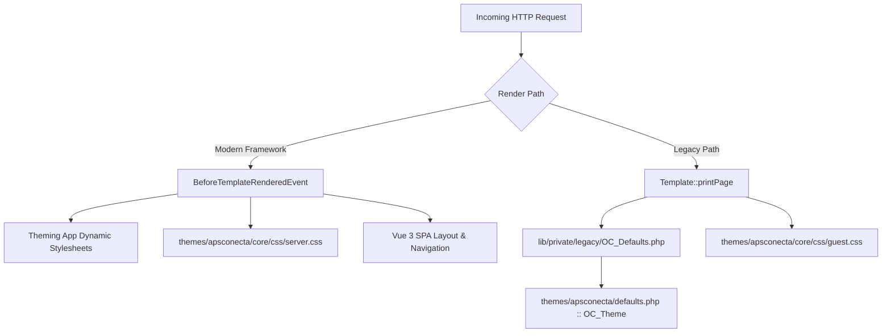

<link rel="stylesheet" href="style.css">
<style>
@import url('https://fonts.googleapis.com/css2?family=Fraunces:ital,opsz,wght@0,9..144,400..800;1,9..144,400..800&family=Nunito+Sans:ital,opsz,wght@0,6..12,400..800;1,6..12,400..800&display=swap');
:root {
  --aps-primary: #7f21fe;
  --aps-dark-violet: #5315a8;
  --aps-ink: #101828;
  --aps-muted: #485363;
  --aps-border: #e4e7ec;
  --aps-gold: #e06f00;
  --aps-dark-gold: #9a4c00;
  --aps-error: #ea003e;
  --aps-error-bg: #FFE7E7;
  --aps-card-bg: #ffffff;
  --aps-canvas-bg: #fcfaff;
  --aps-badge-bg: #f4ebff;
  --aps-badge-text: #5315a8;
}
body, .markdown-body {
  font-family: "Nunito Sans", -apple-system, BlinkMacSystemFont, "Segoe UI", Roboto, sans-serif !important;
  color: var(--aps-ink) !important;
  background-color: var(--aps-canvas-bg);
  line-height: 1.65;
}
h1, h2, h3, h4 { font-family: "Fraunces", Georgia, serif !important; letter-spacing: -0.015em; font-weight: 700; }
h1 { color: var(--aps-dark-violet) !important; border-bottom: 3px solid var(--aps-primary); padding-bottom: 0.35em; }
h2 { color: var(--aps-dark-violet) !important; border-bottom: 1px solid var(--aps-border); padding-bottom: 0.25em; margin-top: 1.6em; }
h3 { color: var(--aps-primary) !important; }
h4 { color: var(--aps-dark-gold) !important; }
a { color: var(--aps-primary) !important; font-weight: 600; text-decoration: none; }
a:hover { color: var(--aps-dark-violet) !important; text-decoration: underline; }
table { border-collapse: collapse; width: 100%; border: 1px solid var(--aps-border); margin: 1.4em 0; border-radius: 8px; overflow: hidden; background: #ffffff; }
th { background-color: var(--aps-dark-violet) !important; color: #ffffff !important; font-family: "Fraunces", serif !important; font-weight: 600; padding: 10px 14px; text-align: left; }
td { padding: 9px 14px; border-bottom: 1px solid var(--aps-border); color: var(--aps-ink); }
tr:nth-child(even) { background-color: #fbf9ff; }
blockquote { border-left: 4px solid var(--aps-primary) !important; background-color: #f8f4ff !important; color: var(--aps-muted) !important; padding: 0.8em 1.4em; border-radius: 0 8px 8px 0; }
code { font-family: ui-monospace, SFMono-Regular, Menlo, monospace !important; background-color: var(--aps-badge-bg); color: var(--aps-dark-violet); padding: 0.2em 0.45em; border-radius: 4px; border: 1px solid #d6bbfb; }
pre { background-color: var(--aps-ink) !important; color: #f9fafb !important; border-radius: 8px; padding: 1.1em 1.3em; border: 1px solid #344054; }
pre code { background: transparent !important; color: inherit !important; border: none !important; }
.aps-hero { background: linear-gradient(135deg, #5315a8 0%, #7f21fe 100%); color: #ffffff; border-radius: 12px; padding: 26px 32px; margin-bottom: 24px; box-shadow: 0 4px 14px rgba(83,21,168,0.22); }
.aps-hero h1 { color: #ffffff !important; border-bottom: 2px solid rgba(255,255,255,0.3); margin: 0 0 10px 0; padding: 0 0 8px 0; }
.aps-tag { display: inline-block; background: #e06f00; color: #ffffff; font-size: 0.78em; font-weight: 700; text-transform: uppercase; letter-spacing: 0.08em; padding: 3px 10px; border-radius: 20px; margin-bottom: 12px; }
.aps-meta { color: rgba(255,255,255,0.9); font-size: 0.95em; margin: 4px 0; }
</style>

<div class="aps-hero">
  <span class="aps-tag">Engineering Architecture & Development</span>
  <h1>APS Conecta Gestión — Developer Manual</h1>
  <p class="aps-meta"><strong>Architecture Invariants, Custom Applications & Quality Engineering</strong></p>
  <p class="aps-meta">Downstream Nextcloud 34 Fork | AGPL-3.0-or-later</p>
</div>

# APS Conecta Gestión — Developer Manual

> **Document Classification:** Engineering Reference & Developer Guide  
> **Platform Version:** Nextcloud 34.0.x / PHP 8.5 / PostgreSQL 18 / Redis 8  
> **Primary Audience:** Software Engineers, System Architects, App Developers, and Maintainers  
> **Target File:** `docs/manuals/DEVELOPER_MANUAL.md`  
> **Licensing:** AGPL-3.0-or-later ([ADR-0010](../adr/0010-agpl-across-the-org.md))  
> **Single Source of Truth (SSOT):** The repository (`docs/ARCHITECTURE.md`, `compose.yaml`, `provisioning/`) is authoritative for behavior.

---

## Master Table of Contents

- [1. Architecture Philosophy & Design Invariants](#1-architecture-philosophy--design-invariants)
  - [1.1 Vanilla Platform, Declarative Configuration-as-Code, No Core Fork (AD-1)](#11-vanilla-platform-declarative-configuration-as-code-no-core-fork-ad-1)
  - [1.2 Custom App Seam & API Boundary (AD-9)](#12-custom-app-seam--api-boundary-ad-9)
  - [1.3 App Taxonomy: Vendored, Own, and Lab Apps](#13-app-taxonomy-vendored-own-and-lab-apps)
  - [1.4 Data Ownership, Topology & Zero Patient Data Invariant](#14-data-ownership-topology--zero-patient-data-invariant)
- [2. Development Environment & Tooling](#2-development-environment--tooling)
  - [2.1 Docker Compose Architecture & Service Topology](#21-docker-compose-architecture--service-topology)
  - [2.2 Derived Dev Layer & Step-Debugging with Xdebug 3](#22-derived-dev-layer--step-debugging-with-xdebug-3)
  - [2.3 Host Permissions & UID Mapping (UID 33 vs Host GID)](#23-host-permissions--uid-mapping-uid-33-vs-host-gid)
  - [2.4 Developer Lifecycle: The Makefile Interface](#24-developer-lifecycle-the-makefile-interface)
- [3. Custom App Development in APS Conecta](#3-custom-app-development-in-aps-conecta)
  - [3.1 Nextcloud App Directory Layout & Manifest (`appinfo/info.xml`)](#31-nextcloud-app-directory-layout--manifest-appinfoinfoxml)
  - [3.2 Application Bootstrap & Registration (`Application.php`)](#32-application-bootstrap--registration-applicationphp)
  - [3.3 Routing Specification (`appinfo/routes.php`)](#33-routing-specification-appinforoutesphp)
  - [3.4 Controllers & Dependency Injection](#34-controllers--dependency-injection)
  - [3.5 Database Layer: Doctrine DBAL Migrations, Entities & Mappers](#35-database-layer-doctrine-dbal-migrations-entities--mappers)
  - [3.6 App Lifecycle & Repair Steps: The `EnsureSeedData` Rule](#36-app-lifecycle--repair-steps-the-ensureseeddata-rule)
  - [3.7 Unified Search Integration (`OCP\Search\IProvider`)](#37-unified-search-integration-ocpsearchiprovider)
  - [3.8 Background Jobs & Cron Scheduling (`OCP\BackgroundJob\TimedJob`)](#38-background-jobs--cron-scheduling-ocpbackgroundjobtimedjob)
  - [3.9 Headless CLI Integration via `occ` (`Symfony\Component\Console\Command\Command`)](#39-headless-cli-integration-via-occ-symfonycomponentconsolecommandcommand)
  - [3.10 Modern Frontend Stack: Vue 3, Vite, Webpack & `@nextcloud/vue`](#310-modern-frontend-stack-vue-3-vite-webpack--nextcloudvue)
- [4. Case Studies: The APS Conecta Custom Apps](#4-case-studies-the-aps-conecta-custom-apps)
  - [4.1 Case Study 1: `epidemiologia` (Public Alert Aggregator & Search Provider)](#41-case-study-1-epidemiologia-public-alert-aggregator--search-provider)
  - [4.2 Case Study 2: `farmacia` (Vademécum & Clinical Risk Evaluation)](#42-case-study-2-farmacia-vademécum--clinical-risk-evaluation)
  - [4.3 Case Study 3: `territorio` (Geospatial Mapping, Boundaries & PMTiles)](#43-case-study-3-territorio-geospatial-mapping-boundaries--pmtiles)
- [5. Server Theme & White-Label Customization](#5-server-theme--white-label-customization)
  - [5.1 Nextcloud Theming Engine Constraints & Specificity Hierarchy](#51-nextcloud-theming-engine-constraints--specificity-hierarchy)
  - [5.2 Color Tokens & Contrast Ledger](#52-color-tokens--contrast-ledger)
  - [5.3 The Dual Render Path: Framework-Rendered vs Legacy-Rendered](#53-the-dual-render-path-framework-rendered-vs-legacy-rendered)
  - [5.4 Legacy Render Path Branding: `OC_Theme` in `defaults.php` (ADR-0004)](#54-legacy-render-path-branding-oc_theme-in-defaultsphp-adr-0004)
  - [5.5 Webfont Pipeline & SVG Font Embedding (Fraunces & Nunito Sans)](#55-webfont-pipeline--svg-font-embedding-fraunces--nunito-sans)
  - [5.6 Header Bar Geometry & Public Link Scoping](#56-header-bar-geometry--public-link-scoping)
  - [5.7 Dynamic Establishment Token: `server.css` & `site.css`](#57-dynamic-establishment-token-servercss--sitecss)
  - [5.8 Single Page Application (SPA) Mount Stub Contract](#58-single-page-application-spa-mount-stub-contract)
- [6. Quality Assurance, Testing & Gate Enforcement](#6-quality-assurance-testing--gate-enforcement)
  - [6.1 Quality Gate Architecture](#61-quality-gate-hierarchy)
  - [6.2 Static Analysis Gate (`scripts/test.sh`)](#62-static-analysis-gate-scriptstestsh)
  - [6.3 Running Core Stack Smoke Gate (`scripts/smoke.sh`)](#63-running-core-stack-smoke-gate-scriptssmokesh)
  - [6.4 Office Backend Smoke Gate (`scripts/office-smoke.sh`)](#64-office-backend-smoke-gate-scriptsoffice-smokesh)
  - [6.5 End-to-End Acceptance Testing via Playwright & Vitest](#65-end-to-end-acceptance-testing-via-playwright--vitest)
- [7. Contribution & Coding Conventions](#7-contribution--coding-conventions)
  - [7.1 Downstream Fork Governance, Legal Licensing & AGPL-3.0 Compliance (ADR-0010)](#71-downstream-fork-governance-legal-licensing--agpl-30-compliance-adr-0010)
  - [7.2 The Bilingual Rule](#72-the-bilingual-rule)
  - [7.3 Architectural Principles: DRY, KISS, YAGNI, and SSOT](#73-architectural-principles-dry-kiss-yagni-and-ssot)
  - [7.4 Git Flow, Conventional Commits & Pull Request Gates](#74-git-flow-conventional-commits--pull-request-gates)

---

## 1. Architecture Philosophy & Design Invariants

APS Conecta Gestión provides Chilean Primary Healthcare (*Atención Primaria de Salud* — APS) establishments (CESFAM, CECOSF, PSR, COSAM, SAPU, SAR) with a sovereign, private operational collaboration intranet. It is engineered around strict architectural invariants designed to prevent vendor lock-in, enable deterministic deployments, and ensure seamless upstream platform upgrades.

### 1.1 Vanilla Platform, Declarative Configuration-as-Code, No Core Fork (AD-1)

The overarching architectural invariant of APS Conecta Gestión is **AD-1**:
> **Nextcloud 34 is an unmodified platform runtime.** The repository contains **no core fork, no patched core PHP scripts, and no modified upstream container layers**.

```
+-------------------------------------------------------------------------+
|                  Official Container Image (NC34-Apache)                 |
|                      (Unmodified Upstream Runtime)                      |
+------------------------------------+------------------------------------+
                                     |
               +---------------------+---------------------+
               | Public API Boundary | Bind-Mounted Recipe |
               v                     v                     v
      +-----------------+   +-----------------+   +-----------------+
      |  Custom Apps    |   |  Server Theme   |   | Declarative     |
      |  (OCP Public)   |   | (themes/apscon) |   | Seed (occ)      |
      +-----------------+   +-----------------+   +-----------------+
```

Every modification to system behavior, directory structure, access permissions, branding, and localization is applied declaratively through:
1. **Idempotent Provisioning Engine:** A sequenced numeric suite of shell scripts executed through the Nextcloud command-line interface (`occ`).
2. **Standard Server Theme Layer:** A bind-mounted server theme directory (`themes/apsconecta/`) registered via `occ config:system:set theme --value apsconecta`.
3. **Public Extension Seams:** Custom apps bind-mounted to `/var/www/html/custom_apps`.

The running instance is purely a **projection** of the repository's declarative recipe applied onto the official container image. A container can be destroyed, repulled, and recreated at any time without loss of architectural integrity.

### 1.2 Custom App Seam & API Boundary (AD-9)

In accordance with **AD-9**, custom applications developed within or deployed alongside APS Conecta Gestión maintain an isolated boundary:

> A custom app may depend on Nextcloud **only through `OCP\*` public APIs**. Never patch core, never reference private internal namespaces (`OC\*`), and Nextcloud core must never depend on a custom app.

#### Permitted vs. Prohibited API Surfaces

| Layer | Status | Description |
|---|---|---|
| `OCP\*` | **Mandatory** | The official Nextcloud Open Collaboration Platform public API (e.g., `OCP\AppFramework\Controller`, `OCP\IDBConnection`, `OCP\Search\IProvider`, `OCP\BackgroundJob\TimedJob`). |
| `OC\*` | **Strictly Forbidden** | Private Nextcloud core implementation classes. Calling methods under `OC\*` triggers immediate failure in architectural reviews and breaks compatibility across minor/major updates. |
| `Symfony\Component\*` | **Permitted for CLI** | Nextcloud exposes Symfony Console interfaces for CLI commands. Implementing `Symfony\Component\Console\Command\Command` directly is required over internal base classes. |
| Direct DB Mutation | **Strictly Forbidden** | App databases must be manipulated through Doctrine DBAL schema abstractions (`OCP\DB\ISchemaWrapper`) or QueryBuilders (`OCP\IDBConnection`), never raw untyped SQL targeting core tables (`oc_filecache`, `oc_users`). |

This boundary guarantees that Nextcloud major version upgrades (such as from NC33 to NC34, and onward to NC35) can be executed without breaking custom apps.

### 1.3 App Taxonomy: Vendored, Own, and Lab Apps

Every application loaded into `/var/www/html/custom_apps` falls into one of three strictly defined categories defined in `apps/README.md`, [ADR-0003](../adr/0003-this-stack-ships-a-custom-app.md), and [ADR-0005](../adr/0005-gestion-is-the-development-trunk.md):

```
apps/ (live-mounted to /var/www/html/custom_apps)
 ├── Vendored Apps     --> groupfolders, side_menu, eurooffice, calendar, contacts, spreed, desktop_workspace
 ├── Own Apps          --> epidemiologia, farmacia, territorio
 └── Lab Apps          --> intravox (ADR-0005; territorio was the last one out)
```

#### 1. Vendored Apps (Upstream Third-Party Apps)
- **Inventory:** `groupfolders`, `side_menu`, `eurooffice`, `calendar`, `contacts`, `spreed`, `desktop_workspace`.
- **Packaging:** Upstream tarballs are committed directly to the repository under `provisioning/apps/<id>/<id>-<version>.tar.gz`.
- **Provenance:** Every vendored app directory must contain a `VENDOR` file declaring exact provenance:
  ```ini
  name=groupfolders
  version=18.0.7
  url=https://github.com/nextcloud-releases/groupfolders/releases/download/v18.0.7/groupfolders-v18.0.7.tar.gz
  sha256=11d5f30fc0766324e930bfdcbf1e2e1e9bf434b92c4bbfb1a3297a7638ce8e93
  ```
- **Patch Engine:** Sequential patch files (`*.patch`) located inside `provisioning/apps/<id>/` are applied in alphabetical order by `provisioning/phases/12-apps.sh` immediately after unpacking.
- **App Store Policy:** **The App Store is completely disabled** in both `nextcloud` and `cron` containers (`appstoreenabled = 0`). A clean install never touches `apps.nextcloud.com` (#98, #163).
- **Integrity Assertion:** Upstream `appinfo/signature.json` files are automatically stripped from patched vendored apps by `12-apps.sh` so Nextcloud's integrity checker does not throw admin overview warnings (#71).

#### 2. Own Apps (Shipped Production Apps)
- **Inventory:** `epidemiologia`, `farmacia`, `territorio` — all three declared in `OWN_APPS` (`provisioning/phases/12-apps.sh`) and shipped as pre-built tarballs under `provisioning/apps/<id>/`, created from git release tags. Production clinic installations require no network access and no git tooling.
- **Lifecycle:** Developed in dedicated repositories under the `APS-Conecta` organization.
- **Development Mode:** On developer workstations, `apps/<id>/` is a live git clone. The helper function `ensure_own_app` inspects `apps/<id>/.git`; if present, it leaves the working directory untouched, preserving branch state and active edits.

#### 3. Lab Apps (Active R&D, Never in Releases)
- **Inventory:** `intravox` (ADR-0005; territorio was the last app to graduate out of this category).
- **Declaration:** Declared in `dev/lab-apps.sh`.
- **Constraint:** **Lab apps are strictly prohibited from release tags.** They exist exclusively as live working trees during research and development. The provisioning system executes them only if `apps/<id>/.git` is present on disk, ensuring clinic deployments bypass them completely.

### 1.4 Data Ownership, Topology & Zero Patient Data Invariant

Every datum in APS Conecta Gestión has exactly one owner:



- **Nextcloud Data Volume (`nextcloud_data`):** Holds physical files, generated previews, and document trees. Persisted in a named Docker volume; never tracked in git.
- **PostgreSQL 18 (`db`):** Authoritative store for user accounts, flat groups (`role-*`, `cat-*`, `prog-*`, `sector-*`), group folder ACL structures, entity tables, and the file cache.
- **Redis 8 (`redis`):** Ephemeral transactional memory, distributed memory cache, and file lock manager (`\OC\Memcache\Redis`).
- **The Repository (`gestion`):** Immutable, declarative desired-state recipe. Contains zero user data, zero clinic documents, and zero operational secrets.

> [!CAUTION]
> **Zero Patient Data Invariant:** APS Conecta Gestión is an administrative and operational collaboration intranet. **Under no circumstances may electronic health records (EHR), clinical records, patient identity attributes (RUN, names, medical histories), or triage clinical notes be committed, cached, or persisted within this stack.** Dev fixtures must be 100% synthetic.

---

## 2. Development Environment & Tooling

### 2.1 Docker Compose Architecture & Service Topology

The development environment runs as a self-contained Docker Compose stack consisting of five core services:

```mermaid
graph LR
    Dev[Developer Browser] -->|HTTP :8180| NC[nextcloud:34-apache]
    Dev -->|HTTP :9980| EO[eurooffice]
    Dev -->|HTTP :8084| TI[tiles PMTiles]
    NC -->|SQL :5432| DB[(postgres:18-alpine)]
    NC -->|RESP :6379| RD[(redis:8-alpine)]
    CR[cron scheduler] --> DB
    CR --> RD
    NC <-->|JWT| EO
    IDE[VS Code Debugger] <--|Xdebug :9003| NC
```

The core `compose.yaml` maintains absolute host portability:
- All paths are relative (`./apps`, `./themes`, `./tiles`).
- No VPS-specific networks, hostnames, or absolute `/srv/` paths exist.
- Service-to-service communication uses Docker internal DNS names (`http://nextcloud`, `http://eurooffice`, `db`, `redis`).
- Host-to-container debugging uses `host.docker.internal` via `extra_hosts: host.docker.internal:host-gateway`.

### 2.2 Derived Dev Layer & Step-Debugging with Xdebug 3

Step debugging is achieved without polluting the production image through a **derived development Dockerfile** (`Dockerfile.dev`) and Compose overlay (`compose.dev.yaml`), activated via `make up-dev`.

#### Derived Image: `Dockerfile.dev`
The dev image builds on demand, pinning the exact digest of the production base image:
```dockerfile
FROM nextcloud:34-apache@sha256:0c74fb931e7e5115c833b3cab8d1eb2a4894ff95cd5fa2e84124ac9d3e1fea09

RUN pecl install xdebug \
    && docker-php-ext-enable xdebug

COPY dev/xdebug.ini /usr/local/etc/php/conf.d/zz-xdebug.ini
```

#### Xdebug Configuration: `dev/xdebug.ini`
Configured specifically for on-demand trigger mode, avoiding performance penalties on ordinary web requests:
```ini
[xdebug]
xdebug.mode = debug
xdebug.start_with_request = trigger
xdebug.client_host = host.docker.internal
```

#### VS Code Configuration: `.vscode/launch.json`
To step-debug custom apps in VS Code, add the standard path mapping linking `/var/www/html/custom_apps` to `${workspaceFolder}/apps`:
```json
{
  "version": "0.2.0",
  "configurations": [
    {
      "name": "Listen for Xdebug (APS Conecta)",
      "type": "php",
      "request": "launch",
      "port": 9003,
      "pathMappings": {
        "/var/www/html/custom_apps": "${workspaceFolder}/apps"
      }
    }
  ]
}
```
*Tip:* To trigger a debug session, pass `XDEBUG_TRIGGER=1` in your query parameters, set an `XDEBUG_SESSION` cookie via browser extensions, or run CLI commands with `XDEBUG_TRIGGER=1 php occ ...`.

### 2.3 Host Permissions & UID Mapping (UID 33 vs Host GID)

A notorious friction point in Linux containerized web development is permission mismatch between the host developer user (e.g. UID 1000) and the Apache web server process inside the container (`www-data`, UID 33).

APS Conecta eliminates this without requiring host `sudo` commands through `make fix-mount-perms`:

```makefile
HOST_GID := $(shell id -g)

fix-mount-perms:
	@docker compose exec -T -u root nextcloud chown -R www-data:$(HOST_GID) /var/www/html/custom_apps /var/www/html/themes 2>/dev/null || true
	@docker compose exec -T -u root nextcloud chmod -R g+w /var/www/html/custom_apps /var/www/html/themes 2>/dev/null || true
```

1. The container's root user sets file ownership to `www-data:<HOST_GID>`.
2. Group-write permissions (`g+w`) are recursively granted.
3. Result: **Both** the container runtime (`www-data`) and the developer on the host (member of `HOST_GID`) have full read/write access to live-edited source code.

### 2.4 Developer Lifecycle: The Makefile Interface

All development and test operations are driven via the root `Makefile`:

```bash
make setup            # Generate .env with secure random credentials (mode 600)
make install          # Stand establishment up, or converge after site.sh edit / git pull
make up               # Start production stack with Euro-Office (--wait healthchecks)
make up-dev           # Build and launch dev stack with Xdebug enabled on port 9003
make fix-mount-perms  # Synchronize host/container read-write permissions
make seed             # Execute the 13-phase idempotent provisioning script
make seed-idempotent  # Validate that a second seed produces zero database writes
make test             # Run local quality gate (static analysis + health checks)
make smoke            # Execute core health assertions against running stack
make office-smoke     # Validate Euro-Office document server connectivity & branding
make divergence       # Detect resources live in Nextcloud not declared in repo
make images-check     # Verify if upstream base images have drifted past pins
make down             # Stop containers while preserving database and data volumes
```

---

## 3. Custom App Development in APS Conecta

Developing custom Nextcloud applications for APS Conecta requires mastering the Open Collaboration Platform (`OCP\*`) contracts. This section details the complete technical lifecycle of a Nextcloud 34 app.

### 3.1 Nextcloud App Directory Layout & Manifest (`appinfo/info.xml`)

Every app lives in `apps/<app_id>` and follows standard Nextcloud directory conventions:

```
apps/<app_id>/
 ├── appinfo/
 │    ├── info.xml            # App metadata, dependencies, navigation, hooks
 │    └── routes.php          # URL-to-Controller route mappings
 ├── lib/
 │    ├── AppInfo/
 │    │    └── Application.php# App bootstrap and dependency container registration
 │    ├── Command/            # Symfony Console CLI commands (occ)
 │    ├── Controller/         # HTTP Controllers (Page, API)
 │    ├── Db/                 # Doctrine DBAL Entities and QBMappers
 │    ├── Migration/          # Database schema migrations & repair steps
 │    ├── Search/             # Unified Search providers
 │    ├── BackgroundJob/      # Background cron jobs (TimedJob)
 │    └── Service/            # Business logic and domain services
 ├── src/                     # Modern Vue 3 / TypeScript source code
 ├── js/                      # Built production JavaScript bundles
 ├── css/                     # App-specific stylesheets
 ├── img/                     # Icons and raster assets (app.svg, app-dark.svg)
 ├── templates/               # Server-side PHP/HTML entrypoint templates
 ├── tests/                   # Vitest (JS) and PHPUnit (unit/integration) tests
 ├── package.json             # NPM package manifest
 └── composer.json            # PHP composer manifest (autowiring metadata)
```

#### The `appinfo/info.xml` Manifest
The `info.xml` file is Nextcloud's declarative contract for loading your app:

```xml
<?xml version="1.0" encoding="UTF-8"?>
<info xmlns:xsi="http://www.w3.org/2001/XMLSchema-instance" 
      xsi:noNamespaceSchemaLocation="https://apps.nextcloud.com/schema/apps/info.xsd">
    <id>farmacia</id>
    <name>Farmacia</name>
    <summary>Vademécum de medicamentos del CESFAM</summary>
    <description><![CDATA[El vademécum de medicamentos que el CESFAM receta y despacha.]]></description>
    <version>0.11.1</version>
    <licence>AGPL-3.0-or-later</licence>
    <author>Daniel Espinoza</author>
    <namespace>Farmacia</namespace>
    <category>tools</category>

    <dependencies>
        <php min-version="8.2" max-version="8.5"/>
        <nextcloud min-version="34" max-version="34"/>
    </dependencies>

    <navigations>
        <navigation>
            <name>Farmacia</name>
            <route>farmacia.page.index</route>
        </navigation>
    </navigations>

    <commands>
        <command>OCA\Farmacia\Command\Import</command>
    </commands>

    <repair-steps>
        <install>
            <step>OCA\Farmacia\Migration\EnsureSeedData</step>
        </install>
        <post-migration>
            <step>OCA\Farmacia\Migration\EnsureSeedData</step>
        </post-migration>
    </repair-steps>
</info>
```

### 3.2 Application Bootstrap & Registration (`Application.php`)

Nextcloud automatically instantiates your app's `Application` class upon boot. It must implement `OCP\AppFramework\Bootstrap\IBootstrap`:

```php
<?php

declare(strict_types=1);

namespace OCA\Farmacia\AppInfo;

use OCP\AppFramework\App;
use OCP\AppFramework\Bootstrap\IBootContext;
use OCP\AppFramework\Bootstrap\IBootstrap;
use OCP\AppFramework\Bootstrap\IRegistrationContext;

class Application extends App implements IBootstrap {
    public const APP_ID = 'farmacia';

    public function __construct(array $urlParams = []) {
        parent::__construct(self::APP_ID, $urlParams);
    }

    public function register(IRegistrationContext $context): void {
        // Services without custom dependencies are autowired automatically.
        // Nothing to register manually in this app; search providers are
        // registered in apps that implement global search (e.g. epidemiologia).
    }

    public function boot(IBootContext $context): void {
        // Executed on every request when the app is loaded. Keep lean!
    }
}
```

### 3.3 Routing Specification (`appinfo/routes.php`)

Routes map incoming HTTP method/URL combinations to specific Controller actions:

```php
<?php

declare(strict_types=1);

return [
    'routes' => [
        // Frontend SPA container
        ['name' => 'page#index', 'url' => '/', 'verb' => 'GET'],

        // Internal CRUD routes (addressed by English identifiers)
        ['name' => 'medication#create', 'url' => '/medications', 'verb' => 'POST'],
        ['name' => 'medication#update', 'url' => '/medications/{id}', 'verb' => 'PUT'],
        ['name' => 'medication#retired', 'url' => '/medications/retired', 'verb' => 'GET'],
        ['name' => 'medication#destroy', 'url' => '/medications/{id}', 'verb' => 'DELETE'],
        ['name' => 'medication#restore', 'url' => '/medications/{id}/restore', 'verb' => 'POST'],

        // Vocabulary endpoints
        ['name' => 'category#create', 'url' => '/categories', 'verb' => 'POST'],
        ['name' => 'category#update', 'url' => '/categories/{slug}', 'verb' => 'PUT'],
        ['name' => 'category#destroy', 'url' => '/categories/{slug}', 'verb' => 'DELETE'],
        ['name' => 'abastece#create', 'url' => '/abastece', 'verb' => 'POST'],

        // Staged spreadsheet import/export
        ['name' => 'import#upload', 'url' => '/import', 'verb' => 'POST'],
        ['name' => 'import#batches', 'url' => '/import/batches', 'verb' => 'GET'],
        ['name' => 'import#review', 'url' => '/import/{id}', 'verb' => 'GET'],
        ['name' => 'import#apply', 'url' => '/import/{id}/apply', 'verb' => 'POST'],
        ['name' => 'import#discard', 'url' => '/import/{id}/discard', 'verb' => 'POST'],
        ['name' => 'import#revert', 'url' => '/import/{id}/revert', 'verb' => 'POST'],
        ['name' => 'export#plain', 'url' => '/export', 'verb' => 'GET'],
    ],
];
```

The internal routes map to `<controller>#<method>`, transforming `medication#create` into `OCA\Farmacia\Controller\MedicationController->create()`.

> [!NOTE]
> **Internal Routes vs. External OCS API Surface:**  
> The internal routes above serve the Vue frontend. External integrations (such as municipal health department synchronizations) do **not** live in `routes.php`. They are exposed via `OCP\AppFramework\OCSController` subclasses decorated with PHP 8 attributes (e.g., `#[ApiRoute(verb: 'GET', url: '/api/v1/medicamentos')]`), exposed under the standard Nextcloud endpoint `/ocs/v2.php/apps/farmacia/api/v1/medicamentos`.

### 3.4 Controllers & Dependency Injection

Nextcloud controllers extend `OCP\AppFramework\Controller`. Parameters from URL paths, query strings, or JSON bodies are automatically injected into controller method parameters matching variable names.

```php
<?php

declare(strict_types=1);

namespace OCA\Farmacia\Controller;

use OCA\Farmacia\AppInfo\Application;
use OCA\Farmacia\Exception\InvalidMedicationException;
use OCA\Farmacia\Service\MedicationService;
use OCP\AppFramework\Controller;
use OCP\AppFramework\Db\DoesNotExistException;
use OCP\AppFramework\Http;
use OCP\AppFramework\Http\Attribute\NoAdminRequired;
use OCP\AppFramework\Http\Attribute\NoCSRFRequired;
use OCP\AppFramework\Http\JSONResponse;
use OCP\IRequest;

class MedicationController extends Controller {
    public function __construct(
        IRequest $request,
        private MedicationService $medications,
    ) {
        parent::__construct(Application::APP_ID, $request);
    }

    /**
     * By default, controller endpoints require Nextcloud Admin privileges.
     * Use #[NoAdminRequired] to allow standard authenticated staff members.
     */
    #[NoAdminRequired]
    public function update(int $id): JSONResponse {
        try {
            $params = $this->request->getParams();
            $result = $this->medications->update($id, $params);
            return new JSONResponse($result, Http::STATUS_OK);
        } catch (InvalidMedicationException $e) {
            return new JSONResponse(['message' => $e->getMessage()], Http::STATUS_UNPROCESSABLE_ENTITY);
        } catch (DoesNotExistException) {
            return new JSONResponse(['message' => 'Medication not found'], Http::STATUS_NOT_FOUND);
        }
    }
}
```

#### Common Controller Annotations & Attributes
- `#[NoAdminRequired]`: Permits regular authenticated users to execute the endpoint.
- `#[PublicPage]`: Bypasses authentication check entirely (for public tokens or webhook callbacks).
- `#[NoCSRFRequired]`: Disables CSRF token validation (recommended only for stateless webhook receivers).

### 3.5 Database Layer: Doctrine DBAL Migrations, Entities & Mappers

Nextcloud provides an object-relational mapping abstraction built upon Doctrine DBAL.

#### 1. Schema Migrations (`lib/Migration/`)
Database tables are declared using `OCP\Migration\SimpleMigrationStep` and `OCP\DB\ISchemaWrapper`.

```php
<?php

declare(strict_types=1);

namespace OCA\Farmacia\Migration;

use Closure;
use OCP\DB\ISchemaWrapper;
use OCP\DB\Types;
use OCP\Migration\IOutput;
use OCP\Migration\SimpleMigrationStep;

class Version000100Date20260917000000 extends SimpleMigrationStep {
    public function changeSchema(IOutput $output, Closure $schemaClosure, array $options): ?ISchemaWrapper {
        /** @var ISchemaWrapper $schema */
        $schema = $schemaClosure();

        if (!$schema->hasTable('farmacia_medication')) {
            $table = $schema->createTable('farmacia_medication');
            $table->addColumn('id', Types::BIGINT, ['autoincrement' => true, 'notnull' => true]);
            $table->addColumn('codigo', Types::STRING, ['notnull' => true, 'length' => 128]);
            $table->addColumn('producto', Types::STRING, ['notnull' => true, 'length' => 255]);
            $table->addColumn('farmaco', Types::STRING, ['notnull' => false, 'length' => 255]);
            $table->addColumn('riesgo_colinergico_am', Types::BOOLEAN, ['notnull' => true, 'default' => false]);
            $table->addColumn('fda_embarazo', Types::STRING, ['notnull' => false, 'length' => 1]);
            $table->addColumn('category_id', Types::BIGINT, ['notnull' => true]);
            $table->addColumn('retired', Types::BOOLEAN, ['notnull' => true, 'default' => false]);
            $table->addColumn('updated_at', Types::DATETIME, ['notnull' => true]);

            $table->setPrimaryKey(['id']);
            $table->addUniqueIndex(['codigo'], 'farm_med_codigo_idx');
            $table->addIndex(['category_id'], 'farm_med_cat_idx');
        }

        return $schema;
    }
}
```

> [!IMPORTANT]
> **No Foreign Keys Invariant:** Cross-reference columns are created as plain `BIGINT` with standard indexes. Foreign key constraints are deliberately avoided to maintain compatibility across PostgreSQL, MariaDB, and SQLite. Referential integrity is strictly enforced within domain Service classes.

#### 2. Entity Definition (`lib/Db/Entity.php`)
Entities extend `OCP\AppFramework\Db\Entity`:

```php
<?php

declare(strict_types=1);

namespace OCA\Farmacia\Db;

use OCP\AppFramework\Db\Entity;

/**
 * @method string getCodigo()
 * @method void setCodigo(string $codigo)
 * @method string getProducto()
 * @method void setProducto(string $producto)
 * @method bool getRetired()
 * @method void setRetired(bool $retired)
 * @method ?\DateTime getUpdatedAt()
 * @method void setUpdatedAt(\DateTime $updatedAt)
 */
class Medication extends Entity {
    protected $codigo = '';
    protected $producto = '';
    protected $farmaco = null;
    protected $riesgoColinergicoAm = false;
    protected $fdaEmbarazo = null;
    protected $categoryId = 0;
    protected $retired = false;
    protected $updatedAt = null;

    public function __construct() {
        $this->addType('retired', 'boolean');
        $this->addType('riesgoColinergicoAm', 'boolean');
        $this->addType('categoryId', 'integer');
        $this->addType('updatedAt', 'datetime');
    }
}
```

#### 3. Database Mapper (`lib/Db/QBMapper.php`)
Mappers extend `OCP\AppFramework\Db\QBMapper`:

```php
<?php

declare(strict_types=1);

namespace OCA\Farmacia\Db;

use BadFunctionCallException;
use OCP\AppFramework\Db\Entity;
use OCP\AppFramework\Db\QBMapper;
use OCP\IDBConnection;

/** @template-extends QBMapper<Medication> */
class MedicationMapper extends QBMapper {
    public function __construct(IDBConnection $db) {
        parent::__construct($db, 'farmacia_medication', Medication::class);
    }

    /**
     * Soft-delete invariant: Medications are never hard-deleted.
     */
    public function delete(Entity $entity): Entity {
        throw new BadFunctionCallException('Medications must be retired, not deleted.');
    }

    public function findByCodigo(string $codigo): Medication {
        $qb = $this->db->getQueryBuilder();
        $qb->select('*')
           ->from($this->getTableName())
           ->where($qb->expr()->eq('codigo', $qb->createNamedParameter($codigo)));

        return $this->findEntity($qb);
    }
}
```

### 3.6 App Lifecycle & Repair Steps: The `EnsureSeedData` Rule

In standard Nextcloud documentation, initial data seeding is often suggested inside migration lifecycle hooks (`postSchemaChange`).

> [!WARNING]
> **The `postSchemaChange` Trap:** `MigrationService::executeStep()` in Nextcloud core skips both `preSchemaChange` and `postSchemaChange` when invoked with the `$schemaOnly` flag — **which is the exact flag used by `occ app:enable` on a fresh install**. If initial data (such as default categories or initial taxonomies) is placed in `postSchemaChange`, a fresh install will create empty tables and fail silently!

#### The APS Conecta Solution: `IRepairStep`
Initial data must be populated via an `IRepairStep` registered in `appinfo/info.xml` under both `<install>` and `<post-migration>`:

```xml
<repair-steps>
    <install>
        <step>OCA\Farmacia\Migration\EnsureSeedData</step>
    </install>
    <post-migration>
        <step>OCA\Farmacia\Migration\EnsureSeedData</step>
    </post-migration>
</repair-steps>
```

The repair step checks whether data exists before writing, making it completely idempotent:

```php
<?php

declare(strict_types=1);

namespace OCA\Farmacia\Migration;

use OCP\IDBConnection;
use OCP\Migration\IOutput;
use OCP\Migration\IRepairStep;

class EnsureSeedData implements IRepairStep {
    public function __construct(private IDBConnection $db) {}

    public function getName(): string {
        return 'Farmacia: Ensure therapeutic categories exist';
    }

    public function run(IOutput $output): void {
        if (!$this->db->tableExists('farmacia_category') || $this->hasRows('farmacia_category')) {
            return;
        }

        foreach (self::CATEGORIES as $slug => $label) {
            $qb = $this->db->getQueryBuilder();
            $qb->insert('farmacia_category')->values([
                'slug' => $qb->createNamedParameter($slug),
                'label' => $qb->createNamedParameter($label),
            ])->executeStatement();
        }

        $output->info('Seeded default therapeutic categories.');
    }

    private function hasRows(string $table): bool {
        $qb = $this->db->getQueryBuilder();
        $qb->select($qb->func()->count('*'))->from($table);
        $result = $qb->executeQuery();
        $count = (int)$result->fetchOne();
        $result->closeCursor();

        return $count > 0;
    }
}
```

### 3.7 Unified Search Integration (`OCP\Search\IProvider`)

Unified Search allows custom apps to expose entities directly in Nextcloud's global search modal (`Ctrl+K`).

```php
<?php

declare(strict_types=1);

namespace OCA\Epidemiologia\Search;

use OCA\Epidemiologia\AppInfo\Application;
use OCA\Epidemiologia\Service\Sources;
use OCP\IL10N;
use OCP\IUser;
use OCP\Search\IProvider;
use OCP\Search\ISearchQuery;
use OCP\Search\SearchResult;
use OCP\Search\SearchResultEntry;

class AlertProvider implements IProvider {
    public function __construct(
        private Sources $sources,
        private IL10N $l,
    ) {}

    public function getId(): string {
        return Application::APP_ID . '-alerts';
    }

    public function getName(): string {
        return $this->l->t('Alertas epidemiológicas');
    }

    public function getOrder(string $route, array $routeParameters): int {
        return str_starts_with($route, Application::APP_ID . '.') ? -1 : 55;
    }

    public function search(IUser $user, ISearchQuery $query): SearchResult {
        // PERFORMANCE INVARIANT: Must read local DB or memory cache. Never initiate outbound HTTP calls!
        $matches = array_slice($this->sources->search($query->getTerm()), 0, $query->getLimit());

        $entries = array_map(
            fn (array $hit): SearchResultEntry => new SearchResultEntry(
                '',
                $hit['item']['title'],
                $this->sources->kind($hit['source'], $this->l) . ' · ' . ($hit['item']['date'] ?? ''),
                $hit['item']['url'],
                'icon-external',
            ),
            $matches,
        );

        return SearchResult::complete($this->getName(), $entries);
    }
}
```

### 3.8 Background Jobs & Cron Scheduling (`OCP\BackgroundJob\TimedJob`)

Nextcloud provides two background job types:
- `OCP\BackgroundJob\QueuedJob`: Run once upon event trigger.
- `OCP\BackgroundJob\TimedJob`: Executes periodically based on a defined time interval.

In APS Conecta, background jobs are scheduled strictly via system cron (`backgroundjobs_mode = cron`).

```php
<?php

declare(strict_types=1);

namespace OCA\Epidemiologia\BackgroundJob;

use OCP\AppFramework\Utility\ITimeFactory;
use OCP\BackgroundJob\TimedJob;

class ProbeJob extends TimedJob {
    /**
     * Notification backoff schedule (in days) to prevent notification fatigue
     */
    private const NOTIFY_AT = [2, 7, 30];

    public function __construct(ITimeFactory $time) {
        parent::__construct($time);

        // Run once every 24 hours
        $this->setInterval(24 * 3600);
        $this->setTimeSensitivity(self::TIME_INSENSITIVE);
    }

    #[\Override]
    protected function run($argument): void {
        // Probe external endpoints, check digests, emit alerts if failing
    }
}
```

Register background jobs in `appinfo/info.xml`:
```xml
<background-jobs>
    <job>OCA\Epidemiologia\BackgroundJob\ProbeJob</job>
</background-jobs>
```

### 3.9 Headless CLI Integration via `occ` (`Symfony\Component\Console\Command\Command`)

CLI commands allow headless administration, data ingestion, and batch operations via `docker compose exec nextcloud php occ ...`.

```php
<?php

declare(strict_types=1);

namespace OCA\Farmacia\Command;

use OCA\Farmacia\Service\ImportService;
use Symfony\Component\Console\Command\Command;
use Symfony\Component\Console\Input\InputArgument;
use Symfony\Component\Console\Input\InputInterface;
use Symfony\Component\Console\Output\OutputInterface;

class Import extends Command {
    public function __construct(
        private ImportService $import,
        private ApplyService $apply,
    ) {
        parent::__construct();
    }

    protected function configure(): void {
        $this->setName('farmacia:import')
             ->setDescription('Etapa una planilla CSV del vademécum para revisión')
             ->addArgument('archivo', InputArgument::REQUIRED, 'Ruta al archivo .csv')
             ->addOption('actor', null, InputOption::VALUE_REQUIRED, 'Quién ejecuta la importación', 'occ')
             ->addOption('apply', null, InputOption::VALUE_NONE, 'Aplicar el lote inmediatamente después de revisarlo');
    }

    protected function execute(InputInterface $input, OutputInterface $output): int {
        $path = (string)$input->getArgument('archivo');
        if (!is_readable($path)) {
            $output->writeln("<error>No se puede leer {$path}</error>");
            return Command::INVALID;
        }

        try {
            $review = $this->import->stage(
                (string)file_get_contents($path),
                basename($path),
                (string)$input->getOption('actor'),
            );
        } catch (InvalidImportException $e) {
            $output->writeln('<error>' . $e->getMessage() . '</error>');
            return Command::FAILURE;
        }

        $batch = $review['batch'];
        $output->writeln(sprintf('Lote #%d en revisión (%d por crear, %d por actualizar)', $batch['id'], $batch['created'], $batch['updated']));

        if (!$input->getOption('apply')) {
            $output->writeln('Revise el lote en Farmacia: Importar planilla.');
            return Command::SUCCESS;
        }

        $this->apply->apply((int)$batch['id']);
        $output->writeln(sprintf('Lote #%d aplicado exitosamente.', $batch['id']));
        return Command::SUCCESS;
    }
}
```

Register commands in `appinfo/info.xml`:
```xml
<commands>
    <command>OCA\Farmacia\Command\Import</command>
</commands>
```

### 3.10 Modern Frontend Stack: Vue 3, Vite, Webpack & `@nextcloud/vue`

Custom apps in APS Conecta utilize modern Single Page Application (SPA) architecture engineered in **100% standard modern JavaScript (ES6+)** without TypeScript compilation overhead.

#### The Mounting Template: `templates/index.php`
Every custom app mounts onto Nextcloud through a standard server-side template `templates/index.php` that implements the universal loading stub contract:

```php
<?php
declare(strict_types=1);
/** The SPA host: everything renders inside this one mount point. */
?>
<div id="farmacia">
    <!-- aps-mount-loading stub: Vue replaces mount children on boot -->
    <div class="aps-mount-loading" role="status" aria-live="polite">Cargando…</div>
    <noscript><p class="aps-mount-noscript">Esta aplicación necesita JavaScript activado.</p></noscript>
</div>
```

*Mount Point IDs:* `#farmacia`, `#territorio`, `#epidemiologia` (never with `-app` suffixes).

#### Build Configuration: Vite vs Webpack
Apps like `epidemiologia` use **Vite** with `@nextcloud/vite-config`:
```javascript
import { createAppConfig } from '@nextcloud/vite-config'

export default createAppConfig({
    main: 'src/main.js',
})
```

Apps like `farmacia` and `territorio` use **Webpack 5** with `@nextcloud/webpack-vue-config`:
```javascript
const path = require('path')
const { createConfig } = require('@nextcloud/webpack-vue-config')

module.exports = createConfig({
    entry: {
        main: path.resolve(__dirname, 'src', 'main.js'),
    },
})
```

#### Shared Component Library: `@nextcloud/vue`
APS Conecta apps leverage the official `@nextcloud/vue` library to match Nextcloud's native look and feel:
```vue
<template>
  <NcContent app-name="farmacia">
    <NcAppNavigation>
      <NcAppNavigationItem :title="t('farmacia', 'Arsenal')" active />
    </NcAppNavigation>
    <NcAppContent>
      <div class="farmacia-container">
        <h1>{{ t('farmacia', 'Vademécum Farmacológico') }}</h1>
      </div>
    </NcAppContent>
  </NcContent>
</template>

<script setup>
import { NcContent, NcAppNavigation, NcAppNavigationItem, NcAppContent } from '@nextcloud/vue'
import { translate as t } from '@nextcloud/l10n'
</script>
```

---

## 4. Case Studies: The APS Conecta Custom Apps

### 4.1 Case Study 1: `epidemiologia` (Public Alert Aggregator & Search Provider)

- **App ID:** `epidemiologia`
- **Role:** Aggregates real-time epidemiological alerts from the Chilean Ministry of Health (MINSAL) and Institute of Public Health (ISP).
- **Architectural Principles:**
  - **Zero Patient Data:** Only aggregates public sanitary alerts, respiratory virus bulletins, and surveillance links.
  - **Stateless Read Path:** Lazy HTTP ingestion with in-memory caching. Background `ProbeJob` verifies upstream feed availability.
  - **Unified Search:** Implements `AlertProvider` so clinicians typing alert terms (e.g. *"Dengue"*, *"Paracetamol"*) in the Nextcloud search box find official notices instantly.



### 4.2 Case Study 2: `farmacia` (Vademécum & Clinical Risk Evaluation)

- **App ID:** `farmacia`
- **Role:** Authoritative drug dictionary (*arsenal farmacológico*) with real-time clinical risk decision support.
- **Data Model:**
  - `farmacia_medication`: Active ingredient (*fármaco*), commercial name (*producto*), concentration (*mg*), presentation (*forma farmacéutica*), category relation.
  - Clinical risk fields:
    - `fda_embarazo`: FDA Pregnancy categories (A, B, C, D, X).
    - `ajuste_renal`: Renal adjustment dosage guidance based on creatinine clearance.
    - `riesgo_colinergico_am`: Boolean risk flag for anticholinergic cognitive impairment in elderly patients.
  - Child tables: GES coverage tags, supply channels (*abastece*), and dispensing restrictions.
- **Batch Processing:** Headless `occ farmacia:import <file.csv>` command and in-browser drag-and-drop review dialog share the exact same `ImportService` validation logic.

### 4.3 Case Study 3: `territorio` (Geospatial Mapping, Boundaries & PMTiles)

- **App ID:** `territorio` (Lab App)
- **Role:** GIS spatial jurisdiction and epidemiological mapping tool for primary care territories.
- **Geographic Hierarchy:**
  ```
  Comuna (Chilean Municipality - CUT 5-digit code)
    └── Unidad Vecinal (Official Neighborhood Unit)
          └── Sector de Salud (CESFAM Health Sector)
                └── Feature / Organization (Schools, Clinics, Community Centers)
  ```
- **Spatial Processing without PostGIS:**
  To avoid heavy database extensions like PostGIS or external C libraries, `territorio` implements ray casting in pure PHP (`PointInPolygon`):
  ```php
  public static function contains(array $rings, float $lon, float $lat): bool {
      // Ray-casting algorithm in pure PHP
      // 1e-9 degree on-the-line tolerance
  }
  ```
- **Basemap Delivery via PMTiles:**
  Uses a dedicated, lightweight Nginx static container serving a single `chile.pmtiles` archive (~1 GB). The browser reads tile ranges via HTTP `Range` headers using `protomaps-leaflet`, consuming only 0.5–1 MB per screenful with zero external API dependencies.

---

## 5. Server Theme & White-Label Customization

Nextcloud's visual identity in APS Conecta is completely customized to provide a clean, dignified primary healthcare interface.

```
themes/apsconecta/
 ├── defaults.php            # OC_Theme legacy render path override
 ├── core/
 │    ├── css/
 │    │    ├── server.css    # Core theme stylesheet (fonts, headers, buttons)
 │    │    ├── guest.css     # Unauthenticated & legacy fallback styles
 │    │    └── site.css      # Generated per-install establishment variables
 │    ├── fonts/
 │    │    ├── Fraunces.woff2
 │    │    ├── Fraunces-Italic.woff2
 │    │    ├── NunitoSans.woff2
 │    │    └── NunitoSans-Italic.woff2
 │    └── img/
 │         ├── favicon.svg
 │         ├── background.svg
 │         └── logo/
```

### 5.1 Nextcloud Theming Engine Constraints & Specificity Hierarchy

Customizing Nextcloud CSS requires understanding how the core theming engine injects variables.

> [!CAUTION]
> **The `:root` Specificity Trap:** Nextcloud declares its CSS variables on `body[data-theme-light]`. A server theme's `server.css` stylesheet is loaded **before** the dynamic theming stylesheet. Therefore, custom properties declared inside `:root` in `server.css` are completely overwritten by Nextcloud's defaults. Measured on NC 34: of 30 variables declared in `:root`, only 7 landed, and only because they matched upstream defaults.

#### The Invariant Rules for Theming CSS:
1. **Never declare custom properties in `:root` in `server.css`:** Custom variables declared on `:root` are overwritten by `body[data-theme-light]`.
2. **Element Selectors Win:** Direct element selectors (`h1`, `a#nextcloud`, `.button-vue`, `:focus-visible`) override core CSS rules without requiring specificity hacks.
3. **Use `!important` on Body-Scoped Variables:** To override core system variables (such as `--font-face`), scope them to `body` with `!important`:
   ```css
   body {
       --font-face: "Nunito Sans", -apple-system, BlinkMacSystemFont, "Segoe UI", Roboto, sans-serif !important;
   }
   ```
4. **The `guest.css` Asymmetric Exception:** `themes/apsconecta/core/css/guest.css` deliberately declares variables on `:root` without `!important`. On legacy error screens (Section 5.3), dynamic theming sheets are absent, so `guest.css` appends after `default.css` and wins. On `/login`, dynamic sheets load later and override it. This asymmetry keeps legacy styling self-limiting without contaminating modern screens.

### 5.2 Color Tokens & Contrast Ledger

The color tokens adhere strictly to WCAG AA legibility criteria across all clinical and administrative screens:

| Token | Hex | Contrast Ratio (White) | WCAG AA Status | Design Role & Permitted Scope |
|---|---|---|---|---|
| **Primary Violet** | `#7f21fe` | 5.57:1 | Pass (AA) | Buttons, checkboxes, active tabs, folder badges (`primary_color`). |
| **Dark Violet** | `#5315a8` | ~8.00:1 | Pass (AAA) | Headings, background backdrop, drawer chrome (`background_color`). |
| **Error Pink** | `#ea003e` | 4.33:1 | Large Text / UI | Alert borders, badges, large warnings (≥19px bold). Not for body text. |
| **Error Tint** | `#FFE7E7` | N/A | N/A | Background tint for error callouts (`--color-error`). Background only. |
| **Brand Gold** | `#e06f00` | 3.07:1 | Fail (Small) / Pass (Large) | Fills, icons, large text (≥24px or ≥19px bold). Fails AA on small text. |
| **Dark Gold** | `#9a4c00` | ≥4.50:1 | Pass (AA) | High-visibility alerts and status text on white backgrounds. |
| **Ink** | `#101828` | ~16.00:1 | Pass (AAA) | Primary interface body text, data tables, and clinical forms. |
| **Muted** | `#485363` | ~7.00:1 | Pass (AA) | Secondary text, file metadata, timestamps, and subtle labels. |

#### Color Derivation Contracts:
- **`--color-error` / `--color-success` are Backgrounds:** Nextcloud 34 utilizes these variables strictly for container backgrounds (`#FFE7E7`), not foreground text. For text colors, use `--color-text-error` and `--color-text-success`.
- **Background Color Inversion Contract:** Nextcloud automatically derives text contrast from `background_color` (`CommonThemeTrait.php:82-83`):
  ```php
  '--color-background-plain-text' => $this->util->invertTextColor($backgroundColor) ? '#000000' : '#ffffff';
  '--background-image-invert-if-bright' => $this->util->invertTextColor($backgroundColor) ? 'yes' : 'no';
  ```
  `background_color` is configured to Dark Violet (`#5315a8`) to match `background.svg`, ensuring the system computes crisp white text (`#ffffff`) and avoids black icon inversion over dark canvas regions.
- **High Contrast Mode Support:** Setting `enforce_theme=light` eliminates Nextcloud's built-in high contrast and dyslexia theme providers from `ThemesService`. Consequently, the `@media (prefers-contrast: more)` block in `server.css` acts as the platform's load-bearing accessibility layer.

### 5.3 The Dual Render Path: Framework-Rendered vs Legacy-Rendered

Nextcloud screens render through two completely separate technical paths:



1. **Framework-Rendered Screens:** Standard authenticated pages, Files, Dashboard, and SPA apps. They dispatch `BeforeTemplateRenderedEvent`, which injects `themes/apsconecta/core/css/server.css` and dynamic CSS variables from the Theming app.
2. **Legacy-Rendered Screens:** Screens rendered through `Template::printPage()`. In Nextcloud 34, there are exactly **seven call sites in two files** (`lib/base.php` and `TemplateManager.php`), covering:
   - Maintenance mode
   - Server setup screens
   - Major version upgrade screens
   - HTTP 429 rate limit screens
   - Fatal server exception error screens
   - Untrusted domain error screens

### 5.4 Legacy Render Path Branding: `OC_Theme` in `defaults.php` (ADR-0004)

On legacy screens, `ThemingDefaults` is bypassed and Nextcloud falls back to hardcoded strings in `OC_Defaults`. To prevent "Nextcloud" branding leaks during outages or upgrades, [ADR-0004](../adr/0004-branding-the-legacy-render-path.md) provides `themes/apsconecta/defaults.php`:

```php
<?php

declare(strict_types=1);

class OC_Theme {
    public function getName(): string {
        return 'APS Conecta Gestión';
    }

    public function getTitle(): string {
        return 'APS Conecta Gestión';
    }

    public function getEntity(): string {
        return 'APS Conecta Gestión';
    }

    public function getProductName(): string {
        return 'APS Conecta Gestión';
    }

    public function getSlogan(?string $lang = null): string {
        return 'La salud primaria que compartimos es la que mejora';
    }

    public function getBaseUrl(): string {
        return 'https://apsconecta.cl';
    }

    public function getColorPrimary(): string {
        return '#7f21fe';
    }

    public function getColorBackground(): string {
        return '#5315a8';
    }
}
```

*Operational Note:* `defaults.php` is cached by PHP Zend OPcache. Edits require restarting the `nextcloud` container (`docker compose restart nextcloud`).

### 5.5 Webfont Pipeline & SVG Font Embedding (Fraunces & Nunito Sans)

APS Conecta mandates zero external font egress. All fonts are self-hosted `.woff2` files located in `themes/apsconecta/core/fonts/`:

- **Fraunces (Variable Serif, Optical Size 9–144, Weights 400–800):** Headings (`h1`, `h2`, `h3`, `.app-name`, `.header-appname`).
- **Nunito Sans (Variable Sans-Serif, Weights 400–800):** System UI, body text, form controls, tables, and buttons.

```css
@font-face {
  font-family: "Fraunces";
  font-style: normal;
  font-weight: 400 800;
  font-display: swap;
  src: url("/themes/apsconecta/core/fonts/Fraunces.woff2") format("woff2");
}

@font-face {
  font-family: "Nunito Sans";
  font-style: normal;
  font-weight: 400 800;
  font-display: swap;
  src: url("/themes/apsconecta/core/fonts/NunitoSans.woff2") format("woff2");
}
```

#### SVG Font Embedding Pipeline (`tools/embed-fonts.py`)
SVGs loaded via `` tags execute in an isolated XML document context that cannot access external `@font-face` rules declared in `server.css` (Issue B-011). To prevent browser fallback to Georgia or Times, `themes/apsconecta/tools/embed-fonts.py` extracts a glyph subset of Fraunces and Nunito Sans, encodes it into base64 WOFF2 data URIs, and embeds the `<style>` block directly into `logo.svg` and `logo-header.svg`.

### 5.6 Header Bar Geometry & Public Link Scoping

The header bar replaces Nextcloud's stock header with a compact three-slot clinical navigation layout (`themes/apsconecta/core/css/server.css:115-165`):
- **Slot Allocation & Optical Geometry:**
  - **Brand Mark Slot:** `logo-mark.svg` rendered at 34×30px. `#header a#nextcloud` reserves **68px** `padding-inline-start` (with `gap: 4px`), and `.logo` is narrowed to **46px** width (from core's 62px). This creates identical 24.5px optical ink-to-ink spacing on both sides of the mark.
  - **Home Navigation Slot:** `core/img/home.svg` rendered at 19px within a 36px interactive button slot (`::before`, border-radius 8px).
  - **Clinic Name Slot:** Dedicated text slot rendered via `::after` with 12px horizontal padding displaying `--aps-clinic`.
- **Target Hit-Testing (`pointer-events`):** `#header a#nextcloud` sets `pointer-events: none`, while the home icon `::before` sets `pointer-events: auto; cursor: pointer`. This ensures clicks hit only the home button, preventing accidental navigation when clicking the clinic name or logo. Keyboard accessibility is preserved because `pointer-events` does not affect keyboard focus (`Tab` + `Enter`).
- **Responsive Breakpoint (601px):** Above 601px, the home icon and clinic name are visible. Below 601px, the layout collapses to preserve horizontal space.
- **Scoping to `a#nextcloud`:** Rules must strictly target `a#nextcloud` rather than `#nextcloud`. The public file share interface reuses `#nextcloud` on a `<div>` element; unscoped rules inadvertently apply padding and home icon geometry to public links.

### 5.7 Dynamic Establishment Token: `server.css` & `site.css`

`server.css` begins with an import of `site.css`:
```css
@import "/themes/apsconecta/core/css/site.css";
```
`site.css` is generated per-establishment during `provisioning/phases/15-branding.sh`. It injects the specific clinic's name:
```css
:root {
  --aps-clinic: "CESFAM Dr. Fernando Monckeberg";
}
```
This token is dynamically consumed by `server.css` to paint the clinic's name in the header bar beside the home icon. If `site.css` is absent (such as on a pristine developer checkout), `server.css` defaults safely via `var(--aps-clinic, "APS Conecta Gestión")`.

### 5.8 Single Page Application (SPA) Mount Stub Contract

To eliminate layout flashes during Vue component mounting across custom apps, `server.css` declares a universal loading stub contract (`.aps-mount-loading`, `.aps-mount-noscript`).

Every custom app's `templates/index.php` embeds this byte-identical stub within its root mount container:
```html
<div id="territorio-app">
  <div class="aps-mount-loading" role="status" aria-live="polite">Cargando…</div>
  <noscript><p class="aps-mount-noscript">Esta aplicación necesita JavaScript activado.</p></noscript>
</div>
```
When Vue 3 initializes and mounts to the container, it cleanly replaces the loading stub with the compiled virtual DOM, ensuring a polished perception of performance across `territorio`, `farmacia`, and `epidemiologia`.

---

## 6. Quality Assurance, Testing & Gate Enforcement

Quality assurance in APS Conecta Gestión is enforced through deterministic scripts acting as local and CI/CD quality gates.

### 6.1 Quality Gate Hierarchy

```
Local Dev Environment / CI Runner
 │
 ├── 1. Static Analysis Gate (make test -> scripts/test.sh)
 │      ├── Shell script syntax verification (bash -n)
 │      ├── Docker Compose configuration resolution
 │      ├── VENDOR manifest sha256 checksums
 │      ├── SPDX license declaration alignment
 │      ├── Brand SVG XML parser check
 │      └── Legacy render path 7-callsite invariant check
 │
 └── 2. Core Health Smoke Gate (make smoke -> scripts/smoke.sh)
        ├── Container runstates (nextcloud, cron, db, redis)
        ├── PostgreSQL & Redis ping responses
        ├── Unbranded /status.php verification
        ├── Cron background job mode validation
        ├── Webmanifest synchronization check
        ├── App policy enforcement check
        ├── Session posture check (loginCanRememberme = false)
        ├── Code integrity signature stripping assertion
        └── Unbranded legacy error screen assertion
```

### 6.2 Static Analysis Gate (`scripts/test.sh`)

`scripts/test.sh` executes the local quality gate. Its first half runs without needing a running stack, validating code integrity in CI on every pull request:
- **Bash Syntax:** `bash -n` across all shell scripts, provisioning phases, and site configs.
- **Vendor Checksums:** Parses `provisioning/apps/*/VENDOR`, asserting exactly one `.tar.gz` archive exists per app matching the declared SHA-256 hash.
- **Licensing Audit:** Extracts `info.xml` from every vendored tarball and asserts that declared licenses match `docs/LICENSING.md`.
- **SVG Integrity:** Parses every SVG asset via Python `xml.etree.ElementTree` to catch XML syntax errors or double-hyphen comment bugs before they hit production browsers.
- **Running Container Inspection Block:** When a running stack is detected, `scripts/test.sh` executes in-container assertions against `/var/www/html`:
  - **7-Callsite Enumeration Gate (ADR-0004):** Asserts that `->printPage()` occurs exactly 7 times in core (`lib/base.php` and `TemplateManager.php`), detecting any newly introduced unbranded screens during major version upgrades.
  - **Selector Contract Gates:** Asserts presence of `#header`, `.logo`, `cm-logo`, and unbranded settings hooks.

### 6.3 Running Core Stack Smoke Gate (`scripts/smoke.sh`)

`scripts/smoke.sh` validates the live running stack across 14 mechanical assertions:
1. **Container Liveness:** Asserts `nextcloud` container is active.
2. **Nextcloud Reachability:** `occ status --output=json` confirms `"installed": true`.
3. **Database Readiness:** `pg_isready -q` against PostgreSQL.
4. **Cache Readiness:** Redis returns `PONG`.
5. **Branding Leak Check:** `GET /status.php` returns HTTP 200 and does **not** contain the word `"Nextcloud"`.
6. **Cron Mode:** `occ config:app:get core backgroundjobs_mode` equals `"cron"`, and the `cron` container is running.
7. **PWA Manifest:** Compares `/apps/theming/manifest` and `/themes/apsconecta/core/img/manifest.json` across 5 JSON keys: `name`, `short_name`, `theme_color`, `background_color`, and `description`.
8. **App Policy:** Asserts store applications are disabled or restricted to administrators according to `provisioning/app-policy.sh`.
9. **Session Security:** Scrapes `/login` and decodes `initial-state-core-loginCanRememberme`, asserting it is strictly `false`.
10. **Code Integrity Check:** Asserts that patched apps have had their `signature.json` cleanly removed so admin overview displays no integrity alerts.
11. **Legacy Screen Branding:** Issues a probe with `Host: untrusted.invalid` and verifies `themes/apsconecta/core/css/guest.css` is linked with no vendor text leaks (exempting only official URLs `docs.nextcloud.com` and `nextcloud.com/install`).
12. **Admin Skeleton:** Verifies the admin user's home directory does not contain stock Nextcloud introductory PDFs.
13. **App Store Disabled:** Asserts `appstoreenabled = 0` in both `nextcloud` and `cron` containers.
14. **Euro-Office URL Alignment:** Verifies `DocumentServerUrl` does not refer to localhost when accessing from external trusted domains, and asserts protocol alignment (`overwriteprotocol=https` requires `https://` on `DocumentServerUrl` to prevent mixed-content blocks).

### 6.4 Office Backend Smoke Gate (`scripts/office-smoke.sh`)

Validates the Euro-Office document server:
- Asserts `eurooffice` container is responding on port 9980 (`/healthcheck` returns 200).
- Confirms JWT shared secret negotiation between Nextcloud and Euro-Office succeeds (`occ eurooffice:documentserver --check`).
- Verifies that UI patches renaming "Nextcloud Office" to "Euro-Office" in admin sidebars remain intact.
- **OSS Container Image Assertion:** Executes `docker inspect` to assert the running container image matches `*euro-office/documentserver*`, verifying zero proprietary or commercial licensing dependencies.

### 6.5 End-to-End Acceptance Testing via Playwright & Vitest

- **JavaScript Unit Testing:** Custom apps execute unit tests via **Vitest** (`npm run test`), mocking Nextcloud global objects (`OC`, `OCA`, `t`).
- **Browser Acceptance Testing:** Automated user journeys (logging in, opening group folders, editing documents in Euro-Office, searching epidemiological alerts, filtering drug vademécums) are verified using **Playwright**.

---

## 7. Contribution & Coding Conventions

### 7.1 Downstream Fork Governance, Legal Licensing & AGPL-3.0 Compliance (ADR-0010)

#### Downstream Fork and Distribution Architecture
APS Conecta Gestión constitutes an engineered downstream distribution and sovereign deployment of the **Nextcloud** collaboration ecosystem. While the project strictly avoids direct in-place modifications to core upstream source code (AD-1) by routing custom logic through public APIs (`OCP\...`), the resulting combination of Nextcloud core, patched vendored applications (ADR-0002), custom clinical applications, server theming, and declarative orchestration constitutes a downstream derivative distribution governed under free software licensing frameworks.

#### Upstream License Preservation Matrix
Developers and contributors must preserve all original upstream copyright notices, attribution comments, and license headers. The deployment stack incorporates components under distinct open-source licenses:

| Component | Upstream Authority | License | SPDX Identifier | Compliance Obligation |
|---|---|---|---|---|
| **Nextcloud Server** | Nextcloud GmbH & Contributors | GNU AGPL v3 or later | `AGPL-3.0-or-later` | Preserve copyright headers; provide source under §13. |
| **Euro-Office DocumentServer** | Euro-Office / Ascensio System SIA | GNU AGPL v3 only | `AGPL-3.0-only` | Verbatim AGPLv3 terms; no license forward-porting. |
| **Vendored App (`eurooffice`)** | Euro-Office / Ascensio System SIA | GNU AGPL v3 only | `AGPL-3.0-only` | Connector app licensed strictly under AGPLv3-only terms. |
| **PostgreSQL Database** | PostgreSQL Global Development Group | PostgreSQL License | `PostgreSQL` | Permissive license; retain copyright notice. |
| **Redis In-Memory Cache** | Redis Ltd. | Tri-License (AGPLv3 / RSALv2 / SSPLv1) | `AGPL-3.0-or-later` | **APS Conecta elects AGPLv3** (OSI-compliant option). |
| **Vendored Apps** (`groupfolders`, `calendar`, `contacts`, `spreed`, `side_menu`, `desktop_workspace`) | Respective Upstream Maintainers | GNU AGPL v3 or later | `AGPL-3.0-or-later` | Retain provenance metadata (`VENDOR`) and patch files. |
| **Brand Fonts** (`Fraunces`, `Nunito Sans`) | Google Fonts / Respective Designers | SIL Open Font License 1.1 | `OFL-1.1` | No standalone sale; retain OFL notice; format conversion permitted. |

#### Own-Code Licensing Policy (ADR-0010)
Pursuant to [ADR-0010](../adr/0010-agpl-across-the-org.md), all original software authored within the APS Conecta organization is licensed under the **GNU Affero General Public License v3.0 or later (GNU AGPL-3.0-or-later)**:
- `gestion` (Multi-container orchestration, provisioning engine, server theme)
- `epidemiologia` (Epidemiological surveillance application)
- `farmacia` (Pharmacological vademécum and risk assessment application)
- `territorio` (Geospatial jurisdiction application)
- `aps-conecta-web` (Public informational web presence)

*Copyright Holder:* Copyright © Daniel Espinoza Charrier / APS Conecta.

#### Remote Network Interaction Copyleft (GNU AGPLv3 Section 13)
> [!CAUTION]
> **Legal Compliance under AGPLv3 §13:**
> The GNU AGPLv3 contains an explicit requirement for software interacting with users across computer networks:
> *"Notwithstanding any other provision of this License, if you modify the Program, your modified version must prominently offer all users interacting with it remotely through a computer network [...] a facility to receive the Corresponding Source of your version by providing access to the Corresponding Source from a network server at no charge."*
>
> In accordance with this requirement, developers must ensure that any build, release container, or deployed instance preserves accessible, public URLs pointing to the exact Corresponding Source code of all running components, including applied patches (`provisioning/apps/<app>/*.patch`). Stripping or disabling source disclosure mechanisms carries severe legal penalties for copyright infringement.

#### Trademark Protection and AGPL Section 7(e) Carve-Out
- **Nextcloud Trademark Disclaimer:** "Nextcloud" is a registered trademark of Nextcloud GmbH. APS Conecta Gestión is an independent downstream software distribution and is not endorsed by, sponsored by, or affiliated with Nextcloud GmbH. All Nextcloud trademarks, brand names, and logos are acknowledged as the property of their respective owners.
- **APS Conecta Trademark Carve-Out:** Software code is freely redistributable and forkable under AGPL-3.0-or-later. However, the visual identity, brand name, institutional logos, and graphic marks in `themes/apsconecta/assets/logo/` are expressly reserved under **AGPL Section 7(e)**. Third parties forking or redeploying this codebase must substitute their own branding and marks.

### 7.2 The Bilingual Rule

APS Conecta enforces a strict language split documented in `AGENTS.md`:

```
+-------------------------------------------------------------------------+
|                              ENGLISH                                    |
|   Code, Variables, PHP/JS Identifiers, CSS Classes, Database Tables,    |
|    Inline Comments, Commit Messages, Pull Requests, Technical Manuals   |
+-------------------------------------------------------------------------+
                                   |
                                   v
+-------------------------------------------------------------------------+
|                              SPANISH                                    |
|   Staff-Facing Web UI, Button Labels, Error Messages, Validation Texts, |
|      Clinic Conventions (docs/CONVENTIONS.md), Staff Documentation      |
+-------------------------------------------------------------------------+
```

- **All technical assets are English:** Variable names (`$medication`), function names (`fetchAlerts()`), database columns (`created_at`), git commit messages (`feat: add renal risk score`), and developer manuals are written in technical English.
- **All user-facing strings are Spanish:** UI labels, modal descriptions, flash notifications, and staff documentation use Chilean healthcare Spanish (*Atención Primaria de Salud* terminology).

### 7.3 Architectural Principles: DRY, KISS, YAGNI, and SSOT

- **DRY (Don't Repeat Yourself):** Code and configuration files are the single source of truth. Never duplicate ACL tables or configuration maps across manuals; link to the authoritative phase file.
- **KISS (Keep It Simple, Stupid):** Prefer straight, readable procedural logic over complex meta-programming or unnecessary abstractions.
- **YAGNI (You Aren't Gonna Need It):** Implement only what is required for current clinical and administrative workflows. Avoid speculative extensibility.
- **Single Source of Truth (SSOT):** The git repository is the sole authority for system state. Changes made through Nextcloud's web administration GUI without corresponding declarative code commits are considered configuration drift and will be overwritten.

### 7.4 Git Flow, Conventional Commits & Pull Request Gates

1. **Trunk-Based Development:** `main` is the development trunk. Releases are immutable git tags (`vX.Y.Z`).
2. **Branch Naming:** Feature and bugfix branches follow the format:
   - `feat/<feature-name>`
   - `fix/<bug-description>`
   - `docs/<documentation-topic>`
   - `chore/<maintenance-task>`
3. **Conventional Commits:** Commit messages must follow the Conventional Commits specification:
   - `feat(farmacia): add anticholinergic risk score filter`
   - `fix(theming): prevent brand color leak on untrusted host error screen`
   - `docs(manual): add developer manual architecture overview`
4. **Quality Gate Verification:** Before submitting any pull request, developers must ensure all tests pass:
   ```bash
   make test
   ```
   CI automatically runs `scripts/test.sh` on all incoming pull requests. A red gate blocks merging.
