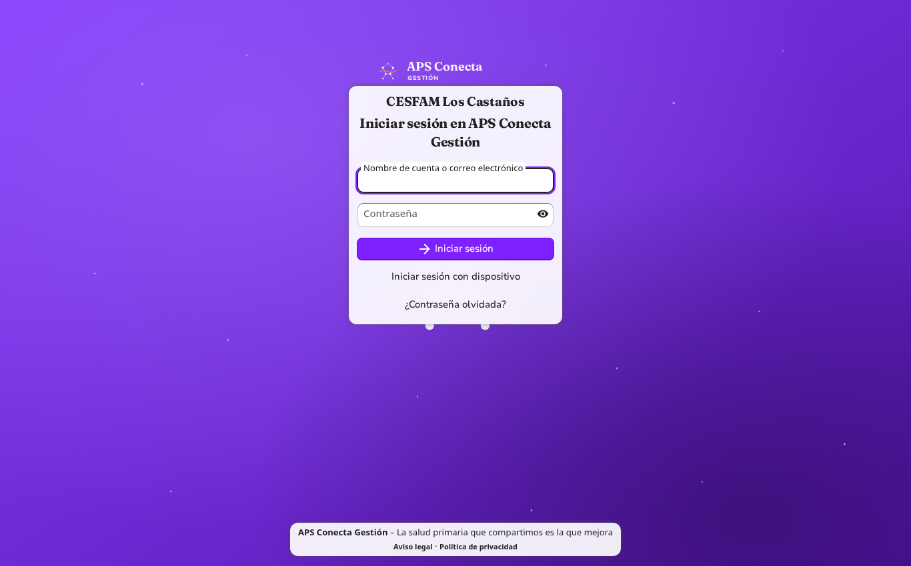
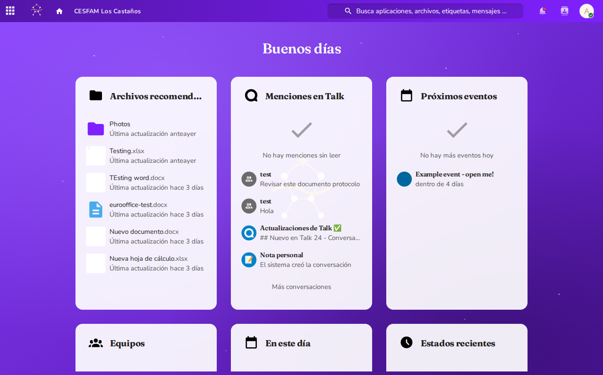
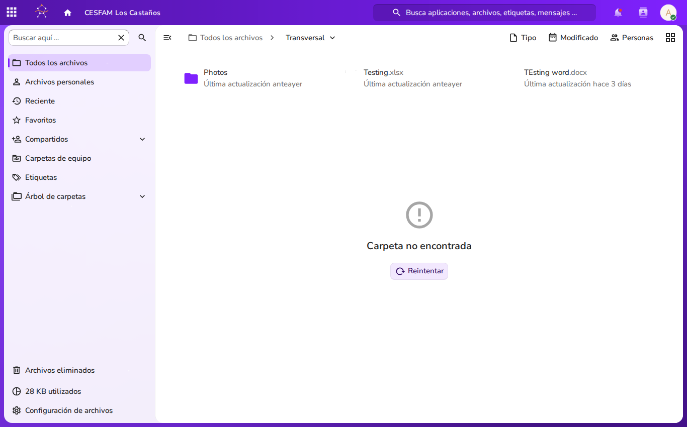
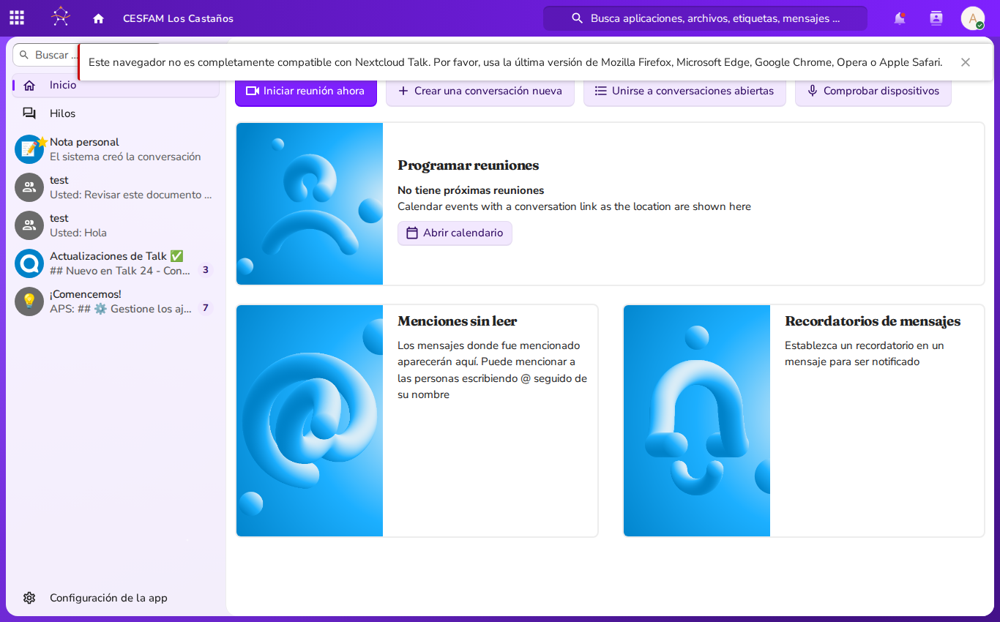
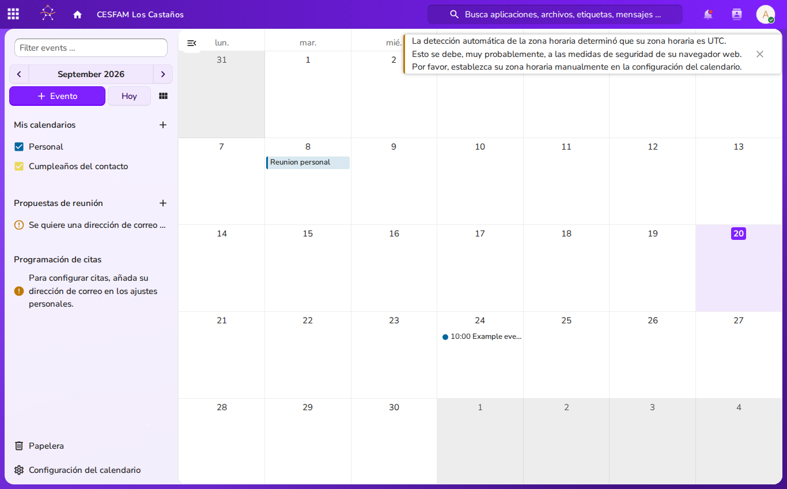
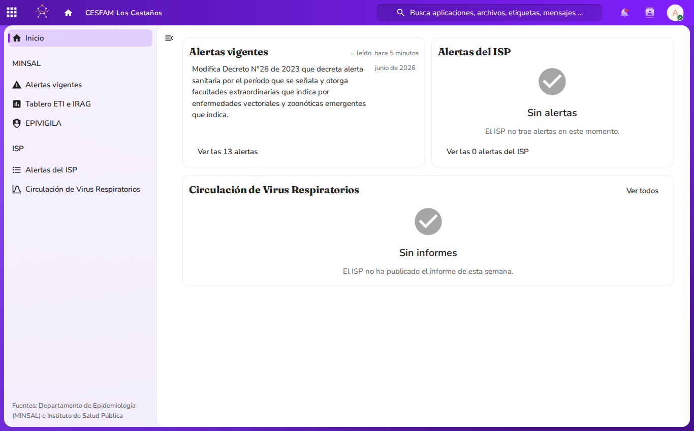
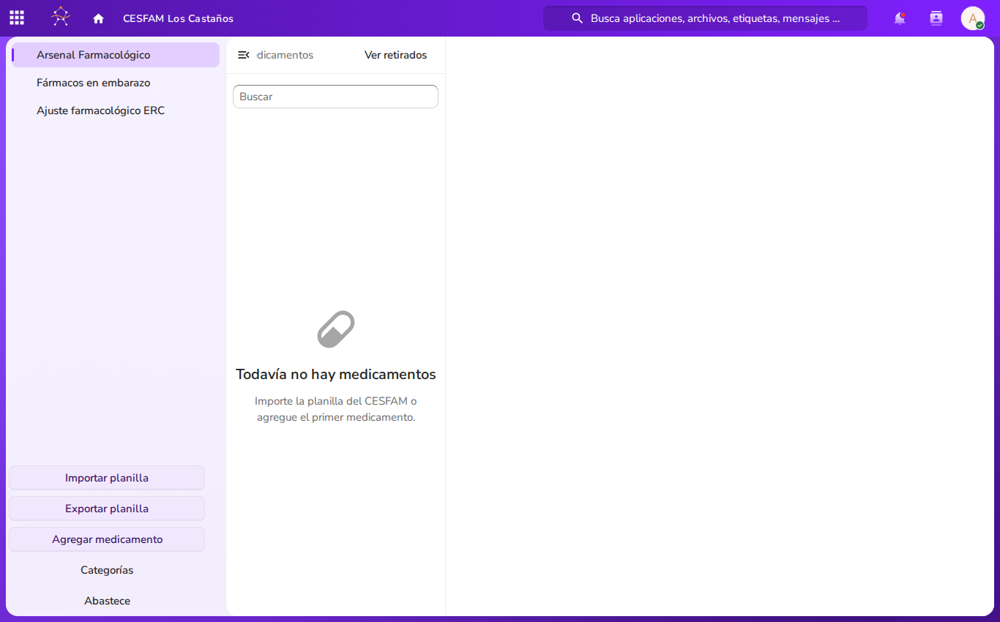
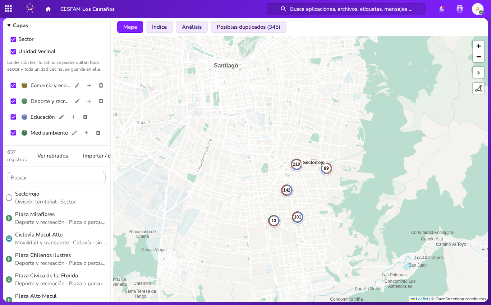

<link rel="stylesheet" href="style.css">
<style>
@import url('https://fonts.googleapis.com/css2?family=Fraunces:ital,opsz,wght@0,9..144,400..800;1,9..144,400..800&family=Nunito+Sans:ital,opsz,wght@0,6..12,400..800;1,6..12,400..800&display=swap');
:root {
  --aps-primary: #7f21fe;
  --aps-dark-violet: #5315a8;
  --aps-ink: #101828;
  --aps-muted: #485363;
  --aps-border: #e4e7ec;
  --aps-gold: #e06f00;
  --aps-dark-gold: #9a4c00;
  --aps-error: #ea003e;
  --aps-error-bg: #FFE7E7;
  --aps-card-bg: #ffffff;
  --aps-canvas-bg: #fcfaff;
  --aps-badge-bg: #f4ebff;
  --aps-badge-text: #5315a8;
}
body, .markdown-body {
  font-family: "Nunito Sans", -apple-system, BlinkMacSystemFont, "Segoe UI", Roboto, sans-serif !important;
  color: var(--aps-ink) !important;
  background-color: var(--aps-canvas-bg);
  line-height: 1.65;
}
h1, h2, h3, h4 { font-family: "Fraunces", Georgia, serif !important; letter-spacing: -0.015em; font-weight: 700; }
h1 { color: var(--aps-dark-violet) !important; border-bottom: 3px solid var(--aps-primary); padding-bottom: 0.35em; }
h2 { color: var(--aps-dark-violet) !important; border-bottom: 1px solid var(--aps-border); padding-bottom: 0.25em; margin-top: 1.6em; }
h3 { color: var(--aps-primary) !important; }
h4 { color: var(--aps-dark-gold) !important; }
a { color: var(--aps-primary) !important; font-weight: 600; text-decoration: none; }
a:hover { color: var(--aps-dark-violet) !important; text-decoration: underline; }
table { border-collapse: collapse; width: 100%; border: 1px solid var(--aps-border); margin: 1.4em 0; border-radius: 8px; overflow: hidden; background: #ffffff; }
th { background-color: var(--aps-dark-violet) !important; color: #ffffff !important; font-family: "Fraunces", serif !important; font-weight: 600; padding: 10px 14px; text-align: left; }
td { padding: 9px 14px; border-bottom: 1px solid var(--aps-border); color: var(--aps-ink); }
tr:nth-child(even) { background-color: #fbf9ff; }
blockquote { border-left: 4px solid var(--aps-primary) !important; background-color: #f8f4ff !important; color: var(--aps-muted) !important; padding: 0.8em 1.4em; border-radius: 0 8px 8px 0; }
code { font-family: ui-monospace, SFMono-Regular, Menlo, monospace !important; background-color: var(--aps-badge-bg); color: var(--aps-dark-violet); padding: 0.2em 0.45em; border-radius: 4px; border: 1px solid #d6bbfb; }
pre { background-color: var(--aps-ink) !important; color: #f9fafb !important; border-radius: 8px; padding: 1.1em 1.3em; border: 1px solid #344054; }
pre code { background: transparent !important; color: inherit !important; border: none !important; }
.aps-hero { background: linear-gradient(135deg, #5315a8 0%, #7f21fe 100%); color: #ffffff; border-radius: 12px; padding: 26px 32px; margin-bottom: 24px; box-shadow: 0 4px 14px rgba(83,21,168,0.22); }
.aps-hero h1 { color: #ffffff !important; border-bottom: 2px solid rgba(255,255,255,0.3); margin: 0 0 10px 0; padding: 0 0 8px 0; }
.aps-tag { display: inline-block; background: #e06f00; color: #ffffff; font-size: 0.78em; font-weight: 700; text-transform: uppercase; letter-spacing: 0.08em; padding: 3px 10px; border-radius: 20px; margin-bottom: 12px; }
.aps-meta { color: rgba(255,255,255,0.9); font-size: 0.95em; margin: 4px 0; }
</style>

<div class="aps-hero">
  <span class="aps-tag">Chilean Primary Healthcare (APS / CESFAM)</span>
  <h1>APS Conecta Gestión — User Manual</h1>
  <p class="aps-meta"><strong>Operational Guide for Healthcare Establishments (CESFAM, CECOSF, PSR)</strong></p>
  <p class="aps-meta">Downstream Nextcloud Fork | Localization: es-CL (America/Santiago)</p>
</div>

# APS Conecta Gestión — User Manual
**Operational Guide for Primary Healthcare Establishments (CESFAM / APS Network)**

---

## 1. Document Title & Master Table of Contents (Index)

### Document Metadata
- **System**: APS Conecta Gestión
- **Target Environment**: Chilean Primary Healthcare Network (*Red de Atención Primaria de Salud* — CESFAM, CECOSF, PSR)
- **Base Platform**: Nextcloud 34, the community image (`nextcloud:34-apache`, `../../compose.yaml`) — no enterprise artifacts anywhere
- **Localization**: Spanish (Chile) / `es-CL` — Timezone: `America/Santiago`
- **Document Scope**: Healthcare Staff Operational Manual (Non-Administrative Users)

---

### Master Table of Contents

- [1. Document Title & Master Table of Contents (Index)](#1-document-title--master-table-of-contents-index)
- [2. Introduction to APS Conecta Gestión](#2-introduction-to-aps-conecta-gestión)
  - [2.1 Mission and Operational Context](#21-mission-and-operational-context)
  - [2.2 Single-Establishment Architecture](#22-single-establishment-architecture)
  - [2.3 Non-Clinical Boundary: Operational Intranet vs. EHR](#23-non-clinical-boundary-operational-intranet-vs-ehr)
  - [2.4 Chilean Primary Healthcare Localization (es-CL)](#24-chilean-primary-healthcare-localization-es-cl)
  - [2.5 Role-Based Primary Healthcare Access Model](#25-role-based-primary-healthcare-access-model)
  - [2.6 Downstream Nextcloud Fork & Open Source License Preservation](#26-downstream-nextcloud-fork--open-source-license-preservation)
- [3. Accessing the Platform & Web Interface](#3-accessing-the-platform--web-interface)
  - [3.1 Web Browser Requirements](#31-web-browser-requirements)
  - [3.2 Logging In to the Platform](#32-logging-in-to-the-platform)
  - [3.3 Visual Identity, Branding & Design System](#33-visual-identity-branding--design-system)
  - [3.4 Side Menu Navigation (`side_menu`)](#34-side-menu-navigation-side_menu)
  - [3.5 Top Navigation Bar and Unified Global Search](#35-top-navigation-bar-and-unified-global-search)
  - [3.6 Desktop Workspace Mode (`desktop_workspace`)](#36-desktop-workspace-mode-desktop_workspace)
- [4. Staff Dashboard](#4-staff-dashboard)
  - [4.1 Dashboard Overview](#41-dashboard-overview)
  - [4.2 Core Health Operations Widgets](#42-core-health-operations-widgets)
  - [4.3 Activity Audit Feed and Notifications](#43-activity-audit-feed-and-notifications)
  - [4.4 Privacy, Security, and External Egress Policy](#44-privacy-security-and-external-egress-policy)
- [5. Files and Document Management](#5-files-and-document-management)
  - [5.1 The 4-Area CESFAM Document Structure](#51-the-4-area-cesfam-document-structure)
    - [Transversal](#transversal)
    - [Programas](#programas)
    - [Unidades](#unidades)
    - [Sectores](#sectores)
  - [5.2 The Operational Principle of "Una sola copia viva"](#52-the-operational-principle-of-una-sola-copia-viva)
  - [5.3 Standardized File Naming Conventions](#53-standardized-file-naming-conventions)
  - [5.4 Version History and Snapshot Restoration](#54-version-history-and-snapshot-restoration)
  - [5.5 Deleted Files Management and Group Folder Trash Bins](#55-deleted-files-management-and-group-folder-trash-bins)
  - [5.6 Favorites and System Tags](#56-favorites-and-system-tags)
- [6. Real-Time Document Collaboration (Euro-Office)](#6-real-time-document-collaboration-euro-office)
  - [6.1 Self-Hosted Euro-Office Architecture](#61-self-hosted-euro-office-architecture)
  - [6.2 File Format Support: Native OOXML and Converted ODF](#62-file-format-support-native-ooxml-and-converted-odf)
  - [6.3 Independent Window Editing (`sameTab=false`)](#63-independent-window-editing-sametabfalse)
  - [6.4 Multi-User Co-Authoring, Comments, and Review Marks](#64-multi-user-co-authoring-comments-and-review-marks)
- [7. Internal Communication: Talk (`spreed`)](#7-internal-communication-talk-spreed)
  - [7.1 Instant Messaging and Healthcare Channels](#71-instant-messaging-and-healthcare-channels)
  - [7.2 Markdown Formatting and the Smart Picker](#72-markdown-formatting-and-the-smart-picker)
  - [7.3 Audio/Video Calls and Clinical Screen Sharing](#73-audiovideo-calls-and-clinical-screen-sharing)
  - [7.4 Operational Boundaries and Clinical Coordination](#74-operational-boundaries-and-clinical-coordination)
- [8. Schedule & Directory: Calendar & Contacts](#8-schedule--directory-calendar--contacts)
  - [8.1 Using the Calendar Application](#81-using-the-calendar-application)
  - [8.2 Coordinating Clinical Shifts, Programs, and Sector Huddles](#82-coordinating-clinical-shifts-programs-and-sector-huddles)
  - [8.3 Health Center Staff Directory (Contacts App)](#83-health-center-staff-directory-contacts-app)
- [9. APS Conecta Specialized Healthcare Apps](#9-aps-conecta-specialized-healthcare-apps)
  - [9.1 Epidemiología (`epidemiologia`)](#91-epidemiología-epidemiologia)
    - [Public Data Aggregation Policy](#public-data-aggregation-policy)
    - [Default Landing View (Inicio)](#default-landing-view-inicio)
    - [Alertas vigentes (MINSAL Alerts)](#alertas-vigentes-minsal-alerts)
    - [Circulación de Virus Respiratorios (ISP Weekly Reports)](#circulación-de-virus-respiratorios-isp-weekly-reports)
    - [Alertas del ISP (Sanitary and Pharmacovigilance Alerts)](#alertas-del-isp-sanitary-and-pharmacovigilance-alerts)
    - [Tablero ETI e IRAG and EPIVIGILA Gateway](#tablero-eti-e-irag-and-epivigila-gateway)
  - [9.2 Farmacia (`farmacia`)](#92-farmacia-farmacia)
    - [CESFAM Pharmacological Arsenal (Vademécum)](#cesfam-pharmacological-arsenal-vademécum)
    - [Clinical Lenses: Arsenal, Embarazo, and Ajuste ERC](#clinical-lenses-arsenal-embarazo-and-ajuste-erc)
    - [Clinical Safety Badges (FDA, Renal Adjustment, Anticholinergic Risk, Trazador)](#clinical-safety-badges-fda-renal-adjustment-anticholinergic-risk-trazador)
    - [Discontinuing and Restoring Medications (Retirar / Restaurar)](#discontinuing-and-restoring-medications-retirar--restaurar)
    - [Pharmacological Management: CSV Import & Export](#pharmacological-management-csv-import--export)
  - [9.3 Territorio (`territorio`)](#93-territorio-territorio)
    - [Institutional GIS Knowledge Base](#institutional-gis-knowledge-base)
    - [Territorial Hierarchy: Comuna, Unidades Vecinales, and Sectores](#territorial-hierarchy-comuna-unidades-vecinales-and-sectores)
    - [Community Features (Elementos Territoriales: Lugares, Zonas, Rutas)](#community-features-elementos-territoriales-lugares-zonas-rutas)
    - [Interactive Map and Self-Hosted Chile PMTiles Basemap](#interactive-map-and-self-hosted-chile-pmtiles-basemap)
- [10. Personal Profile, Security & Preferences](#10-personal-profile-security--preferences)
  - [10.1 Accessing Personal Settings](#101-accessing-personal-settings)
  - [10.2 Chilean Localization and Timezone Verification](#102-chilean-localization-and-timezone-verification)
  - [10.3 Password Management and Hygiene](#103-password-management-and-hygiene)
  - [10.4 Two-Factor Authentication (TOTP) and Emergency Recovery](#104-two-factor-authentication-totp-and-emergency-recovery)

---

## 2. Introduction to APS Conecta Gestión

### 2.1 Mission and Operational Context
APS Conecta Gestión is the self-hosted operational intranet and document collaboration suite engineered for Chilean Primary Healthcare (*Atención Primaria de Salud* — APS). It directly serves Family Healthcare Centers (*Centros de Salud Familiar* — CESFAM), Community Family Healthcare Centers (CECOSF), and Rural Health Posts (PSR).

The platform addresses information fragmentation across the Comprehensive Family and Community Healthcare Model (*Modelo de Atención Integral de Salud Familiar y Comunitaria* — MAIS). It replaces ad-hoc local files, fragmented physical binders, and informal chat groups with an audited digital workspace.

### 2.2 Single-Establishment Architecture
- **Single Establishment Per Deployment**: Each production install serves exactly one healthcare establishment. The establishment identity is declared in configuration (`SITE`) and rendered consistently across the interface.
- **On-Premise Custody**: All documents, databases, communication logs, and geospatial indexes reside on the health center's self-hosted infrastructure. No municipal health documentation is sent to external commercial cloud providers.

### 2.3 Non-Clinical Boundary: Operational Intranet vs. EHR
> [!IMPORTANT]
> **APS Conecta Gestión is an operational intranet, NOT an Electronic Health Record (EHR / Ficha Clínica).**
> The platform does NOT store, process, or transmit identifiable individual patient records, electronic prescriptions, or encounter notes.

Primary care teams utilize designated municipal EHR systems (e.g., Rayen, OMI) for direct patient care. APS Conecta Gestión governs **institutional operations**:
- Care protocols, referral criteria (*criterios de derivación*), and triage flows.
- Shift rosters, sector committees, and technical councils.
- Public epidemiological alerts from MINSAL and the ISP.
- The institutional pharmacological vademécum and clinical safety guidance.
- Geospatial mapping of community resources across the health sectors.

### 2.4 Chilean Primary Healthcare Localization (es-CL)
Every deployment is initialized with Chilean operational standards:
- **Language**: Standard Spanish (`default_language: es`, `force_language: es`).
- **Locale (`default_locale: es_CL`)**: Chilean formatting standards for dates (`DD/MM/AAAA`), numbers (period thousands separator, comma decimal separator), and currency.
- **Timezone (`America/Santiago`)**: Synchronized with Continental Chilean time.
- **Phone Region (`default_phone_region: CL`)**: Formatted for Chilean national telecommunications.

### 2.5 Role-Based Primary Healthcare Access Model
Access control within the platform is governed by groups reflecting CESFAM organizational structure:

1. **Universal Staff Group**:
   - `all-staff` (*Todo el personal*): Contains every authenticated account. Grants read access to transversal guidelines, circulars, and institutional notices.
2. **Functional Categories**:
   - `cat-jefaturas` (*Jefaturas*): Center Directorship, Medical Subdirectorship, Sector Chiefs, and Unit Coordinators. Holds write and administrative authority over transversal documentation.
   - `cat-clinicos` (*Clínicos*): Physicians, Dentists, Pharmacists, Nurses, Midwives, Physical Therapists, Psychologists, Social Workers, Nutritionists, Occupational Therapists, and Speech Therapists.
   - `cat-tecnicos` (*Técnicos*): Paramedics and clinical technicians (TENS, TONS).
   - `cat-administrativos` (*Administrativos*): Administrative clerks, SOME officers, and statistical staff.
3. **Standardized Primary Care Roles (22 Roles)**:
   - Includes: `role-director-cesfam`, `role-subdirector-jefe-tecnico`, `role-jefe-sector-mais`, `role-medico`, `role-dentista`, `role-quimico-farmaceutico`, `role-enfermeria`, `role-matroneria`, `role-kinesiologo`, `role-psicologo`, `role-trabajador-social`, `role-nutricionista`, `role-terapeuta-fono`, `role-tens-procedimientos`, `role-tens-farmacia`, `role-tons`, `role-administrativo-some`, `role-jefe-some`, `role-oirs`, `role-estadistica-rem`, `role-conductor`, and `role-auxiliar-servicio`.
4. **Program and Sector Teams**:
   - Health programs (e.g., `prog-cardiovascular`, `prog-salud-mental`).
   - Territorial health sectors (e.g., `sector-sol`, `sector-luna`).

### 2.6 Downstream Nextcloud Fork & Open Source License Preservation

#### Downstream Platform Lineage
APS Conecta Gestión is an operational downstream distribution and tailored fork of the **Nextcloud** open-source ecosystem. The system deploys official Nextcloud 34 components orchestrated via declarative configuration-as-code, supplemented by custom primary care applications (`epidemiologia`, `farmacia`, `territorio`) and dedicated institutional theming.

#### Open Source License Preservation
All software components in APS Conecta Gestión strictly preserve their respective open source licenses and upstream legal notices:
- **Base Nextcloud Platform**: Distributed under the **GNU Affero General Public License version 3 or later (GNU AGPL-3.0-or-later)**.
- **Euro-Office Collaboration Backend**: Euro-Office DocumentServer and its connector application are licensed under the **GNU AGPL version 3 only (GNU AGPL-3.0-only)**.
- **Custom Primary Care Applications**: Custom applications authored by APS Conecta (`epidemiologia`, `farmacia`, `territorio`), the server theme (`themes/apsconecta`), and provisioning infrastructure are licensed under the **GNU AGPL version 3 or later (GNU AGPL-3.0-or-later)** pursuant to ADR-0010.
- **Network User Rights (GNU AGPLv3 Section 13)**: In compliance with Section 13 of the GNU AGPLv3, any user interacting with this platform remotely over a computer network has the legal entitlement to receive the Corresponding Source code of the software version running on the server. Clinic staff may request access to the complete source code repository from their establishment administrator.

#### Trademarks & Attribution
- **Nextcloud Trademark**: "Nextcloud" and the Nextcloud logo are registered trademarks of Nextcloud GmbH. APS Conecta Gestión is an independent downstream project and is neither endorsed by, affiliated with, nor sponsored by Nextcloud GmbH.
- **Copyright Preservation**: Upstream copyright notices, authorship credits, and license headers are maintained across all source files.
- **Brand Carve-Out**: APS Conecta brand marks, graphics, and emblems are reserved under AGPL Section 7(e).

---

## 3. Accessing the Platform & Web Interface

### 3.1 Web Browser Requirements
For optimal performance, collaborative editing, and real-time audio/video communications, use the latest version of one of these supported desktop web browsers:
- Google Chrome / Chromium
- Mozilla Firefox
- Apple Safari
- Microsoft Edge

> [!NOTE]
> JavaScript and WebSockets must be enabled. Desktop web browsers are required for multi-user editing in Euro-Office and GIS editing in Territorio.

### 3.2 Logging In to the Platform
To log in:
1. Navigate to the establishment's internal web address in your browser.
2. The login card displays your establishment's name and the APS Conecta Gestión brand mark.
3. Enter your **Nombre de cuenta o correo electrónico** (Account username or email address).
4. Enter your **Contraseña** (Password).
5. Click **Iniciar sesión** (Log In).


*Figure 3.1: APS Conecta Gestión authentication interface displaying establishment identity.*


### 3.3 Visual Identity, Branding & Design System
APS Conecta Gestión implements an accessible institutional design system tailored to Chilean primary healthcare environments.

#### Color Palette & Contrast Ledger
The color tokens satisfy WCAG AA legibility standards across all clinical monitors:

| Token | Hex | Contrast Ratio (White) | Clinical UI Role |
|---|---|---|---|
| **Primary Violet** | `#7f21fe` | 5.57:1 | Primary actions, interactive buttons, active tab indicators, and folder badges (`primary_color`). |
| **Dark Violet** | `#5315a8` | ~8.00:1 | Main page headings, full-canvas background backdrop, and navigation drawer (`background_color`). |
| **Error Pink** | `#ea003e` | 4.33:1 | Warning borders, alert icons, and large clinical risk indicators (not used as body text). |
| **Error Background** | `#FFE7E7` | N/A | Soft background tint for clinical safety and error notifications (`--color-error`). |
| **Brand Gold** | `#e06f00` | 3.07:1 | Informational badges, fills, and large text (≥24px or ≥19px bold). |
| **Dark Gold** | `#9a4c00` | ≥4.50:1 | Small text warnings, alerts, and high-visibility status tags on white backgrounds. |
| **Ink** | `#101828` | ~16.00:1 | High-legibility primary body text across documents, tables, and forms. |
| **Muted** | `#485363` | ~7.00:1 | Secondary metadata, dates, file sizes, and secondary descriptions. |

#### Typography
The platform enforces a dual variable-font hierarchy self-hosted with zero external network egress:
- **Display Typography (Fraunces)**: Variable serif font (optical size 9–144, weights 400–800) applied to primary section headings (`h1`, `h2`), dashboard greetings, and modal titles.
- **Interface Typography (Nunito Sans)**: Variable sans-serif font (weights 400–800) applied across all interface controls, data tables, clinical forms, menus, and body text.

#### Brand Assets & Header Architecture
The user interface integrates dedicated vector marks:
- **Login Lockup (`logo.svg`)**: Full institutional lockup rendered on the centralized authentication card.
- **Drawer Lockup (`logo-header.svg`)**: Displayed within the expanded side navigation drawer (`.cm-logo`).
- **Compact Brand Mark (`logo-mark.svg`)**: 34×30px mark positioned in the top-left navigation slot.
- **Home Navigation Icon (`home.svg`)**: 19px icon located in a 36px interactive header slot, returning the user to the Staff Dashboard.
- **Dynamic Establishment Label**: Dynamically displays the local clinic name (e.g., *"CESFAM Dr. Fernando Monckeberg"*) beside the home icon on screens wider than 601px. On screens below 601px, the label is collapsed to preserve horizontal workspace.
- **Institutional Full Backdrop (`background.svg`)**: Full-canvas brand background covering the operational workspace.

#### Enforced Light Theme
The platform enforces light mode system-wide (`enforce_theme=light` and `disable-user-theming=yes`). This prevents contrast and rendering inconsistencies across shared multi-user clinical terminals in consulting rooms (*box de atención*), triage stations, and administrative counters. For users requiring elevated contrast, the theme responds directly to operating system accessibility settings (`prefers-contrast: more`).

### 3.4 Side Menu Navigation (`side_menu`)
Main application navigation is provided by the left-side drawer:
- **Toggle**: Click the 9-dot launcher icon in the top-left corner, or press `Ctrl + O`.
- **Application Groups**:
  - **Principal**: *Archivos* (Files), *Tablero* (Dashboard), *Escritorio* (Desktop Workspace).
  - **Salud**: *Epidemiología* (MINSAL/ISP Alerts), *Farmacia* (Vademécum), *Territorio* (Health Sector Map).
  - **Comunicaciones y Agenda**: *Talk* (Chat and Video), *Calendario* (Shifts and Programs), *Contactos* (Staff Directory).
- **Keyboard Navigation**: Press `Tab` to navigate through items, and `Ctrl + O` or click outside the drawer to close (note: the `Escape` key does not dismiss the menu in `side_menu`).

### 3.5 Top Navigation Bar and Unified Global Search
The persistent top navigation bar contains:
1. **Side Menu Toggle (9-dot icon)**: Expands the application drawer.
2. **Brand Mark & Establishment Name**: Displays the clinic logo and name. Note that the logo mark and clinic name text have `pointer-events: none` applied by theme geometry (`server.css`); only the adjacent house icon (`home.svg`) is the interactive button that returns to the Staff Dashboard.
3. **Unified Global Search Bar**: Searches across files, folders, system tags, talk messages, staff contacts, and active epidemiological circulars simultaneously.
4. **Notifications Bell**: Displays system alerts, mentions, and calendar reminders.
5. **Contacts Shortcut**: Quick lookup for internal phone extensions.
6. **User Profile Avatar**: Manages user status (*En consulta*, *Reunión de sector*, *Disponible*), personal settings, or logout.

### 3.6 Desktop Workspace Mode (`desktop_workspace`)
Desktop Workspace provides an in-browser window manager:
- **Window Management**: Run Files, Calendar, Farmacia, and Talk in resizable, movable windows within a single browser tab.
- **Taskbar & Dock**: A bottom taskbar tracks running windows and provides a desktop clock formatted in Chilean Spanish (`es-CL`) based on the client workstation time.
- **Desktop Shortcuts**: Place frequently accessed clinical protocols directly on the desktop canvas. Drag and drop local files onto the canvas to upload them.
- **Persistent State**: Window coordinates and desktop shortcuts persist across user sessions.

---

## 4. Staff Dashboard

### 4.1 Dashboard Overview
Upon logging in, the platform opens the **Staff Dashboard** (*Tablero*), serving as the daily operational launchpad.


*Figure 4.1: Staff Dashboard displaying Talk mentions, scheduled events, and quick team access.*

### 4.2 Core Health Operations Widgets
The dashboard provides operational status cards:
1. **Menciones en Talk (Talk Mentions)**: Tracks unread messages where your account (`@name`) was mentioned in clinical or sector channels.
2. **Próximos eventos (Upcoming Events)**: Displays scheduled appointments, sector huddles, and clinical committee meetings for the day, with one-click video room links.
3. **Equipos (Teams)**: Direct shortcuts to designated sector folders (e.g., *Sector Sol*) and health program workspaces.
4. **En este día & Estados recientes**: Historical activity and status updates across establishment teams.

> [!NOTE]
> **Dashboard Recommendations Policy**: In accordance with the establishment baseline policy (`app-policy.sh`), the *Archivos recomendados* (Recommended Files) widget is disabled for standard clinical and administrative staff and restricted to technical administrators, keeping staff workspaces uncluttered and focused strictly on operational notifications.

### 4.3 Activity Audit Feed and Notifications
The activity feed records operational events within your accessible group folders:
- Publication of newly approved clinical protocols in `Transversal/Protocolos`.
- Updates to the pharmacological arsenal in `Unidades/Farmacia`.
- Filing of committee minutes in `Transversal/Actas de reuniones`.

### 4.4 Privacy, Security, and External Egress Policy
External network calls from staff dashboards (such as public weather widgets and external promotional announcements) are permanently disabled or restricted to technical administrators. Dashboards operate strictly within the health center's local domain.

---

## 5. Files and Document Management

### 5.1 The 4-Area CESFAM Document Structure
Establishment documents are organized into the **4-Area CESFAM Model**, provisioned as managed Group Folders.


*Figure 5.1: Primary Files interface showing folder structure and management options.*

The four core functional areas are:

#### Transversal
The shared institutional repository for all center personnel.
- **Permissions**: Read access for all staff (`all-staff`). Write and management access restricted to Leadership (`cat-jefaturas`).
- **Subfolders**:
  - `Protocolos`: Official clinical protocols, emergency procedures, triage workflows.
  - `Flujogramas`: Patient flow diagrams, inter-unit pathways, and referral routes (*redes de derivación*).
  - `Documentación`: Health Service circulars, administrative resolutions, institutional templates.
  - `Registro de redes`: Contact registries for referral hospitals, emergency services (SAMU), and intersectoral networks.
  - `Actas de reuniones`: Minutes from Technical Councils (*Consejo Técnico*), Sector Meetings, and Quality Committees.


*Figure 5.2: Directory view within the Transversal institutional repository.*

#### Programas
Dedicated workspaces for primary healthcare programs:
- **Standard Programs**: `Cardiovascular`, `Salud Mental`, `Infantil`, `Adolescente`, `Mujer`, `Adulto Mayor`, `Odontológico`, `Respiratorio`.
- **Permissions**: Both the assigned program team (e.g., `prog-cardiovascular`) and Leadership (`cat-jefaturas`) hold full operational permissions (`read write delete`).

#### Unidades
Functional administrative and clinical support units:
- **Standard Units**:
  - `SOME`: Managed by admission administrative staff (`role-administrativo-some`) with full rights (`read write delete`), with supervisory read-only access for Leadership (`cat-jefaturas`).
  - `Farmacia`: Managed by the Pharmacy Director (`role-quimico-farmaceutico`) and pharmacy technicians (`role-tens-farmacia`) (`read write delete`), with supervisory read-only access for `cat-jefaturas`.
  - `Dental`: Managed by the Dental Chief (`role-dentista`) and oral technicians (`role-tons`) (`read write delete`), with supervisory read-only access for `cat-jefaturas`.
  - `OIRS`: Managed by the Public Information Officer (`role-oirs`) (`read write delete`), with supervisory read-only access for `cat-jefaturas`.
  - `Estadística-REM`: Managed by the Health Statistics Officer (`role-estadistica-rem`) for monthly statistical records (`read write delete`), with supervisory read-only access for `cat-jefaturas`.
  - `Dirección`: Executive repository managed exclusively by `cat-jefaturas` (`read write delete`).

#### Sectores
Territorial multidisciplinary team folders under the MAIS model:
- **Standard Sectores**: `Sector Sol`, `Sector Luna`, `Sector Estrella`, `Sector Lucero` (customized to each clinic's actual sector names).
- **Permissions**: Both the multidisciplinary sector teams (e.g., `sector-sol`, `sector-luna`, `sector-estrella`, `sector-lucero`) and Leadership (`cat-jefaturas`) hold full operational management rights (`read write delete`).

---

### 5.2 The Operational Principle of "Una sola copia viva"
To eliminate version drift across clinical teams, staff must observe the **"Una sola copia viva" (A Single Living Copy)** standard:
1. **Never Download to Edit Locally**: Do not download documents to local hard drives for modification. Local editing creates orphaned duplicates.
2. **Edit In-Place in the Browser**: Click the document in the web interface to open it in Euro-Office. All modifications are saved directly to the server.
3. **No Redundant Version Suffixes**: Never create files named `Protocolo_v2_final.docx`, `Protocolo_v2_final_corregido.docx`, or `Protocolo_ESTE_SI.docx`. The platform maintains version history behind the authoritative file.
4. **Share Links, Not Attachments**: Copy and share internal document links rather than attaching file copies to chat or email.

---

### 5.3 Standardized File Naming Conventions
Files must adhere to the standardized naming convention:

$$\text{AAAA-MM-DD\_area\_tema\_vN.ext}$$

- **`AAAA-MM-DD`**: ISO date prefix (e.g., `2026-07-19`) for chronological sorting.
- **`area`**: Functional area in lowercase unaccented text (e.g., `protocolos`, `cardiovascular`, `farmacia`).
- **`tema`**: Topic descriptor separated by hyphens (e.g., `triage-urgencias`, `pauta-visita-domiciliaria`).
- **`vN`** *(Optional)*: Milestone version suffix (e.g., `v1`, `v2`) used only when an institutional review cycle formally closes.
- *Standard Example*: `2026-07-19_protocolos_triage-urgencias_v2.docx`

---

### 5.4 Version History and Snapshot Restoration
The platform maintains automated version control:
- **Snapshot Creation**: A version snapshot is saved automatically when changes are made to a file, provided at least two minutes have elapsed since the prior snapshot.
- **Inspecting Versions**:
  1. Select the file in the **Files** app.
  2. Open the **Details** sidebar on the right.
  3. Select the **Versiones** (Versions) tab to review all stored snapshots with timestamps and editor names.
- **Restoring Snapshots**:
  - Click the circular arrow icon next to any historic snapshot to revert the document to that state.
  - Click the timestamp to download that historical version.
- **Naming Milestone Versions (Asignar nombre a una versión)**:
  - To permanently protect an institutional document version from automatic expiration, click the three dots (`...`) next to any snapshot in the **Versiones** panel and select **Asignar nombre a una versión** (Name this version).
  - Named versions are exempt from the standard 30-day and 50%-storage expiration policies, guaranteeing that approved clinical protocols and signed resolutions remain accessible permanently.
- **Version Retention Schedule**:
  - First second: 1 version kept.
  - First 10 seconds: 1 version every 2 seconds.
  - First minute: 1 version every 10 seconds.
  - First hour: 1 version every minute.
  - First 24 hours: 1 version every hour.
  - First 30 days: 1 version every day.
  - After 30 days: 1 version every week until storage quota limits require cleanup.
  - The versioning system never exceeds 50% of available disk space; older versions are expired automatically when this limit is reached.

---

### 5.5 Deleted Files Management and Group Folder Trash Bins
Deleted files are moved to the **Archivos eliminados** (Trash bin):
- **Access**: Click **Archivos eliminados** at the lower left of the Files sidebar.
- **Restoration**:
  - Click **Restaurar** next to any item to return it to its original path.
  - If the original parent directory was removed, the file is restored to the root files directory.
- **Group Folder Trash Bins**: Shared group folders (`Transversal`, `Programas`, `Unidades`, `Sectores`) maintain independent trash bins separate from personal trash bins. Restoring a deleted file returns it to the root of that specific group folder rather than the user's personal storage root. In shared institutional folders like `Transversal`, where general staff possess read-only rights, only users with deletion/write management rights (`cat-jefaturas`) can recover deleted files.
- **Permanent Removal**: Files are permanently deleted when manually purged by authorized staff or expired by automated server retention policies.

---

### 5.6 Favorites and System Tags
- **Favorites (Favoritos)**: Click the star icon on any file or folder to flag it as a favorite. Access all starred items via the **Favoritos** link in the left sidebar.
- **System Tags (Etiquetas)**: Standardized server-wide labels (e.g., `Urgente`, `Protocolo MINSAL`, `Campaña Invierno`, `GES`) used to categorize files across directories.
  - Assign tags via the **Detalles** panel on any file.
  - Filter files across the entire platform by clicking **Etiquetas** in the sidebar.
  - Tag access levels:
    * **Public**: Visible to all users; users can assign or remove.
    * **Restricted**: Visible to all users; assignment/removal restricted to administrators.
    * **Invisible**: Hidden from standard users; used for automated workflows.

---

## 6. Real-Time Document Collaboration (Euro-Office)

### 6.1 Self-Hosted Euro-Office Architecture
Euro-Office is integrated as a self-hosted document server container within the establishment stack:
- **Data Sovereignty**: Document rendering, text processing, and co-authoring synchronization occur entirely on the local server. No file contents are transmitted to external commercial office services.
- **Office Compatibility**: Full formatting and rendering fidelity for word processing documents, spreadsheets, and presentations.

---

### 6.2 File Format Support: Native OOXML and Converted ODF
- **Native OOXML Support**: Microsoft Office formats (`.docx`, `.xlsx`, `.pptx`) open natively with full formatting fidelity and simultaneous multi-user editing.
- **Converted ODF Support**: OpenDocument formats (`.odt`, `.ods`, `.odp`) are supported via automatic conversion (`lossy-edit`). Euro-Office converts the document to OOXML during the editing session and writes it back on save. This prevents the creation of manual duplicate files and preserves the "Una sola copia viva" standard.

---

### 6.3 Independent Window Editing (`sameTab=false`)
The document editor is configured to launch in an **independent browser window or tab** (`sameTab=false`):
- In standard browser mode, clicking any spreadsheet or text document opens Euro-Office in a new tab, which may require allowing popups for the clinic domain on first launch. Your primary intranet session remains open in your original tab, allowing continuous multitasking during clinical duties.
- When operating within **Desktop Workspace Mode** (`desktop_workspace`), window opening is intercepted directly by the desktop shell (`desktop-shell.js`), opening the document within an in-shell resizable desktop window without spawning an external browser tab.

---

### 6.4 Multi-User Co-Authoring, Comments, and Review Marks
Euro-Office provides collaborative authoring tools:
1. **Concurrent Co-Authoring**: Multiple clinical or administrative staff can work in the same document simultaneously. Live colored cursors indicate the position and identity of each collaborator.
2. **Threaded Comments**: Highlight any text or table cell, right-click, and select **Add Comment** (*Agregar comentario*). Collaborators can reply to comments and mark them resolved.
3. **Track Changes (Control de Cambios)**: When revising institutional protocols, activate **Track Changes** from the Review menu. Additions, deletions, and formatting changes are tagged with the author's identity. Coordinators and leadership (`cat-jefaturas`) can systematically accept or reject modifications before final publication.
4. **Enforced Light Editor**: The editor is configured with `customizationTheme: default-light`, ensuring clear readability across all clinical workstations.

---

## 7. Internal Communication: Talk (`spreed`)

### 7.1 Instant Messaging and Healthcare Channels
The **Talk** application provides encrypted internal messaging, team channels, and audio/video meetings.


*Figure 7.1: Talk communications interface displaying active chat rooms, mentions, and meeting schedulers.*

- **Creating Conversations**:
  - Click **+ Crear una conversación nueva** to create a direct one-on-one message or a group chat room (e.g., *Sector Sol Clínico*, *TENS Procedimientos*).
  - **Conversaciones abiertas**: Public establishment channels accessible to all personnel (e.g., *Comité Paritario*, *Comunicaciones Internas*).
- **Nota personal**: A private notebook pinned at the top of your chat list for personal notes, drafts, and link bookmarks.

---

### 7.2 Markdown Formatting and the Smart Picker
Chat messages support Markdown syntax for structured communication:
- **Headings**: `# Heading 1`, `## Heading 2`
- **Text Styling**: `**bold**`, `*italic*`, `~~strikethrough~~`, `` `inline code` ``
- **Task Lists**:
  ```markdown
  - [ ] Revisar protocolo de triage urgencias
  - [x] Notificar caso ETI a delegada epidemiológica
  ```
- **Tables**: Markdown tables for structured clinical parameters.
- **Smart Picker**: Type `/` in the message input field to summon the Smart Picker, allowing immediate insertion of internal files, calendar appointments, or contacts.

---

### 7.3 Audio/Video Calls and Clinical Screen Sharing
- **Initiating Calls**:
  - Click **Iniciar llamada** from the top bar or the green **Unirse a la llamada** button inside any chat room.
  - Grant browser permissions for your microphone and camera when prompted.
  - Use the media settings panel to select devices and verify audio input levels prior to joining.
- **Screen Sharing**:
  - Click the monitor icon in the call controls to share your entire display, an application window, or a specific browser tab. This facilitates real-time review of referral flowcharts, epidemiological trends, or shift rosters during team meetings.

---

### 7.4 Operational Boundaries and Clinical Coordination
Talk is optimized for **internal establishment operational coordination and small-group clinical teamwork**:
- Daily morning sector briefings (*huddle de sector*).
- Triage coordination between SOME admission, TENS procedures, and urgent care physicians.
- Urgent pharmacovigilance consultations between Pharmacy and Sector Teams.
- *Notice*: Large public webinars (100+ attendees) should use municipal video bridges. Talk is reserved for secure internal staff communications.

---

## 8. Schedule & Directory: Calendar & Contacts

### 8.1 Using the Calendar Application
The **Calendar** application coordinates clinical shifts, program activities, and administrative committees.


*Figure 8.1: Calendar interface showing personal calendars, shift schedules, and timezone indicators.*

- **Creating an Event**:
  1. Click **+ Evento** or click directly on any time slot in the calendar grid.
  2. Enter the event title (e.g., *Reunión Clínica Sector Sol*, *Comité Técnico Mensual*).
  3. Specify start and end times.
  4. Select the target calendar (e.g., *Personal*, *Sector*, *Programa*).
  5. Add attendees by typing their name or group ID.
  6. Add a location or attach a Talk video room link for remote attendance.
- **Views**: Switch between Day, Week, Month, and Agenda views using the top navigation controls.

---

### 8.2 Coordinating Clinical Shifts, Programs, and Sector Huddles
- **Sector Calendars**: Health sectors maintain shared calendars to coordinate home visits (*visitas domiciliarias*), community workshops, and clinical duty rosters.
- **Shift Coordination**: Visual calendar scheduling prevents coverage gaps between morning shifts and extended evening emergency coverage (SAPU/SAR).
- **Timezone Standardization**: All calendars operate on `America/Santiago`. If your browser alerts you regarding timezone differences, ensure your operating system clock is set to Chilean Continental time.

---

### 8.3 Health Center Staff Directory (Contacts App)
The **Contacts** (*Contactos*) application maintains the establishment's directory:
- **System Address Book**: Every active user account is automatically listed with their full name, clinical role, and assigned sector.
- **Directory Search**: Search for colleagues by clinical role (e.g., *Químico Farmacéutico*, *Jefe de Sector*), internal telephone extension, or unit.
- **Direct Communication**: Open any contact card to initiate a direct Talk conversation or schedule a calendar meeting.

---

## 9. APS Conecta Specialized Healthcare Apps

APS Conecta Gestión ships three native healthcare applications engineered for Chilean primary care. These apps operate via public APIs, store no patient data, and require no core platform modifications.

---

### 9.1 Epidemiología (`epidemiologia`)

#### Public Data Aggregation Policy
The **Epidemiología** application aggregates real-time public health data published by the Ministry of Health (*Ministerio de Salud* — MINSAL) and the Public Health Institute (*Instituto de Salud Pública* — ISP).

> [!NOTE]
> **Data Integrity**: The application rehosts no state documents, creates no database tables, and contains **zero patient information**. It functions as an authoritative, real-time reader connecting clinical staff to official public health circulars.


*Figure 9.1: Epidemiología application dashboard showing active MINSAL alerts, ISP virus reports, and sanitary notices.*

#### Default Landing View (Inicio)
Upon opening the application, staff are presented with the **Inicio** (Overview) screen, providing immediate status cards for current sanitary decrees, active respiratory virus alerts, and direct surveillance shortcuts.

#### Alertas vigentes (MINSAL Alerts)
- **Official Sanitary Decrees**: Displays current national and regional health alerts issued by MINSAL (e.g., sanitary emergency decrees under *Decreto N°28* for respiratory viruses or vector-borne disease emergencies).
- **Filtering**: Searchable by text keyword, publication year, and month.

> [!WARNING]
> **Upstream MINSAL Link Access**: Historical MINSAL epidemiological alert cards link directly to upstream documents hosted on `epi.minsal.cl`. Due to Cloudflare bot-management policies on the ministerial portal, clinical workstations on certain healthcare network subnets may receive an upstream HTTP 403 Forbidden error when attempting to open some historical links. Local summaries, ISP virus reports, and national alerts published within the app remain fully accessible.

#### Circulación de Virus Respiratorios (ISP Weekly Reports)
- **Weekly Surveillance**: Surfaces the weekly laboratory report (*Informe de Circulación de Virus Respiratorios*) issued by the ISP, structured by epidemiological week (*semana epidemiológica*).
- **Clinical Utility**: Enables acute respiratory teams (Salas ERA/IRA) and emergency clinicians to monitor circulating viral strains (Influenza A/B, RSV/VRS, Adenovirus, Metapneumovirus, SARS-CoV-2) to anticipate clinical demand.

#### Alertas del ISP (Sanitary and Pharmacovigilance Alerts)
- **Sanitary Recalls & Warnings**: Collects real-time feeds from the ISP covering:
  - Market recalls of defective medications (*Retiros de mercado*).
  - Pharmaceutical counterfeiting alerts.
  - Pharmacovigilance safety advisories.
  - Defective medical device recalls.

#### Tablero ETI e IRAG and EPIVIGILA Gateway
- **Tablero ETI e IRAG**: Directly embeds the official MINSAL Power BI surveillance dashboard tracking Flu-Like Illness (*Enfermedad Tipo Influenza* — ETI) and Severe Acute Respiratory Infection (*Infección Respiratoria Aguda Grave* — IRAG).
- **EPIVIGILA Gateway**: Provides operational guidance and a direct gateway link to the national mandatory disease notification system (EPIVIGILA) for mandatory notifiable diseases (*Enfermedades de Notificación Obligatoria* — ENO).

---

### 9.2 Farmacia (`farmacia`)

#### CESFAM Pharmacological Arsenal (Vademécum)
The **Farmacia** application provides a digital catalog (*Vademécum*) of all medications approved, prescribed, and dispensed within the health center.

> [!IMPORTANT]
> **Operational Scope**: Farmacia does NOT manage individual patient prescriptions, warehouse inventory counts, or batch expiration dates. It is an institutional pharmacological catalog and clinical decision-support tool.


*Figure 9.2: Farmacia catalog interface showing clinical safety lenses, medication search, and spreadsheet import/export.*

#### Clinical Lenses: Arsenal, Embarazo, and Ajuste ERC
The application provides three immediate clinical perspectives ("Lentes") across the same underlying pharmacological dataset:
1. **Arsenal Farmacológico**: Complete institutional catalog showing commercial brand, active principle (*principio activo*), pharmaceutical form, concentration, and supply channel (*abastece*).
2. **Fármacos en embarazo**: Filters medications with documented FDA Pregnancy Risk categories.
3. **Ajuste farmacológico ERC**: Filters medications requiring dosage modifications in patients with Chronic Kidney Disease (*Enfermedad Renal Crónica* — ERC) based on estimated Glomerular Filtration Rate (eGFR).

#### Clinical Safety Badges (FDA, Renal Adjustment, Anticholinergic Risk, Trazador)
Medication cards display clinical safety badges:
- **FDA Pregnancy Category**: Marked with standard categories **A**, **B**, **C**, **D**, or **X**.
- **Renal Adjustment in CKD (ERC)**: Indicates whether dose spacing or dosage reduction is required in renal impairment.
- **Anticholinergic Risk in Older Adults (*Adulto Mayor*)**: Highlights medications with anticholinergic burden, cautioning against cognitive, sedative, or urinary complications in geriatric patients.
- **GES / AUGE Indicators**: Displays the specific AUGE/GES health problem covered by the medication.
- **Medicamento Trazador**: Essential medications designated as national tracer drugs under ministerial primary care evaluation frameworks display the distinctive **Trazador** badge.

#### Discontinuing and Restoring Medications (Retirar / Restaurar)
- **Discontinuation Workflow**: When a medication is removed from the local formulary, pharmacy staff click **Retirar** on the medication card. The item is marked as retired and hidden from standard clinical views, preserving historical prescription audit trails without cluttering current catalog searches.
- **Inspecting Retired Drugs**: Check the **Mostrar retirados** (Show retired) filter to view discontinued items.
- **Restoration**: If a discontinued drug is re-added to clinical stock, click **Restaurar** to reinstate it in active clinical searches.

#### Pharmacological Management: CSV Import & Export
- **For Pharmacy Directors (`role-quimico-farmaceutico`)**:
  - The catalog can be bulk-updated by uploading the official clinic spreadsheet (*Planilla CSV*).
  - Click **Importar planilla** to review and apply updates.
  - The system tracks every upload as a reversible batch (*Lote*) with author and timestamp auditing.
  - Click **Exportar planilla** to export the vademécum to CSV for municipal reporting.

> [!NOTE]
> **Operational Governance on Data Modifications**: While the CSV import workflow is designed for the Pharmacy Director (`role-quimico-farmaceutico`), in the current dev trunk build the import endpoint is governed by physical workstation and operational role assignment rather than strict API-level role gating (tracked in the technical debt registry).

---

### 9.3 Territorio (`territorio`)

#### Institutional GIS Knowledge Base
The **Territorio** application is an interactive geographic information system (GIS) mapping the social, physical, and epidemiological environment of the population served by the CESFAM.

> [!NOTE]
> Territorio maintains **one single shared institutional registry** for the entire health center. An update made by one sector worker is immediately visible to all staff.


*Figure 9.3: Territorio map interface displaying health sector boundaries, municipal neighborhood units, and clustered community places.*

#### Territorial Hierarchy: Comuna, Unidades Vecinales, and Sectores
Territorio organizes geographic space into three administrative tiers:
1. **Comuna**: The municipal boundary (identified by official CUT code) to which the installation is scoped.
2. **Unidades Vecinales (UV)**: Official municipal community subdivisions drawn from the national cadastre. These represent community organizational boundaries (where *Juntas de Vecinos* operate) and serve as fixed reference markers. Unidades Vecinales are maintained as an independent reference layer and do not strictly align with health sector boundaries.
3. **Sectores de Salud**: The clinical sector divisions established by the CESFAM itself (e.g., *Sector Sol*, *Sector Luna*, *Sector Estrella*, *Sector Lucero*). Sectores divide both geographic territory and the enrolled population among multidisciplinary primary care teams to ensure continuous family healthcare (MAIS). While staff colloquially refer to sector borders as "límites" (boundaries), in the GIS system they are represented as full polygon geometries (*Zonas de Sector*) that partition the establishment territory.

#### Community Features (Elementos Territoriales: Lugares, Zonas, Rutas)
The registry classifies community features into three geometric kinds:
- **Places (Lugares)**: Single location points (schools, kindergartens, pharmacies, sports clubs, community dining halls, neighborhood councils).
- **Zones (Zonas)**: Geographic areas (parks, plazas, informal settlements / campamentos, specialized risk zones).
- **Routes (Rutas)**: Linear paths (cycle paths, emergency transit routes, health walking circuits).

Features are classified under standard categories: *Educación*, *Salud*, *Deporte y recreación*, *Comercio y economía local*, *Medioambiente*, and *Organizaciones sociales*.

#### Interactive Map and Self-Hosted Chile PMTiles Basemap
- **Self-Hosted Basemap**: Territorio uses a self-hosted vector basemap of Chile (`chile.pmtiles`) served directly by the internal stack. No map requests are transmitted to third-party providers.
- **Clustered Markers**: Dense community markers automatically cluster at zoom levels for smooth navigation.
- **Layer Panel (Capas)**: Toggle visibility of Sectores, Unidades Vecinales, and specific categories of interest.
- **Duplicate Review Queue**: An integrated review queue (*Posibles duplicados*) flags potential duplicate records for administrative review.
- **Export Formats**: Export territorial datasets to GeoJSON, KML, and CSV for municipal coordination.

---

## 10. Personal Profile, Security & Preferences

### 10.1 Accessing Personal Settings
To configure your personal account settings:
1. Click your profile avatar in the upper right corner of the top navigation bar.
2. Select **Configuración** (Settings) from the dropdown menu.
3. Your personal settings page allows you to manage security credentials, review your group memberships, and inspect storage usage.

---

### 10.2 Chilean Localization and Timezone Verification
- **Language**: Enforced to Spanish (`es`).
- **Locale**: Enforced to Chilean Spanish (`es_CL`) to ensure standard formatting for dates, decimals, and phone numbers.
- **Timezone**: Set to `America/Santiago`. If accessing from a browser with strict privacy configurations, ensure your local system clock is synchronized with Chilean Continental time.

---

### 10.3 Password Management and Hygiene
To change your password:
1. In the **Configuración** page, select **Seguridad** (Security) from the left sidebar.
2. Under **Contraseña**:
   - Enter your **Contraseña actual** (Current password).
   - Enter your **Nueva contraseña** (New password).
   - Re-enter the new password to confirm.
3. Click **Cambiar contraseña** (Change password).

> [!TIP]
> Use a strong passphrase combining uppercase and lowercase letters, numbers, and symbols. Never share your account credentials; shared access compromises the audit trail across clinical documents.

---

### 10.4 Two-Factor Authentication (TOTP) and Emergency Recovery
Two-Factor Authentication (2FA) adds a security layer to protect health center records.

#### Configuring 2FA:
1. Navigate to **Configuración** > **Seguridad**.
2. Locate the **Autenticación en dos pasos** (Two-Factor Authentication / TOTP) section.
3. Open an authenticator application on your smartphone (such as FreeOTP, Google Authenticator, Aegis, or 1Password).
4. Scan the QR code displayed on your screen (or manually enter the secret key).
5. Enter the 6-digit verification code generated by your mobile app into the confirmation field and click **Verificar**.

#### Backup Recovery Codes:
When 2FA is activated, the system generates a set of single-use **Códigos de respaldo** (Backup codes):
- Download or securely record these codes.
- If your phone is lost, damaged, or discharged, enter a backup code to regain access to your account.
- Each backup code can only be used once.

---
*APS Conecta Gestión — Primary Healthcare Internal Operations Manual.*  
*Documentation maintained under open-source governance. Built for the Chilean Primary Healthcare Network.*
