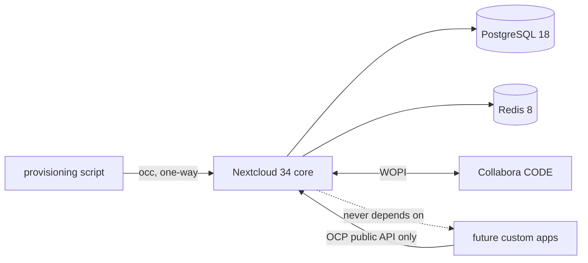
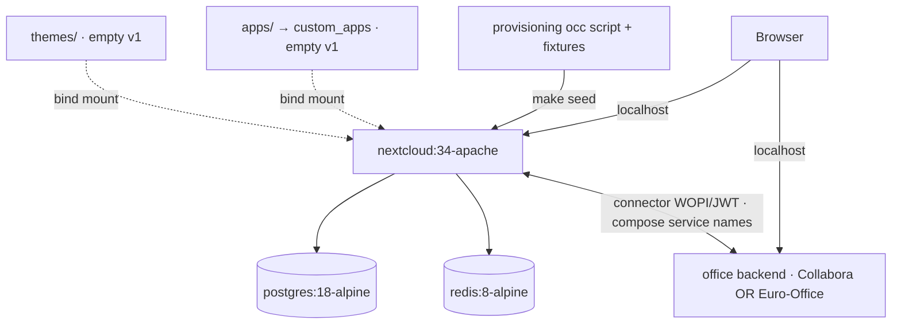
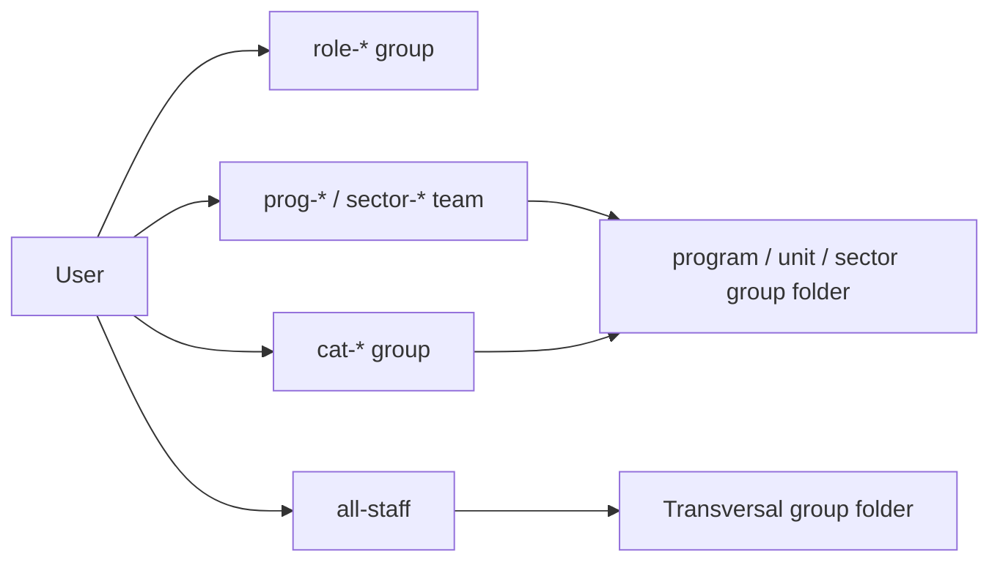

# Architecture Spine — APS Conecta Gestión v1

> Every `AD` below is **binding** once this spine is `status: final`. `[ADOPTED]` marks the ones the user or
> existing reality already settled (the rest were coached and accepted); the tag records provenance, not a
> weaker force.

## Design Paradigm

**Vanilla platform + configuration-as-code, no fork.** Nextcloud 34 is the platform and owns the runtime and
all product data. The repository contributes **only** declarative customization — configuration, theming,
group/folder/ACL provisioning — never a fork or a core patch. In v1 there is **zero custom PHP**. Desired state
is applied by one idempotent `occ`-based provisioning script; the running instance is a *projection* of the
repo's recipe over the official image.

| Location | Holds | Note |
| --- | --- | --- |
| `apps/` → `custom_apps` | future Layer-2 apps | **empty in v1**; bind-mounted for live edit |
| `themes/` | custom CSS theme | **empty in v1**; branding is done via `occ`, not here |
| `provisioning/` | idempotent `occ` script + fixtures + branding assets | the only writer of desired state |
| `config` (`.env`, `config.php` via `occ`) | instance configuration | secrets in `.env` (gitignored) |

## Invariants & Rules

Dependency direction (a unit may depend only in the arrow's direction):



### AD-1 — No fork; customize only via config / apps / themes  `[ADOPTED]`
- **Binds:** all customization (FR-6, FR-7, NFR-5)
- **Prevents:** a Nextcloud source fork or core patch that breaks upgradeability
- **Rule:** Nextcloud runs from the **official image**. Changes go only into `apps/` (custom_apps), `themes/`, or configuration. No editing/patching core; no `defaults.php`-style overrides.

### AD-2 — Configuration-as-code: one idempotent provisioning writer
- **Binds:** branding, locale, groups, folders, ACLs, fixtures (FR-4, FR-7..FR-14)
- **Prevents:** hand-clicked drift; two writers of desired state; double-application on re-run
- **Rule:** All desired state is applied by the single `provisioning/` `occ` script (invoked by `make seed`).
  Every step is **idempotent by guard**: query-before-create (`occ group:list`, `groupfolders:list`, read a
  recorded folder-id map) and skip/patch if present — never blind-create (`groupfolders:create` is *not*
  idempotent by name). Fixed **phase order**: (1) branding + locale config → (2) groups → (3) group folders →
  (4) ACLs → (5) user→group membership → (6) sample-content fixtures. **Ownership partition:** provisioning
  owns *structure* (groups, folders, ACLs, branding, locale); fixtures own *only* sample content and sample
  users placed into already-existing groups. One owner per artifact.

### AD-3 — Data ownership boundary  `[ADOPTED]`
- **Binds:** all persisted data (NFR-2)
- **Prevents:** product data or secrets in git; ambiguity over where a datum lives
- **Rule:** Nextcloud owns product content (data volume), **PostgreSQL** owns metadata, **Redis** owns
  cache/locks. The repo owns only the desired-state recipe + config. **No real product data, no secrets** in
  git, Docker volumes, or Syncthing; dev data is synthetic fixtures only.

### AD-4 — RBAC via Group Folders: group-only principals, allow-refinement  `[ADOPTED]`
- **Binds:** identity & access, Document Home (FR-9..FR-14)
- **Prevents:** per-user grants; nesting assumptions; empty-group lockouts; DENY rules breaking multi-role union
- **Rule:** Access is granted through **Group Folders** to **groups only**, never individuals. Principals are
  the flat groups in the **Group Registry** below: `role-*`, `cat-*`, `all-staff`, and the parameterizable
  team groups `prog-*` (program teams) and `sector-*` (territorial-sector teams). A user is provisioned into
  their `role-*` group, their `cat-*` group, **`all-staff`**, and any `prog-*`/`sector-*` teams they belong to.
  **"All staff" is exactly the `all-staff` group** (never the union of `cat-*`), and every user is a member.
  Mount model (Group Folders do not nest): **Transversal = one group folder** (read → `all-staff`; per-subfolder
  manager writes via ACL); **each program, unit, and sector = its own group folder** granted to that team group
  (+ `cat-jefaturas` read), minimal ACL. ACL uses **allow-refinement**: grant least at the folder base, add
  explicit **allow** rules; **no DENY rules** (deny overrides allow and would break a multi-role user's union).

### AD-5 — Office editing via a standalone document server, switchable Collabora ↔ Euro-Office  `[ADOPTED]`
- **Binds:** live collaborative editing (FR-15..FR-17)
- **Prevents:** the built-in server's small-team cap; a paid dependency; a single hard-wired office backend
- **Rule:** Editing is served by a **standalone document-server container**, with the backend **switchable
  between two OSS options**: **Collabora Online CODE** (`collabora/code`, via the `richdocuments`/WOPI app) and
  **Euro-Office** (`ghcr.io/euro-office/documentserver`, via the `eurooffice` connector + shared JWT). Both are
  NC34+ standalone servers with no concurrency cap. The built-in `richdocumentscode` app is **not installed**.
  Container↔container URLs use compose service names (AD-8). The comparison picks a winner later (Deferred).

### AD-6 — White-label as config, not a theme file  `[ADOPTED]`
- **Binds:** branding (FR-7)
- **Prevents:** the fork-adjacent `defaults.php`/opcache path; brand drift
- **Rule:** Branding is applied via `occ theming:config` (`name`, `slogan`, `url`, `logo`, `favicon`,
  `primary_color`, `background_color`, `background`) plus `occ theming:config disable-user-theming yes`.
  Branding assets are bind-mounted local files. A `themes/` CSS theme is used **only** for what
  `occ theming:config` cannot express.

### AD-7 — Spanish/es-CL as seeded, unlocked defaults  `[ADOPTED]`
- **Binds:** localization (FR-8, NFR-4)
- **Prevents:** hard-coded UI language; inconsistent Chilean formatting
- **Rule:** Instance defaults `default_language=es_419` (UI translation; a discrete `es_CL` translation does
  not exist) and `default_locale=es_CL` (date/number formatting; a valid ICU locale), set via `occ`, **not**
  forced — users/devs may change them. UI text is Spanish; all code, identifiers, and config keys are English.

### AD-8 — Portable core compose; explicit host-vs-service networking  `[ADOPTED]`
- **Binds:** the dev environment, WOPI networking (FR-1, FR-15, NFR-1)
- **Prevents:** "works on my machine"; VPS coupling; container↔container calls mis-routed through the host
- **Rule:** The core `compose` runs unmodified on any dev's machine and OS, with no absolute host paths and
  nothing VPS-specific (Tailscale etc.). **Container↔container** traffic (Nextcloud↔Collabora↔PostgreSQL↔Redis)
  uses **compose service names** (e.g. `http://collabora:9980`, `http://nextcloud`). **`host.docker.internal`
  is only for host↔container** (the browser or a container reaching a host-published port); on Linux add
  `extra_hosts: host.docker.internal:host-gateway`.

### AD-9 — Custom-code boundary (future)
- **Binds:** any future Layer-2 app
- **Prevents:** core forks/patches sneaking in via "custom" code; reverse dependencies
- **Rule:** Custom apps live in `apps/` → `custom_apps` and may depend on Nextcloud **only through OCP public
  APIs** — never patch core, never rely on private internals. Core never depends on a custom app.

### AD-10 — Xdebug as a derived dev-only image
- **Binds:** the debug capability (FR-2)
- **Prevents:** Xdebug in the base/prod image; a debug fork
- **Rule:** Step-debugging comes from a **derived** image/compose profile (`compose.dev.yaml`) layered on the
  official image, enabled only in dev — never baked into the base image or the committed core.

### AD-11 — Exactly one office backend active at a time
- **Binds:** the office-suite switch (FR-15..FR-17, AD-5)
- **Prevents:** two office backends fighting over the same docx/xlsx/pptx file handlers
- **Rule:** Collabora and Euro-Office are **never both active** on one instance. The switch
  (`make office-collabora` / `make office-eurooffice`) brings up the chosen server's compose **profile**,
  enables its connector, and **disables the other's** — so exactly one connector claims each MIME type, and
  only the active office server runs.

## Group Registry

*Seed — the ~21 roles are the PRD's provisional taxonomy; the **IDs, slug rule, and role→category mapping are
the invariant** builders must share. `prog-*`/`sector-*` names are CESFAM-parameterized placeholders.*

**ID rule:** ASCII kebab-case, accent-stripped, deterministic; English identifiers, Spanish display names.

| Group ID | Display (es-CL) | Category |
| --- | --- | --- |
| `role-director-cesfam` | Director/a de CESFAM | `cat-jefaturas` |
| `role-subdirector-jefe-tecnico` | Subdirector/a Médico o Jefe Técnico | `cat-jefaturas` |
| `role-jefe-sector-mais` | Jefe/a de Sector (Gestión MAIS) | `cat-jefaturas` |
| `role-medico` | Médico General / de Familia | `cat-clinicos` |
| `role-dentista` | Cirujano Dentista | `cat-clinicos` |
| `role-quimico-farmaceutico` | Químico Farmacéutico (Dir. Técnico Farmacia) | `cat-clinicos` |
| `role-enfermeria` | Enfermera/o | `cat-clinicos` |
| `role-matroneria` | Matrona/Matrón | `cat-clinicos` |
| `role-kinesiologo` | Kinesiólogo/a | `cat-clinicos` |
| `role-psicologo` | Psicólogo/a | `cat-clinicos` |
| `role-trabajador-social` | Trabajador/a Social | `cat-clinicos` |
| `role-nutricionista` | Nutricionista | `cat-clinicos` |
| `role-terapeuta-fono` | Terapeuta Ocupacional / Fonoaudiólogo/a | `cat-clinicos` |
| `role-tens-procedimientos` | TENS – Procedimientos / Vacunatorio | `cat-tecnicos` |
| `role-tens-farmacia` | TENS – Farmacia / PNAC | `cat-tecnicos` |
| `role-tons` | TONS (Técnico en Odontología) | `cat-tecnicos` |
| `role-administrativo-some` | Administrativo SOME | `cat-administrativos` |
| `role-oirs` | Encargado/a OIRS | `cat-administrativos` |
| `role-estadistica-rem` | Encargado/a de Estadística (REM) | `cat-administrativos` |
| `role-conductor` | Conductor (Ambulancia / Traslado) | `cat-administrativos` |
| `role-auxiliar-servicio` | Auxiliar de Servicio | `cat-administrativos` |

Plus: `all-staff` (every user); categories `cat-jefaturas` · `cat-clinicos` · `cat-tecnicos` ·
`cat-administrativos`; team groups `prog-*` (e.g. `prog-salud-mental`, `prog-infantil`, `prog-cardiovascular`)
and `sector-*` (e.g. `sector-1`, `sector-azul` — named per CESFAM).

## Consistency Conventions

| Concern | Convention |
| --- | --- |
| Group IDs | Per the Group Registry ID rule; grants target IDs, never display names. |
| Folder names (Spanish) | Top-level group folders `Transversal`, plus one folder per program / unit / sector (es-CL display names). |
| Data & formats | Formatting locale `es_CL` (dates `dd-mm-yyyy`, CLP, RUT); timezone America/Santiago (per-user auto). IDs/keys/code English. |
| State & mutation | Instance state changes **only** through `occ` / the provisioning script; `config.php` via `occ config:system:set`; secrets via `.env`. |
| Provisioning | Idempotent by guard (query-before-create); fixed phase order (AD-2); membership via `occ group:adduser`. |
| Org conventions (FR-14) | A documented naming/placement rule set + a **one-live-copy** versioning norm (the answer to "no single trusted version"), surfaced in-repo and in-folder READMEs. Human-followed in v1 (no auto-enforcement). |
| Make targets | `make up` starts services only (no seeding); `make seed` runs provisioning idempotently; `make smoke`/`test` = the local gate. |

## Stack

*Seed — verified current 2026-07-19; the code owns this once it exists. Licenses noted for the OSS-first
mandate (NFR-3); the full enumeration is the committed License-outline artifact (see Deferred).*

| Name | Version | License |
| --- | --- | --- |
| Nextcloud (official image) | `nextcloud:34-apache` (rolling 34.x; 34.0.1 head, EOL ~June 2027) | AGPL-3.0 |
| PostgreSQL | `postgres:18-alpine` (PG18, NC-recommended) | PostgreSQL License |
| Redis | `redis:8-alpine` (Redis 8 restored OSS licensing) | AGPL-3.0 |
| Office server A — Collabora CODE | `collabora/code` (current) + `richdocuments`/WOPI | MPL-2.0 / AGPL-3.0 |
| Office server B — Euro-Office | `ghcr.io/euro-office/documentserver` (v9.3.x) + `eurooffice` connector | AGPL-3.0 |
| Group Folders | `groupfolders` (NC34 line; surfaced as "Team folders") | AGPL-3.0 |
| Orchestration / tooling | Docker Compose · Make · Xdebug (dev only) | — |

`nextcloud:34-apache` rolls across 34.x patches; pin an exact patch if byte-identical environments become
necessary. Both office suites are OSS/AGPL, uncapped, and >20-concurrent-capable; **Collabora** is the
whiter-label ("Nextcloud Office"), **Euro-Office** (an AGPL OnlyOffice fork) has stronger MS-Office fidelity but
a heavier ~8 GB footprint (vs Collabora ~3 GB). **Redis 8** re-added OSS licensing (AGPL-3.0); **Valkey**
(`valkey/valkey`, BSD-3, drop-in) is the permissive alternative to settle in the License outline if preferred.

## Structural Seed

Container / runtime topology (v1 = local dev, one compose per developer):



RBAC shape (how a user's groups resolve to Document Home mounts):



Source tree (scaffold — code owns the detail):

```text
apsconecta-gestion/
  compose.yaml            # nextcloud + postgres + redis + collabora
  compose.dev.yaml        # Xdebug derived profile (AD-10)
  .env.example            # → .env (gitignored)
  Makefile                # up · down · seed · smoke · test
  provisioning/           # idempotent occ script + fixtures + branding assets (AD-2)
  apps/                   # → custom_apps (empty in v1)
  themes/                 # custom CSS (empty in v1)
  docs/                   # ARCHITECTURE.md, planning/
```

**Environments:** v1 covers **local dev per developer only**. Staging/production (hosting, Collabora TLS
reverse-proxy + hardened WOPI allow-list, backups/RTO-RPO, sizing/HA, observability) are **Deferred**.

## Capability → Architecture Map

| Capability (PRD) | Lives in | Governed by |
| --- | --- | --- |
| FR-1 one-command bring-up | `compose.yaml` + `Makefile` | AD-8, Stack |
| FR-2 live PHP debug | `compose.dev.yaml` (Xdebug) | AD-10 |
| FR-3 smoke/test gate | `Makefile` (`smoke`/`test`) | Conventions |
| FR-4 synthetic fixtures | `provisioning/` (fixtures partition) | AD-2, AD-3 |
| FR-5 repo-as-SSOT onboarding | `README`/`CONTRIBUTING`/`docs/` | — |
| FR-6 custom app/theme mounts | `apps/`, `themes/` | AD-1, AD-9 |
| FR-7 white-label branding | `provisioning/` (`occ theming:config`) | AD-6 |
| FR-8 es-CL locale defaults | `provisioning/` (`occ config`) | AD-7 |
| FR-9..FR-11 roles & access | Group Registry + `provisioning/` | AD-4, AD-2 |
| FR-12..FR-13 Document Home | Group Folders (per-area/program/unit/sector) + ACL | AD-4 |
| FR-14 organization conventions | in-repo/in-folder convention docs | Conventions |
| FR-15..FR-17 live editing | `collabora/code`/`richdocuments` **or** Euro-Office/`eurooffice` (switchable) | AD-5, AD-8, AD-11 |

## Deferred

- **Operational envelope (production):** hosting/provider, Collabora TLS reverse-proxy + hardened WOPI
  allow-list (v1 dev uses `--o:ssl.enable=false`), backups/RTO-RPO, sizing/HA, observability — v1 is dev-only
  (PRD NFR-6).
- **License-outline SSOT artifact (NFR-3):** the committed enumeration of every image/app/dependency license
  (cores noted in Stack) — including the **Redis 8 AGPL vs Valkey BSD** choice — produced as a repo artifact.
- **Legal / Chile data-governance SSOT (PRD §10):** the committed Legal artifact + compliance checklist (Ley
  19.628 / 21.719, MINSAL/APS) — tracked from the start; v1 exposure is low (no patient data), reviewed when a
  feature touches data/formats/scheduling.
- **Layer-2 custom apps** (REM etc.), the **structured-data stack** (Tables/search/Paperless/Analytics), and
  the **AI layer** — roadmap; AD-9 fixes where they attach.
- **Final CESFAM-validated access matrix** + concrete `prog-*`/`sector-*` names — parameterizable first cut;
  validated with a specific CESFAM later.
- **Prod-like office-server TLS profile** and **exact rolling-vs-pinned image policy** — fixed at/after Epic 0.
- **Office-suite winner** — after the Collabora vs Euro-Office comparison, narrow AD-5 to the chosen backend
  (or keep the switch if a per-deployment choice is wanted).
- **`disable-user-theming` relaxation** — revisit if per-user dev themes are ever wanted.
